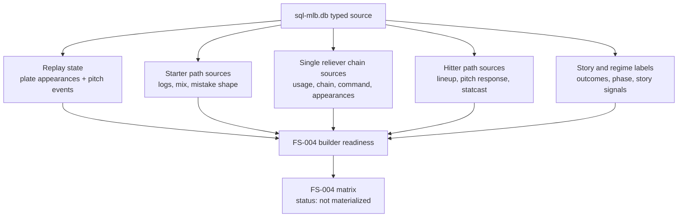

# MLB-M3 Alpha-6 FS-004 Source Feasibility Audit

Run ID: `mlb_m3_alpha6_fs004_source_feasibility`

## Summary

- Contract: `/Users/jcchen/Documents/New project/pipeline/mlb/features/contracts/m3_fs_004_state_path_redesign_v0.json`
- DB: `/Users/jcchen/Documents/New project/data-private/warehouse/sports/mlb/sql-mlb.db`
- Tables audited: `53`
- Existing tables: `53`
- Populated tables: `53`
- Surfaces audited: `19`
- Surface statuses: `{'partial_source_contract_decision': 2, 'source_feasible': 15, 'source_feasible_with_optional_source_decisions': 2}`

## Source DAG

## Surface Feasibility

| Surface | Priority | Family | Status | Missing Required Groups | Source Decisions |
| --- | --- | --- | --- | --- | --- |
| `starter_workload_trajectory` | `P0` | `starter_path` | `source_feasible` | - | - |
| `starter_damage_distribution` | `P0` | `starter_path` | `source_feasible` | - | - |
| `starter_pitch_shape_change` | `P1` | `starter_path` | `source_feasible` | - | - |
| `starter_opponent_pressure_residual` | `P0` | `starter_path` | `source_feasible` | - | - |
| `starter_low_data_uncertainty` | `P0` | `starter_path` | `source_feasible` | - | - |
| `reliever_availability_reset` | `P0` | `reliever_chain` | `source_feasible` | - | - |
| `first_up_reliever_router` | `P0` | `reliever_chain` | `partial_source_contract_decision` | - | `actual_first_reliever_target` |
| `reliever_chain_length_regime` | `P0` | `reliever_chain` | `source_feasible` | - | - |
| `reliever_performance_volatility` | `P0` | `reliever_chain` | `source_feasible` | - | - |
| `hitter_vs_starter_phase` | `P0` | `hitter_path` | `source_feasible` | - | - |
| `hitter_vs_reliever_chain_phase` | `P0` | `hitter_path` | `partial_source_contract_decision` | - | `reliever_phase_order` |
| `hitter_current_state_residual` | `P1` | `hitter_path` | `source_feasible` | - | - |
| `lineup_pa_volume_context` | `P0` | `hitter_path` | `source_feasible` | - | - |
| `ordered_story_memory` | `P0` | `story_memory` | `source_feasible` | - | - |
| `traffic_conversion_state` | `P0` | `story_memory` | `source_feasible` | - | - |
| `game_regime_labels` | `P0` | `story_memory` | `source_feasible` | - | - |
| `schedule_travel_context` | `P2` | `game_context` | `source_feasible_with_optional_source_decisions` | - | - |
| `market_context_lines` | `P2` | `market_context` | `source_feasible` | - | - |
| `tail_calibration_feedback` | `P0` | `feedback` | `source_feasible_with_optional_source_decisions` | - | - |

## Important Findings

- Replay fields for PA/pitch state are present in typed `plate_appearances` and `pitch_events`.
- The first-up reliever router and hitter-vs-reliever-chain phase need populated canonical `entry_order`/chain-phase fields. Typed staging has values; canonical `pitcher_appearances` must be backfilled before those surfaces are fully feasible.
- Tail calibration feedback is intentionally not a builder blocker, but promotion and pricing must remain deferred until settlement/calibration gates exist.
- This audit does not create features or train anything; it only maps FS-004 source readiness.
