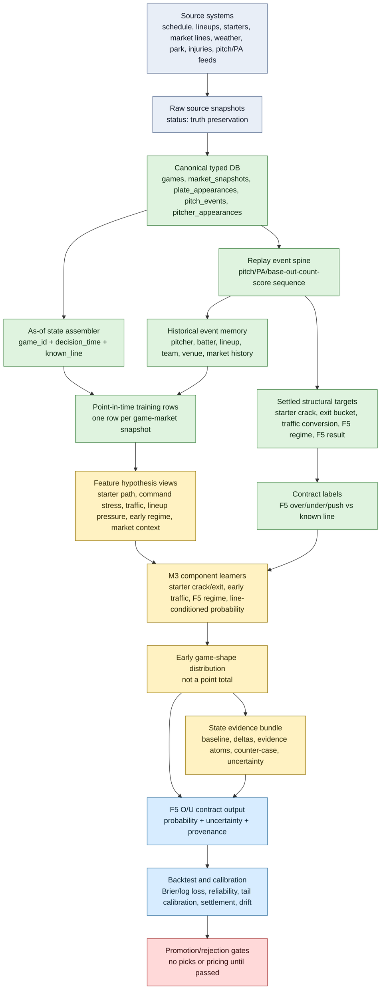
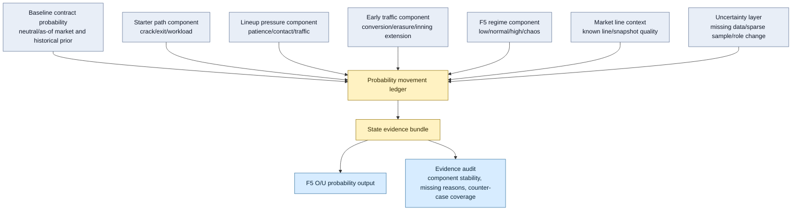

# MLB-M3 Early Game Shape v0 Pipeline

Status: draft for review

Last updated: 2026-06-03

Constitution: `development-docs/mlb/models/mlb-m3-constitution.md`

Purpose: define the first real MLB-M3 data pipeline, target map, state evidence bundle, and output contract after resetting away from generic run-total regression.

## Scope

Early Game Shape v0 is the first contract-first MLB-M3 phase.

It focuses on the first five innings because that forces the system to model starter path, early traffic, lineup pressure, count/base/out state, and early game regime before taking on the full late-game bullpen chain.

This phase is not a picks engine, not a simulator, not a player prop model, and not a generic final-score model.

## First Real Contract

Primary market contract:

```text
F5 O/U with known line
```

Primary output:

```text
P(F5 total runs > known line)
P(F5 total runs < known line)
P(push), when line can push
uncertainty and calibration metadata
state evidence bundle explaining probability movement
```

Primary structural targets:

- starter crack
- starter exit/workload bucket
- early traffic conversion
- F5 low-run regime
- F5 normal regime
- F5 high-run regime
- F5 chaos regime

Why this first:

- It is a real market-style contract, not average-run MAE.
- It keeps evaluation tied to a known line.
- It forces starter-path modeling.
- It uses the pitch/PA/base-out-count-score event spine.
- It creates reusable state for starter props, full-game totals, team totals, and hitter props.
- It avoids requiring the entire late reliever chain before the first real M3 target exists.

## Top-Level DAG



## Data Flow By Grain

| Layer | Grain | Purpose | Must Not Do |
| --- | --- | --- | --- |
| Raw snapshots | source payload | Preserve provider truth and lineage. | Decide baseball opinions. |
| Canonical events | pitch, PA, pitcher appearance, market snapshot | Normalize replayable game state. | Collapse sequence into one average. |
| Replay spine | ordered pitch/PA event | Rebuild what happened in baseball order. | Lose base/out/count/score transitions. |
| As-of state | game plus decision time | Define what was known before a prediction/market decision. | Include final game data or future games. |
| Feature views | point-in-time game row | Represent hypotheses about starter path, traffic, lineup pressure, and early game shape. | Hard-code arbitrary windows as truth. |
| Structural labels | settled game state | Train/evaluate starter crack, exit, traffic, and F5 regime. | Use labels as features. |
| Contract labels | game plus known line | Train/evaluate F5 O/U probabilities. | Evaluate only average-run MAE. |
| State evidence | contract probability plus component state | Explain probability movement and uncertainty. | Invent prose reasons after the fact. |
| Contract output | game plus known line | Produce probabilities, uncertainty, and provenance. | Produce picks, stakes, or promotion claims. |

## Required Inputs

### Source Truth

These inputs are required before Early Game Shape v0 can be trusted:

- schedule and game identity
- probable or confirmed starters
- starting lineups and lineup order when available
- park and venue context
- weather context when available
- market line snapshots for F5 total, including line value and timestamp
- pitch-level event feed
- PA-level event feed
- pitcher appearance order and role
- team rest, series, and travel context when available
- raw source payloads and provenance

### Canonical Replay Fields

Pitch and PA events need enough state to replay the story:

- `game_id`
- `game_date`
- `inning`
- `half_inning`
- `pa_index`
- `pitch_index`
- `pitcher_id`
- `batter_id`
- `batting_team_id`
- `fielding_team_id`
- `balls_before`
- `strikes_before`
- `outs_before`
- `outs_after`
- `base_state_before`
- `base_state_after`
- `score_before`
- `score_after`
- `pitch_type`
- `pitch_velocity`
- `pitch_location`
- `pitch_call`
- `pa_result`
- `runs_scored`
- `rbi`
- `is_whiff`
- `is_contact`
- `is_walk`
- `is_strikeout`
- `raw_json`
- `source`
- `source_version`

Pitcher appearances need:

- `pitcher_id`
- `team_id`
- `game_id`
- `pitcher_role`
- `entry_order`
- `first_inning`
- `first_half`
- `batters_faced`
- `outs_recorded`
- `pitches`
- `runs_allowed`
- `inherited_runners`
- `inherited_runners_scored`

Market snapshots need:

- `game_id`
- `market`
- `line`
- `price_over`
- `price_under`
- `snapshot_ts`
- `source`

## Point-In-Time Feature Views

Features should be built as hypothesis views, not permanent baseball opinions.

### Starter Path View

Purpose: describe the starter's expected early-game path.

Candidate representations:

- prior workload baseline with uncertainty
- recent deviation from workload baseline
- pitch-count stress history
- command stress history by count and PA state
- traffic buildup history
- damage after traffic history
- times-through-order decay candidates
- pitch-mix change candidates
- start-to-start volatility
- low-data reliability

Bad encodings:

- `last_5_era`
- `hot_pitcher_flag`
- one fixed starter score

### Lineup Pressure View

Purpose: describe how the opposing lineup can stress the starter.

Candidate representations:

- lineup patience and walk pressure
- contact and whiff profile by pitch type
- traffic creation history
- conversion after traffic
- handedness and pitch-type matchup history
- lineup completeness and uncertainty
- top/middle/bottom order pressure shape

Bad encodings:

- expected AB as an input truth
- one team hitting score
- fixed last-N team run average as the main signal

### Early Traffic View

Purpose: detect whether F5 is more likely to become dead, normal, high-run, or chaos.

Candidate representations:

- starter free-pass risk
- lineup traffic pressure
- base/out state conversion history
- two-out traffic conversion
- GIDP/traffic-erasure tendencies
- early pitch-count acceleration
- inning extension probability

Bad encodings:

- average F5 runs as the target feature
- one chaos score without decomposed evidence

### Market Context View

Purpose: evaluate the known F5 line as the contract, not as a pick trigger.

Candidate representations:

- known F5 total line
- market snapshot time
- line movement history when available
- price over/under when available
- market availability and source quality

Bad encodings:

- using final closing line as a feature when the prediction time was earlier
- turning market disagreement directly into a pick

## State Evidence Bundle

State evidence is a required output family for Early Game Shape v0.

It explains why the contract probability moved from baseline to final probability. It is not a pick justification yet, because selection policy is out of scope.

Required fields:

- `game_id`
- `decision_time`
- `contract`
- `line`
- `baseline_probability`
- `final_probability`
- `probability_delta`
- `component_contributions`
- `top_evidence_atoms`
- `counter_case_risks`
- `missing_data_flags`
- `uncertainty_adjustments`
- `calibration_context`
- `not_a_pick`
- `not_a_price`
- `not_promoted`

Component contribution examples:

```text
starter_path_delta: +0.08
lineup_pressure_delta: +0.05
early_traffic_delta: +0.03
market_line_context_delta: +0.04
uncertainty_delta: -0.02
final_net_delta: +0.18
```

Evidence atoms should be structured and traceable:

```text
atom_id
component
direction
magnitude
source_feature_or_component
supporting_value
baseline_value
reliability
```

Counter-case risks should explain why the model can be wrong:

- starter command holds despite stress indicators
- lineup is incomplete or materially changed
- low-data pitcher role change
- market line source missing or stale
- weather/park context unavailable
- traffic indicators historically fail to convert

The state evidence bundle should make it possible to audit whether M3 is seeing baseball state or just a hidden proxy.

## Evidence DAG



## Structural Targets

These are not necessarily final products. They are intermediate baseball-state targets that force the system to learn the right game path.

### Starter Crack

Goal: did the starter materially lose control of the early game?

Candidate label ingredients:

- early runs allowed
- early traffic clusters
- walks or hit-by-pitch pressure
- hard contact or extra-base damage
- hook before expected workload
- pitch-count acceleration
- score/inning context

Output type:

```text
P(starter_crack)
```

### Starter Exit / Workload Bucket

Goal: model starter workload as a distribution, not a single innings projection.

Candidate buckets:

- very short
- short
- normal
- deep

Output type:

```text
P(exit_bucket)
expected outs distribution
```

### Early Traffic Conversion

Goal: distinguish traffic erased from traffic converted.

Candidate labels:

- traffic without conversion
- traffic converts to one run
- traffic converts to crooked inning
- traffic erased by GIDP, strikeout, or stranded runners

Output type:

```text
P(traffic_conversion_bucket)
```

### F5 Regime

Goal: model the first five innings as a regime distribution.

Candidate buckets:

- low-run
- normal
- high-run
- chaos

Output type:

```text
P(F5_low)
P(F5_normal)
P(F5_high)
P(F5_chaos)
```

## Contract Target

Primary target:

```text
F5 total over/under/push against known line
```

Required label fields:

- `game_id`
- `decision_time`
- `f5_total_line`
- `f5_total_runs_final`
- `f5_over_result`
- `f5_under_result`
- `f5_push_flag`
- `market_source`
- `settlement_status`

Output fields:

- `model_run_id`
- `feature_set_id`
- `game_id`
- `decision_time`
- `f5_total_line`
- `p_over`
- `p_under`
- `p_push`
- `uncertainty`
- `regime_distribution`
- `starter_crack_probability`
- `starter_exit_distribution`
- `state_evidence_bundle`
- `calibration_scope`
- `not_a_pick`
- `not_a_price`
- `not_promoted`

## Evaluation Gates

Top-level evaluation for this phase must not be average-run MAE.

Required gates:

| Gate | Question | Candidate Metrics |
| --- | --- | --- |
| Point-in-time validity | Did every row use only pre-decision information? | leakage audit, source timestamps |
| Structural target quality | Are starter crack/exit/traffic/regime labels learnable and stable? | Brier, log loss, calibration, prevalence by fold |
| F5 line-conditioned probability | Does the model grade the known F5 line? | Brier, log loss, reliability bins, calibration slope |
| Tail/regime calibration | Does it understand low-run and chaos games? | regime-conditioned reliability, tail recall/precision |
| Distribution quality | Are uncertainty bands honest? | interval coverage, pinball loss, CRPS-style diagnostics |
| State evidence quality | Does the model explain probability movement from component state? | contribution stability, evidence completeness, counter-case coverage |
| Market sanity | Does it compare to known market snapshots cleanly? | line availability, settlement joins, CLV later |
| Promotion guard | Is it safe to claim anything? | no picks/prices/promotion until all above pass |

Average-run MAE is allowed only as:

```text
point-head smoke diagnostic
```

It cannot block or promote the M3 phase by itself.

## What This Does Not Build Yet

Early Game Shape v0 does not yet build:

- full-game O/U
- moneyline
- team totals
- player props
- starter props
- reliever props
- full PA/base-out simulator
- late reliever-chain simulator
- selection policy
- picks
- prices
- edge claims

It should create the first real M3 spine that those later contracts can consume.

## Implementation Order

Recommended order:

1. Validate canonical pitch/PA/pitcher-appearance/market fields needed for this pipeline.
2. Write feature hypothesis cards for starter crack, starter exit, early traffic, and F5 regime.
3. Define settled labels for starter crack, exit bucket, early traffic conversion, and F5 regime.
4. Build a point-in-time training row at `game_id + decision_time + known F5 line`.
5. Train/evaluate structural targets.
6. Train/evaluate line-conditioned F5 O/U probabilities.
7. Add state evidence bundles with baseline probability, component deltas, evidence atoms, counter-case risks, and uncertainty flags.
8. Add calibration and regime-conditioned rejection gates.
9. Only then consider model registry promotion.

## Open Questions

1. Which F5 market source is the first canonical source for known lines and timestamps?
2. What decision time should v0 use when multiple market snapshots exist: opening, fixed pregame cutoff, latest before first pitch, or all snapshots as separate training rows?
3. Should starter crack be labeled from explicit hook/workload deviation, early damage, traffic stress, or a multi-label combination?
4. Should F5 regime buckets be fixed by run count first, or learned from game-state clusters later?
5. Which pitch/PA replay fields are missing from the typed DB today and need migration/backfill before v0 can be built honestly?
6. Should component contribution deltas be learned natively by model decomposition, approximated by ablation/SHAP-like diagnostics, or represented first as transparent additive evidence ledgers?
