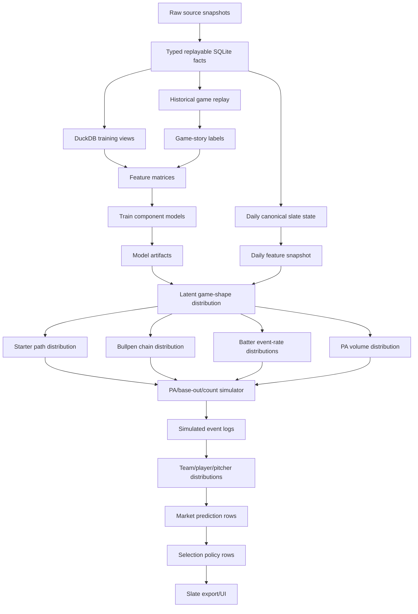
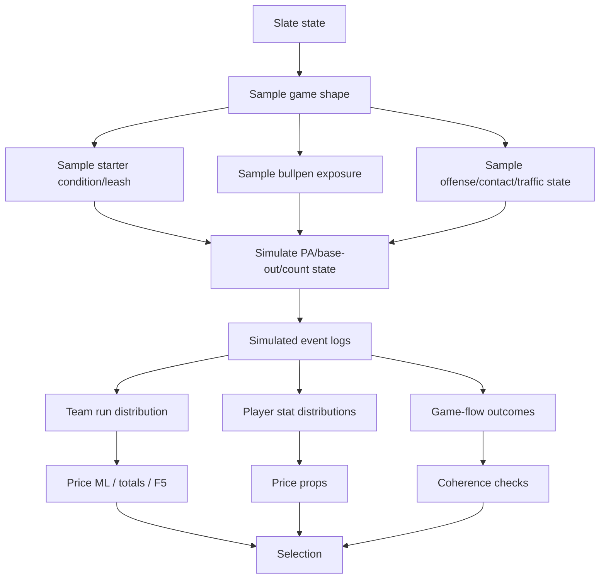

# MLB-M3 Hierarchical Simulator Architecture

## Goal

M3 should be a contract-first hierarchical baseball simulator.

The goal is not to perfectly simulate every real-world detail. The goal is to model the causal structure of a baseball game well enough that market prices are wrong in detectable, testable ways.

M3 should not be a single prop model, and it should not be a bundle of independent heads. The market heads are final pricing outputs. The core intelligence is a latent game-shape/regime simulator.

Current working research notes live in:

- `research-m3/model-architecture-notes.md`
- `research-m3/signal-discovery-notes.md`
- `research-m3/game-story-labels.md`
- `research-m3/tech-debt.md`

## Layer Stack

```text
L0: Source contracts
  lineups, starters, markets, weather, park, umpire, bullpen, injuries, notes

L1: Canonical slate state
  one clean game object per game, one clean player/team state

L2: Feature/state assets
  pitcher form, hitter state, bullpen fatigue, lineup pressure, park/weather, soft signals

L3: Latent regime model
  dead game / normal / high-run / chaos / blowout / bullpen-collapse distributions

L4: Component models
  starter leash, pitcher event rates, batter event rates, bullpen chain, PA volume

L5: Game simulator
  inning/PA/base-out/score simulation with pitcher changes and lineup turnover

L6: Simulated event logs
  reproducible ensemble of baseball paths

L7: Distribution aggregators
  team runs, F5 runs, ML win prob, player hits/TB/HR/RBI/walk/K distributions

L8: Market pricing
  compare fair probability to known lines/prices

L9: Selection policy
  choose what to show, pass, veto, or mark live-only

L10: Presentation/export
  board JSON/UI/reporting only
```

## Asset DAG



## Runtime Simulation DAG



## Important Correction: Heads Are Aggregators

M3 should not have independent market heads that all look at the same feature table and produce unrelated probabilities.

The shared simulator should produce event logs. Market heads should aggregate those logs into the contract being priced:

```text
simulated event logs
  -> full-game total distribution
  -> F5 total distribution
  -> moneyline distribution
  -> player hits / total bases / RBI / walks
  -> pitcher strikeouts / outs
  -> home run probability
```

This is how player props stay coherent with game flow. Props are not separate from the game. They are views over plate appearances, lineup turnover, pitcher changes, score state, and event sequencing.

## Why Latent Game Shape Comes First

A basic multi-head prop model is not robust enough for MLB volatility. Baseball is not drawn from one smooth average distribution. Scoring is clustered through traffic, walks, extra-base hits, bullpen exposure, defensive mistakes, sequencing, and lineup turnover.

Instead of treating a game as only:

```text
expected runs = 8.7
```

M3 should represent a mixture of regimes:

```text
dead script: 21%
normal script: 46%
high-run script: 24%
chaos script: 9%
```

Player props should be conditional on those regimes:

```text
Player total bases over:
  dead script: 22%
  normal script: 31%
  high-run script: 43%
  chaos script: 58%

blended fair probability: 35.8%
```

This lets related markets move together coherently. A game with elevated chaos risk should not independently price pitcher outs, F5 totals, bullpen exposure, team totals, RBIs, extra PA, and batter total bases as if they are unrelated.

## Contract Families

The current output inventory is stored in:

- `development-docs/mlb/models/mlb-m3-output-contract-inventory-2026-06-02.md`
- `data-migration/reports/mlb_output_contract_inventory_2026-06-02.json`

M3 should promote these contract families:

```text
canonical_slate_state
latent_forecast.game_shape
latent_forecast.game_flow
latent_forecast.starter_path
latent_forecast.reliever_shadow
latent_forecast.pa_volume
market_prediction.moneyline
market_prediction.first5_moneyline
market_prediction.full_game_total
market_prediction.first5_total
market_prediction.first_inning
market_prediction.player_prop
market_prediction.home_run
selection_policy_result
experiment_artifact
presentation_export
```

## Soft Signals

New qualitative or narrative inputs should be encoded as soft signals, not hand-applied directly to picks.

Example:

```json
{
  "signal_id": "soft-2026-06-03-pitcher-stress",
  "entity_type": "player",
  "entity_id": "pitcher_id",
  "signal_type": "stress_state",
  "direction": "negative",
  "strength": 0.42,
  "source": "beat_report",
  "source_confidence": 0.55,
  "expires_at": "2026-06-04T00:00:00Z"
}
```

Soft signals should move latent distributions, not picks directly.

For example, "pitcher stressed" should not mean "bet over." It may move:

```text
starter failure probability +3%
walk cluster probability +2%
chaos regime probability +1.5%
pitcher strikeout variance wider
```

Then the simulator determines which markets benefit.

Every soft signal needs:

```text
source
source confidence
entity scope
direction
strength
expiry
backtest lineage
calibration status
```

## Design Rules

1. Market heads price contracts from shared simulated worlds.
2. Player props are downstream of game flow, not isolated from it.
3. Every prediction row should trace to feature snapshot, model artifacts, calibration, and selection policy.
4. Selection policy should never be fused with probability generation.
5. Presentation should never be the source of truth.
6. Soft inputs should alter latent distributions with shrinkage and provenance.
7. Backtests must evaluate tail calibration, not only mean accuracy.
8. The system should test whether a feature improves market pricing before promoting it.

Smooth final-score probability is not enough. M3 must preserve regime and tail behavior:

```text
low-run script
normal script
high-run script
chaos script
starter-failure script
bullpen-collapse script
```

The same average total can hide very different baseball. The simulator needs to know whether a game was a quiet under, a traffic-without-conversion under, a normal over, or a bullpen avalanche.

## First M3 Build Slice

The first build slice should not attempt the whole simulator at once.

Recommended order:

```text
1. Define JSON schemas for canonical slate state, latent forecasts, market predictions, and selection rows.
2. Materialize current M2/RP36 outputs into those schemas as baseline rows.
3. Promote game-flow context from side-board artifacts into latent_forecast.game_flow.
4. Promote reliever shadow into latent_forecast.reliever_shadow.
5. Add starter_path and PA_volume forecast contracts.
6. Build a first simple simulation layer that samples game shape, starter path, bullpen exposure, and PA volume.
7. Price full-game total, F5 total, moneyline, and a small player-prop set from the same simulated worlds.
8. Compare against the M2 baseline and legacy normalized prediction rows.
```
