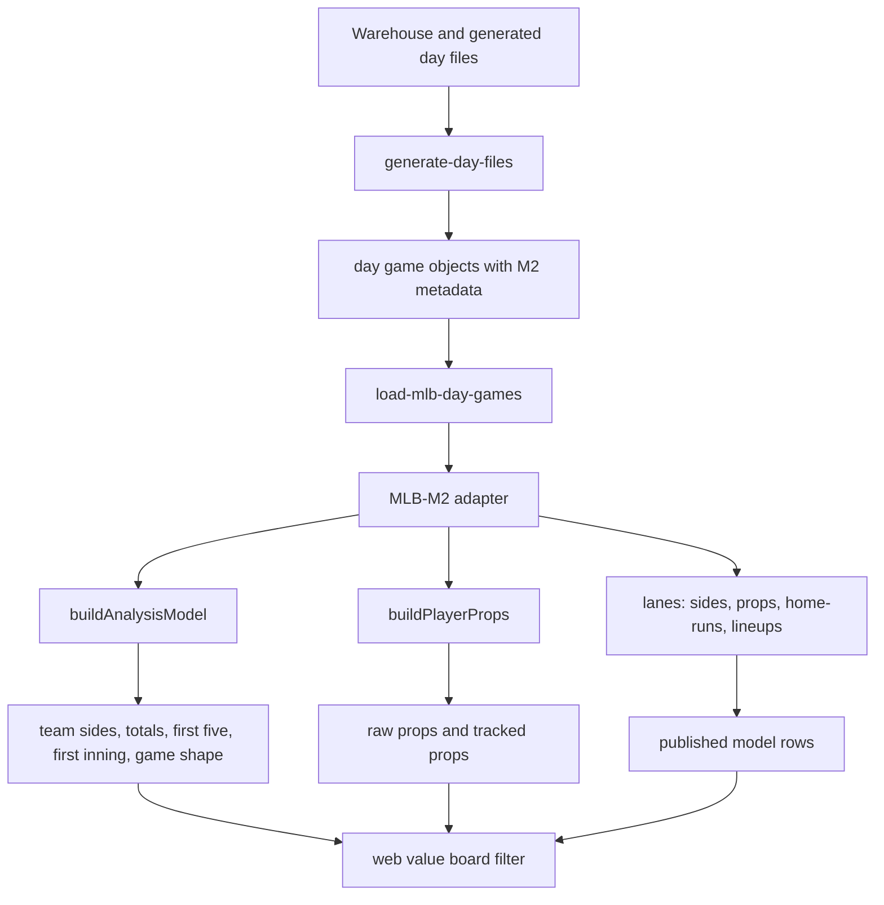

# M2 Bet Audit Index

Date folder: `061226`

Workspace basis: current local code under `models/mlb/cartridges/MLB-M2`, `pipeline/lib/load-mlb-day-games.mjs`, and the web value-board adapter code. This audit describes what the model does right now, not what we intend it to do after the next round of model work.

## What this audit is answering

This audit traces how every current M2 bet surface is calculated:

- Team moneyline and side confidence.
- Full-game totals, first-five totals, late scoring shape, and first-inning YRFI/NRFI.
- Batter props, pitcher strikeout props, tracked prop rows, and batter value-board rows.
- Home run candidates and HR board rows.
- Value-board publication, ranking, gating, and hidden research-only rows.
- Shared factors: starter, bullpen, RP2, lineup, market, weather, park, umpire, late-start visibility, team form, batter splits, Statcast, and H2H-like matchup context.

## Split documents

- `bet_audit_01_data_pipeline_and_shared_context.md`
  - How games, odds, lineups, addendums, ENV1, RP2, FanGraphs-derived data, FIC-derived data, and generated files enter M2.
- `bet_audit_02_team_sides_confidence_and_game_shape.md`
  - Moneyline side scoring, team confidence, volatility, ranking, Tier 1 controls, efficient-favorite lane, flip-risk lane, and game-shape lens.
- `bet_audit_03_totals_first_five_first_inning_environment.md`
  - Full totals, first-five totals, late-total logic, total chaos gates, first-five tail overlay, first-inning YRFI/NRFI, park/weather/umpire/late-start handling.
- `bet_audit_04_player_props_and_batter_h2h.md`
  - Batter props, tracked prop board, pitcher strikeout props, batter H/R/RBI style rows, matchup inputs, and the current batter-vs-pitcher H2H gap.
- `bet_audit_05_home_runs_batter_value_rows.md`
  - Home run prototype, Savant/lineup/park/weather/starter factors, HR board generation, and batter value-board row scoring.
- `bet_audit_06_value_board_publication_and_gaps.md`
  - What is actually allowed onto the value board, what the UI filters, what is research-only, and what is still missing or shadow-only.

## High-level flow

## Biggest current truths

1. M2 is a layered scoring engine today, not one trained end-to-end ML model.
   - Side scores are weighted signal blends.
   - Confidence is a formula built from model edge, signal coverage, market agreement, market support, contextual confidence modifiers, MLB decision indicators, and Tier 1 controls.
   - Totals are projection plus veto/gate logic, not only projected runs minus posted line.
   - Props are expected-value estimates plus support/tracking gates.

2. The value board is supposed to be a filter, not a calculator.
   - The model should own rows before they appear as betting recommendations.
   - The web layer can rank, hide, or group rows, but should not invent bet-grade rows from raw projection fields.

3. ENV1 and RP2 are already consumed by M2 as addendum contexts.
   - ENV1 contributes park, weather, umpire, HR force, run deltas, HR deltas, and late-start visibility multipliers.
   - RP2 contributes relief projection and late-game bridge stress.
   - M2 consumes the normalized addendum output. It does not directly scrape FanGraphs or FIC inside the scoring files.

4. Exact first-reliever identity is still shadow-only.
   - `buildRp2BullpenChainContext` marks RP2 chains as `projectionOnly: true`.
   - It also marks `identityConfidence: "low"`.
   - The chain can affect team/bullpen context, but the exact first reliever should not be treated as high-confidence.

5. Batter-vs-pitcher H2H is not fully implemented the way requested.
   - M2 uses handedness, split rates, pitch-type fit, opponent context, starter profile, lineup fit, and matchup grades.
   - It does not currently enforce the rule: "if batter vs pitcher has more than 5 at-bats, adjust hits, runs, bases, RBI, HR, OPS, and pitcher allowed stats accordingly."
   - That is a real gap and should be treated as not yet active.

6. First-five O/U has a special caution.
   - Model notes say first-five O/U was downgraded to research-only after a May 31 failure.
   - Current code still computes first-five total projections and leans.
   - Bet-grade promotion must be treated carefully unless the lane explicitly publishes a gated model-owned row.

## Active vs shadow vs research-only

| Layer | Active in scoring | Active on board | Shadow/research caveat |
| --- | --- | --- | --- |
| Moneyline sides | Yes | Yes | Haircut by volatility, late stability, relief risk, lineup status, Tier 1 controls |
| Full-game totals | Yes | Conditionally | Chaos gates can convert lean to Pass |
| First-five totals | Computed | Restricted | Model notes call first-five O/U research-only unless explicitly published by cartridge |
| First-inning YRFI/NRFI | Yes | Conditionally | NRFI has stronger shadow-calibration note than YRFI |
| Batter tracked props | Yes | Yes | HR and hits are disabled in tracked prop board |
| Pitcher K props | Yes, from market snapshots | Yes | Requires line edge, lineup context, workload, K-rate inputs |
| Home runs | Yes, separate prototype lane | Yes as HR scope | High variance, uses candidate bands and HR board labels |
| Batter H/R/RBI rows | App/value layer | Yes when gates pass | Not the same as hard BvP >5 AB adjustment |
| RP2 exact first reliever | Partial context only | No as exact identity | Explicitly low-confidence/shadow |
| ENV1 park/weather/umpire | Yes | Indirectly | Consumed as normalized addendum, not raw-source scraping |
| RF lens | Totals/game-shape check | Not direct picker | Research lens, not direct moneyline picker |

## Audit standard used

For each bet type, the audit identifies:

- Entry point and files.
- Input fields.
- Formula or scoring path.
- Gates and vetoes.
- Confidence calculation.
- Board publication rules.
- Current gaps.

## Most important implementation files

- `models/mlb/cartridges/MLB-M2/lib/analysis-model.js`
- `models/mlb/cartridges/MLB-M2/lib/mlb-analysis-context.js`
- `models/mlb/cartridges/MLB-M2/lib/mlb-decision-indicators.js`
- `models/mlb/cartridges/MLB-M2/lib/mlb-side-controls.js`
- `models/mlb/cartridges/MLB-M2/lib/mlb-props.js`
- `models/mlb/cartridges/MLB-M2/lib/mlb-simulation.js`
- `models/mlb/cartridges/MLB-M2/lib/mlb-game-shape.js`
- `models/mlb/cartridges/MLB-M2/lanes/generate-day-files.mjs`
- `models/mlb/cartridges/MLB-M2/lanes/props.mjs`
- `models/mlb/cartridges/MLB-M2/lanes/home-runs.mjs`
- `models/mlb/cartridges/MLB-M2/lanes/sides.mjs`
- `pipeline/lib/load-mlb-day-games.mjs`
- `models/mlb/app-model.js`
- `models/mlb/cartridges/MLB-M2/MODEL_NOTES.md`

