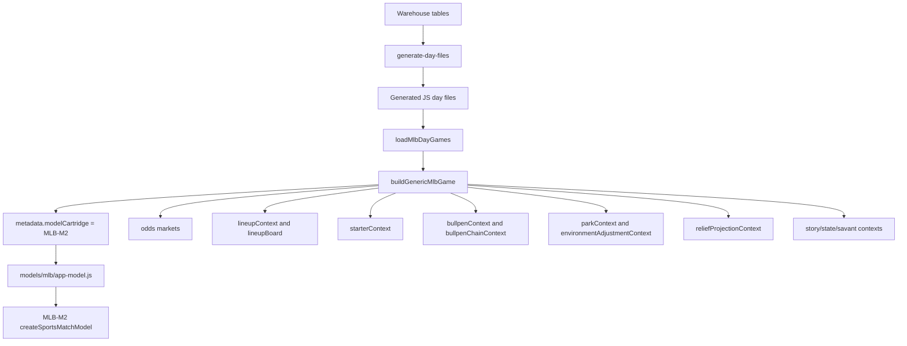

# M2 Bet Audit: Data Pipeline And Shared Context

This document audits how M2 gets the data that every bet type depends on.

## Core entry path

## Loader behavior

The active runtime entry path is `pipeline/lib/load-mlb-day-games.mjs`.

The loader does this:

1. It asks `models/mlb/app-model.js` which MLB model is active.
2. It tries to load games from the database via `models/mlb/db/day-games.mjs`.
3. If database loading returns games, those games are used.
4. If database loading fails or returns no games, it falls back to generated JS day files:
   - `web/src/lib/day-${date}-data.js`
   - `web/src/lib/mlb-context-${date}.js`
   - `web/src/lib/day-${date}-lineups.js`
   - optional `web/src/lib/day-${date}-reliever-shadow.js`
   - optional `web/src/lib/mlb-story-context-${date}.js`
5. It builds a generic game object with all M2 metadata attached.

The active adapter is selected in `models/mlb/app-model.js`.

For M2, the adapter is:

- `models/mlb/cartridges/MLB-M2/lib/sports-model.js`
- export: `createSportsMatchModel`
- core builder: `buildAnalysisModel`
- prop builder: `buildPlayerProps`

## Day-game metadata attached to every game

`buildGenericMlbGame` attaches the fields that later scoring code consumes:

| Field | What it holds | Used by |
| --- | --- | --- |
| `metadata.modelCartridge` | Active cartridge name, expected `MLB-M2` | App model routing, board labeling |
| `metadata.parkContext` | Park and run environment metadata | Hit projection, run conversion, totals, HR |
| `metadata.environmentAdjustmentContext` | ENV1 addendum output | Totals, HR/run force, park/weather/umpire/visibility |
| `metadata.offenseContext` | Team offense context | Side signals, projected hits, run conversion |
| `metadata.bullpenContext` | Team bullpen summaries | Side signals, projected hits/runs |
| `metadata.bullpenChainContext` | Likely bullpen chain | Side signals, late stability, relief risk |
| `metadata.relieverShadowContext` | Reliever shadow context if generated | Research/shadow relief context |
| `metadata.reliefProjectionContext` | RP2 addendum output | Bridge stress, projected relief adjustment, late totals |
| `metadata.savantContext` | Statcast/team quality context | Side signals, projected hits, props |
| `metadata.storyContext` | Team story priors | Side signals and volatility modifiers |
| `metadata.stateContext` | Team state and trend snapshots | Decision indicators and traps |
| `metadata.lineupContext` | Daily lineup fit context | Sides, totals, props, HR, batter rows |
| `metadata.lineupBoard` | Published lineup board context | Weather, market, lineups, batter rows |
| `metadata.starterContext` | Listed starter profiles and recent form | Sides, totals, props, first inning |
| `metadata.odds` | Market prices and totals | Market signal, side confidence, totals lines |

## Generated day files and warehouse relationship

The generation lane is `models/mlb/cartridges/MLB-M2/lanes/generate-day-files.mjs`.

Important behavior:

- It loads base games and odds.
- It loads addendum contexts using `loadMlbAddendumContextsFromDb(date)`.
- It attaches `parkContext`.
- It attaches `environmentAdjustmentContext`.
- It attaches `reliefProjectionContext`.
- It adds model metadata:
  - `metadata.addendums.environmentAddendum = "MLB-ENV1"` when ENV1 exists.
  - `metadata.addendums.reliefProjectionAddendum = "MLB-RP2"` when RP2 exists.

The addendum lookup prefers `gamePk` first, then local game id.

## What M2 consumes from FanGraphs-derived work

M2 does not directly scrape FanGraphs during scoring.

The current scoring path consumes normalized warehouse/addendum fields that can be sourced upstream from FanGraphs, RosterResource, or other ingestion jobs:

- `reliefProjectionContext`
  - RP2 relief projection.
  - Candidate relievers.
  - Team relief risk.
  - Late bridge pressure.
  - Expected bullpen adjustment.
- `bullpenChainContext`
  - Legacy or RP2-built top reliever chain.
  - Availability and fatigue.
  - Role and bridge suitability.
- `starterContext`
  - Starter recent form and leash where warehoused.
- `lineupContext`
  - Daily lineup and pitcher-vs-lineup fit when generated.

FanGraphs advanced reliever data such as FIP, xFIP, SIERA, WAR, WPA/LI, K-BB%, GB%, HR/FB, and split-specific reliever quality should be treated as upstream warehouse features unless they are explicitly present inside the normalized contexts. The current M2 formula files do not directly reference those raw FanGraphs columns by name.

## What M2 consumes from FIC-derived work

M2 does not directly scrape FIC inside the scoring formulas.

The current path is:

- FIC Umpire Factors and HR force should be warehoused upstream.
- ENV1 normalizes that into `environmentAdjustmentContext`.
- M2 consumes the normalized values:
  - HR force.
  - effective HR force.
  - run deltas.
  - HR deltas.
  - umpire identity.
  - umpire zone/run/SO/walk tendencies.
  - dome or N/A context.

Important current rule encoded in ENV interpretation:

- HR force `>= 1.4` is treated as high carry unless dome/N/A context says otherwise.
- Dome/N/A contexts are treated as lower weather carry in the current environment-total context.
- User note: N/A often means dome parks. The current model treats dome/N/A as lower weather carry, not as unknown high carry.

## RP2 bullpen chain creation

`pipeline/lib/load-mlb-day-games.mjs` can build a bullpen chain from RP2 output via `buildRp2BullpenChainContext`.

For each team, it maps `reliefProjectionContext.candidates` into top relievers and marks:

- `source: "MLB-RP2"`
- `projectionOnly: true`
- `identityConfidence: "low"`
- note: exact first-up reliever identity remains shadow-only.

That means RP2 can affect:

- Bullpen follow-through.
- Likely bridge chain.
- Late stability.
- Relief pitching risk.
- Totals chaos and late-run context.

But it should not be read as:

- A high-confidence exact first-reliever prediction.
- A directly bettable "first reliever" market.

## Legacy bullpen chain and fatigue logic

`generate-day-files.mjs` also builds a legacy bullpen chain from bullpen usage and pitcher appearances.

Important logic:

- It filters out likely starters.
- It filters out relievers with average outs above the starter-like threshold.
- It ranks relievers by likelihood, availability, bridge role, expected outs, and fatigue.
- It builds a reset profile for heavy recent usage.

Heavy-use reset inputs:

- Days since last appearance.
- Last appearance pitch count.
- Recent last-three-game load.
- Worked yesterday flag.
- Back-to-back flag.
- Team and pitcher quick-reuse history.
- Adaptive heavy-pitch threshold clamped roughly around 30 to 42 pitches.

If a reliever has a high heavy-use reset flag, the chain removes him from ranking if there are other candidates.

This is the part that implements the practical rule that a reliever who threw roughly 20 to 40-plus pitches is more likely to rest. It is not yet a fully trained first-reliever identity model.

## Starter context

Starter context is built and consumed in several forms:

- Listed starter data from the day game.
- Season ERA, WHIP, K/9, BB/9, HR/9, hits/9.
- Win/loss record.
- Current and prior WAR when available.
- Recent form from recent starts.
- Leash score.
- First-inning season/recent tendencies.
- Third-time-through and fatigue profiles where available.

Starter profile labels include:

- Unknown sample.
- Power.
- Volatile bat-misser.
- Contact suppressor.
- Craft.
- Traffic-risk.
- Strike-throwing.

Starter profile affects:

- Side signals.
- Projected hits.
- Run conversion.
- First-five scoring.
- First inning.
- Pitcher strikeout props.
- Batter props.
- Home run candidates.

## Lineup context

Lineup context is one of the highest-impact shared contexts.

It contributes:

- Lineup status: posted, partial, pending.
- Batter slot.
- Handedness.
- Platoon pressure.
- Top-third score.
- Middle/depth score.
- Matchup grades.
- Pitch-type pressure index.
- Bullpen pitch-type pressure index.
- Starter threat count.
- Contact/power/patience/form aggregates.
- Team script and traffic estimates.
- Batter row summaries.

Lineup context affects:

- Side signal `Lineup-vs-pitching fit`.
- Projected hit profiles.
- First-inning run probability.
- Prop expected plate appearances.
- Batter prop confidence.
- HR candidate scoring.
- Batter value-board rows.

Lineup status is also a gate:

- Posted lineups increase prop support.
- Partial lineups receive smaller penalties.
- Pending lineups receive larger penalties.
- Team side confidence and ranking can be haircut for incomplete lineup confidence.

## Market context

Market inputs enter through:

- Moneyline odds.
- Posted full-game total.
- Posted first-five total when available.
- Prop market snapshots, especially pitcher strikeouts.
- Kalshi or other mapped asks in app-level value rows when present.

Market context is used for:

- Side market signal.
- Side confidence agreement bonus.
- Side market support term.
- Favorite/underdog classification.
- Total line comparison.
- First-five total line derivation.
- Prop line edge for pitcher strikeouts.
- Value-board payoff/playable checks.

The model does not simply follow market prices. Market is one signal and one confidence modifier.

## Environment context

Environment context enters in two layers.

First, direct weather and park data from lineup board and park context:

- Temperature.
- Wind speed.
- Wind direction.
- Precipitation.
- Dome/roof context.
- Park run index.
- Park wOBA index.
- Park HR index.

Second, ENV1 normalized addendum:

- HR force.
- Effective HR force.
- Weather run delta.
- Weather HR delta.
- Park run delta.
- Park HR delta.
- Total runs delta.
- Runs multiplier.
- HR multiplier.
- Umpire factors.
- Late-start visibility multipliers.

Environment affects:

- Projected hit volume.
- Run conversion rates.
- Full totals.
- First-five totals.
- Late totals.
- First inning.
- HR candidates.
- Total chaos gates.
- Side confidence indirectly through game shape and volatility.

## State and story context

State context can include:

- Win/loss streaks.
- Close losses.
- Snapback pressure.
- Improving contact.
- Quiet-start patterns.
- Run clustering.
- Mistake chaos.
- Dead-bat traffic.
- Traffic without conversion.
- Team first-inning tendencies.

Story context contributes:

- Offense sustainability.
- Lineup momentum.
- Starter trajectory.
- Bullpen trust.
- Call-up energy.
- Variance penalty.

These are not decoration. They feed:

- Team story signal.
- Volatility modifiers.
- MLB decision indicators.
- Tier 1 traps and veto flags.
- Game-shape labels.

## Important current gaps at data level

1. Direct batter-vs-pitcher table use is incomplete.
   - M2 uses matchup grades, splits, handedness, pitcher profile, pitch type, and opponent context.
   - It does not currently look up a direct BvP row and apply a hard "more than 5 AB" adjustment.

2. FanGraphs advanced reliever metrics are not visibly referenced by raw column name inside M2 scoring code.
   - If they are warehoused, they need to be normalized into `reliefProjectionContext`, `bullpenContext`, or `bullpenChainContext` to affect M2.

3. FIC umpire factors are consumed only after normalization.
   - The scoring layer expects ENV1 fields. It does not independently validate the raw FIC page.

4. Exact first reliever is still low-confidence.
   - RP2 candidates are useful for bridge stress and team bullpen effects.
   - Exact identity should remain shadow until a trained model clears backtest targets.

5. Value-board rows must be checked for model ownership.
   - The UI has helper logic, but model notes say rows should be cartridge-published before bet-grade promotion.

