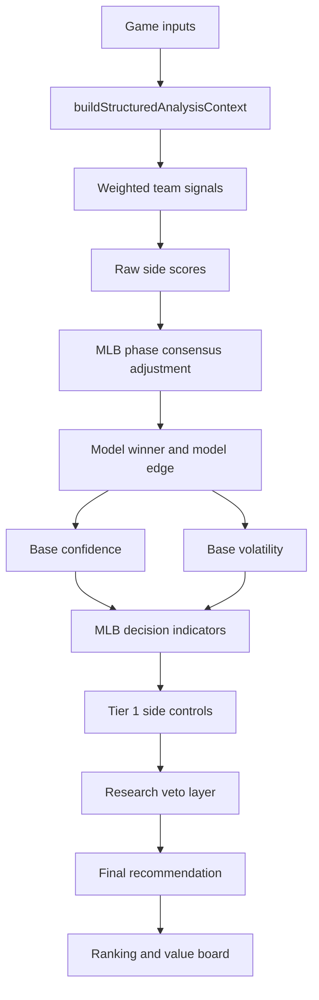

# M2 Bet Audit: Team Sides, Confidence, And Game Shape

This document audits the moneyline/team-side calculation, including confidence, volatility, Tier 1 controls, efficient favorites, flip-risk detection, and game-shape context.

## Main files

- `models/mlb/cartridges/MLB-M2/lib/analysis-model.js`
- `models/mlb/cartridges/MLB-M2/lib/mlb-analysis-context.js`
- `models/mlb/cartridges/MLB-M2/lib/mlb-decision-indicators.js`
- `models/mlb/cartridges/MLB-M2/lib/mlb-side-controls.js`
- `models/mlb/cartridges/MLB-M2/lib/pick-rankings.js`
- `models/mlb/cartridges/MLB-M2/lib/mlb-game-shape.js`

## Side model overview



## Team-side signals

M2 builds a set of team signals. Each signal has a label, a score for each team, a weight, and source notes.

The important signals are:

| Signal | Weight | Main inputs | Meaning |
| --- | ---: | --- | --- |
| Market price | shared market weight | Moneyline/no-vig probability | What the market implies |
| Standings profile | 0.14 | Win pct, division rank, run differential, division leader flag, streak, games back | Team quality baseline |
| Hit-production baseline | 0.14 | Baseline hits, home/away split hits, last-three hit form | Team hit volume profile |
| Bullpen follow-through | 0.13 | Bullpen ERA, WHIP, K/BB | How well team can finish after starter |
| Likely bridge chain | 0.11 | Top reliever chain, availability, bridge score, fatigue, expected outs | Late-inning chain quality |
| Team story context | 0.10 | Offense sustainability, lineup momentum, starter trajectory, bullpen trust, call-up energy, variance | Narrative/state prior converted into score |
| Statcast contact quality | 0.10 | BA, xBA, hard-hit pct, barrel pct, xwOBA | Contact quality and expected quality |
| Lineup-vs-pitching fit | 0.14 | Posted lineup, handedness, platoon, pitch-type pressure, starter arsenal, reliever arsenal | Daily batter vs pitcher fit |
| Starter record | 0.16 | Starter win pct and decisions | Starter result baseline |
| Starter ERA | 0.23 | Starter ERA | Run prevention quality |
| Strikeout ceiling | 0.09 | Starter strikeouts | Starter bat-missing ceiling |
| Recent starter form | 0.11 when present | Recent starts | Starter current form |
| Projected hit volume | 0.19 | M2 projected full-game hits and hit efficiency | Model hit expectation |
| Home field | 0.07 | Home/away | Small venue/last-at-bat adjustment |

The side score is a weighted average of these signal scores.

## Standings profile formula

The score is approximately:

```text
26
+ winPct * 56
+ (6 - divisionRank) * 3
+ clamp(runDifferential, -80, 80) / 5
+ 6 if division leader
+ streak * 1.2
- gamesBack * 0.8
```

Then it is clamped to the model's standings range.

## Hit-production baseline formula

If the feed is stale, the model avoids overtrusting it.

Otherwise:

```text
score =
48
+ (baselineHits - 7.8) * 10
+ (splitHits - 7.8) * 7
+ (recentHits - baselineHits) * 8
```

This is clamped into a usable range.

## Bullpen follow-through formula

The bullpen signal blends:

```text
ERA score  = clamp(96 - bullpenERA * 11)
WHIP score = clamp(114 - bullpenWHIP * 35)
KBB score  = clamp(28 + KBBRatio * 18)

bullpenScore = ERA score * 0.46 + WHIP score * 0.34 + KBB score * 0.20
```

This is team bullpen quality, not exact first-reliever prediction.

## Likely bridge chain formula

For the top two likely relievers:

```text
relieverScore =
firstRelieverLikelihood * 0.24
+ availability * 0.31
+ bridgeScore * 0.31
+ expectedOuts * 4.2
+ roleBonus
- fatiguePenalty
```

Role bonus:

- Bridge role: about +4.
- Closer or setup: about +2.

Fatigue penalty:

- Worked yesterday: about -6.
- Back-to-back: about -10.
- Additional rank/fatigue penalty by index.

Team bridge score:

```text
primaryRelieverScore * 0.62 + secondaryRelieverScore * 0.38
```

Recent bullpen summaries can adjust this if enough recent sample exists.

Important caveat:

- RP2 can populate this context.
- Exact reliever identity remains low-confidence/shadow.

## Lineup-vs-pitching fit formula

The signal starts around 50 and adjusts by daily lineup fit:

```text
score =
50
+ averageMatchupGrade * 2.8
+ (platoonCount - 6) * 1.7
+ (powerCount - 2) * 1.2
+ (contactCount - 1) * 1.1
+ (pitchTypePressureIndex - 50) * 0.24
+ (bullpenPitchTypePressureIndex - 50) * 0.12
+ (heaterCount - 2) * 1.0
- suppressorCount * 0.8
+ (topThirdScore - 50) * 0.12
+ (depthScore - 50) * 0.08
```

This is where daily handedness and pitcher-vs-lineup fit matter most for sides.

Current limitation:

- This is not a hard batter-vs-pitcher historical AB rule.
- It is a matchup-fit score based on lineup, handedness, pitch type, and related profiles.

## Starter signals

Starter score includes:

- Record score.
- ERA score.
- Strikeout score.
- Recent form.
- WAR and WAR trend where available.
- Leash and hold context in later decision indicators.

Starter profile labels affect downstream interpretation:

- Power starter.
- Contact suppressor.
- Traffic-risk starter.
- Volatile bat-misser.
- Craft starter.
- Strike-throwing starter.
- Unknown sample.

## Projected hit volume signal

Projected hit volume is built in the shared context and then passed back into side scoring.

It includes:

- Team baseline hits.
- Home/away split hits.
- Recent hit form.
- Statcast quality.
- Daily lineup pressure.
- Opposing starter traffic profile.
- Opposing bullpen profile.
- Park run/wOBA context.
- Weather.
- ENV1 hit/run context.
- RP2 late relief adjustment.
- Sun/visibility context.

The side signal then converts projected hits and hit efficiency into a score.

## MLB underdog phase adjustment

After raw side scores are built, M2 can adjust an underdog if the favorite's projected hit and phase profile is weak.

The underdog can receive support when:

- Favorite projected hit gap is negative.
- Favorite first-five gap is negative.
- Favorite late gap is negative and favorite bullpen gap is also negative.

The adjustment is capped and only nudges the side score. It does not automatically flip the bet.

## Phase consensus adjustment

M2 checks whether key phases all agree:

- Full-game edge team.
- First-five edge team.
- Late edge team.
- Bridge edge team.

If they all point to the same side and the raw model edge is still small, M2 can bump that consensus side. This helps avoid a small raw-score loss when all baseball-specific phases point in the same direction.

## Model winner and edge

After all side score adjustments:

```text
modelWinner = team with higher adjusted side score
modelEdge = winnerScore - loserScore
```

That edge is one ingredient in confidence. It is not the whole confidence.

## Base confidence formula

The core confidence formula is:

```text
baseConfidence =
50
+ modelEdge * 0.95
+ coverageBonus
+ agreementBonus
+ abs(marketSupport - 0.5) * 12
+ context.confidenceModifier
```

Then it is clamped between roughly 52 and 89.

Where:

- `coverageBonus = min(6, signalCount)`.
- `agreementBonus = +5` if market winner matches model winner.
- `agreementBonus = -3` if market winner disagrees with model winner.
- `agreementBonus = 0` if no usable market winner exists.
- `marketSupport` is the market probability for the model winner when available, otherwise about 0.5.
- `context.confidenceModifier` comes from the structured context.

This means confidence is not just "how much M2 likes the team." It also reflects:

- Signal coverage.
- Market alignment.
- Market distance from coinflip.
- Contextual confidence.

## Base volatility formula

Volatility starts from context and market tightness:

```text
marketTightness =
if market probabilities exist:
  (1 - abs(probA - 0.5) * 2) * 12
else:
  4

baseVolatility =
context.volatilityBase / 52
+ marketTightness
+ sum(volatilityModifierDeltas)
- modelEdge * 0.5
+ 6 if fewer than 3 signals
```

Then it is clamped into the model volatility range.

Volatility gets higher when:

- Market is tight.
- Signal count is thin.
- Context flags are noisy.
- Model edge is weak.

Volatility gets lower when:

- Model edge is stronger.
- Context is cleaner.
- Market is less coinflippy.

## MLB decision indicators

`buildMlbDecisionIndicators` takes the side pick and computes baseball-specific risk indicators.

Important indicators:

| Indicator | Inputs | Why it matters |
| --- | --- | --- |
| Starter leverage index | Starter score gap, projected hit edge, starter hold gap, opponent lineup pressure | Detects whether the pick depends too much on the starter |
| Late-inning stability index | Bullpen gap, bullpen chain gap, opponent bullpen pitch pressure, volatility, projected hit edge | Detects whether the bet can survive the bullpen phase |
| Relief pitching risk | Opponent bullpen/chain edge, starter gap, leash gap, hit edge against pick, low model edge, high volatility | Measures bullpen fragility |
| Coinflip pressure | Leash uncertainty, lineup pressure, bullpen pressure, bounceback/state risk, weak edge, high volatility | Measures whether a side is being overcalled in a coinflip game |
| Projected hit edge | Pick projected hits minus opponent projected hits | Checks whether side pick matches hit-volume projection |
| Lineup confidence | Posted/partial/pending lineups | Haircuts confidence when lineups are not secure |
| Stateful traps | Snapback, heat regression, quiet start, series carryover, bullpen mismatch | Adds warnings or haircuts |

The indicators can change:

- Confidence.
- Volatility.
- Tier.
- Notes.
- Veto flags.

## Current late-stability sign caveat

The late-inning stability formula currently subtracts `bullpenChainGap` in one branch:

```text
lateInningStabilityIndex =
50
+ bullpenGap * 1.3
- bullpenChainGap * 0.95
- opponentBullpenPitchPressure adjustment
+ pick defensive pressure adjustment
- high base volatility adjustment
- hit-edge-against-pick adjustment
```

This is listed here because the audit is describing what the code does. If `bullpenChainGap` is defined as pick chain minus opponent chain, subtracting it can be counterintuitive. That should be reviewed before relying too hard on this exact indicator.

## Tier 1 side controls

`applyMlbTierOneControls` is the primary side-bet safety layer.

It can haircut:

- Model edge.
- Confidence.
- Volatility.
- Tier.
- Selection.

Major flags:

| Flag | Trigger shape | Effect |
| --- | --- | --- |
| High-volatility edge pass | High volatility, big edge, weak late stability or starter overdependence | Can force Pass |
| Starter-late fragility | Strong starter signal but weak late stability | Edge/confidence haircut |
| Thin support high edge | Big model edge with too few favored signals | Edge/confidence haircut |
| Negative leash gap big edge | Pick has worse leash profile despite edge | Edge/confidence haircut |
| Stateful opponent snapback | Opponent bounceback/snapback pressure | Edge/confidence/volatility adjustment |
| Tier-three bullpen mismatch | Bullpen command/quality mismatch | Edge/confidence haircut |
| Expensive favorite danger | Favorite is too priced-up with volatility/late/state risk | Confidence and tier haircut |
| Underdog needs proof | Dog lacks starter/late/support proof | Confidence and tier haircut |
| Moderate favorite clean | Reasonable favorite with clean profile | Small confidence lift |

Risk points are counted from factors like:

- Volatility.
- Model edge.
- Late stability.
- Starter leverage.
- Coinflip pressure.
- Relief risk.
- Signal count.

High risk points can demote a side even if the side has a good raw score.

## Research veto flags

The side model has research veto flags that can force Pass.

Examples:

- Heavy favorite with weak lineup conversion.
- Heavy favorite with noisy bullpen.
- Dead-early risk.
- Quiet-first-three full-game risk.
- Cluster/bullpen trap.
- Protected market dog context.

If active research vetoes exist, the final tier is Pass.

This is important because the model can still show a side it likes internally while refusing to publish it as bet-grade.

## Final recommendation score

After confidence, volatility, and edge are finalized:

```text
recommendationScore =
finalConfidence * 0.60
+ (100 - finalVolatility) * 0.22
+ finalModelEdge * 0.18
```

This score is used for ranking, but board eligibility is still gated by tier, volatility, confidence, stale feeds, and safety checks.

## Ranking logic

`rankAnalysisPicks` ranks analysis picks by safety and quality.

MLB safety penalties include:

- Volatility above 60.
- Coinflip pressure above 34.
- Late stability below 56.
- Relief risk above 48.
- Model edge below 6.
- Swingy or Pass tier.
- Tier 1 pass.
- Tier 1 risk points.
- Starter/late split.
- Stale offense or bullpen feed.
- Incomplete lineups.
- Favorite with high volatility.
- Favorite with lower confidence and high volatility.

Core eligibility generally requires:

- Not stale.
- Not Pass.
- Volatility not too high.
- Coinflip pressure not too high.
- Late stability not too low.
- Confidence at least mid-60s.
- Model edge above a minimum.
- No Swingy/Pass tier.
- Risk points not too high.

The ranking formula is therefore not just "highest confidence wins."

## Efficient favorite lane

The efficient-favorite layer looks for playable favorites that are not too expensive and not unstable.

Positive ingredients:

- Favorite probability in a moderate range.
- Strong starter leverage.
- Strong enough late stability.
- Low enough relief risk.
- Good lineup conversion.
- Low dead-bat traffic.
- Enough signals.
- Confidence and edge above minimum.

Blockers:

- Not a favorite.
- Active veto.
- Tier 1 pass.
- Very low favorite probability.
- Too expensive of a favorite.
- High volatility.
- Too much snapback risk.
- Late fragility.
- Weak conversion.
- Quiet-start or dead-traffic flags.

This lane is meant to identify favorites that are efficient rather than simply popular.

## Flip-risk lane

The flip-risk lane is separate from the side recommendation.

It identifies games where the favorite may be vulnerable or the underdog may be live.

Inputs include:

- Favorite/underdog market shape.
- Market tightness.
- Volatility.
- Low side confidence.
- Low model edge.
- Relief risk.
- Coinflip pressure.
- Starter-late split.
- Dog odds range.
- Whether the model already likes the dog.

Flip risk is not automatically a bet. It is a warning or alternate-lane signal.

## Game-shape lens

`mlb-game-shape.js` builds a baseball shape around the game:

- Pressure.
- Chaos.
- Freeze.
- Air.
- Bridge.
- Flow.

Shape labels include:

- Crooked-inning chaos.
- Dead-early grind.
- Starter/late split.
- Bullpen-flip game.
- Starter-control lane.
- Balanced traffic game.

This lens is used to explain and sanity-check which bet families fit a game:

- Weather/air chaos can support totals or HR clusters.
- Dead-early grind can warn against early overs.
- Bullpen-flip game can warn about full-game side risk.
- Starter-control lane can support NRFI/first-five/side shapes, depending on line and context.

## RF research lens

The RF lens is not a direct picker for sides.

Current notes from the code:

- Moneyline RF baseline exists but is not deployable as a standalone picker.
- First-five RF baseline exists but is not deployable as a standalone picker.
- Totals RF lens is more deployable as a totals/game-shape check.
- First-inning RF lens is not direct-pick deployable.

So if a board row says M2 likes a moneyline, that should come from M2 structured scoring and controls, not simply RF output.

## Side bet factor checklist

A current M2 side bet can account for:

- Market price.
- Team record and standings.
- Run differential.
- Recent streak.
- Hit production baseline.
- Home/away hit split.
- Recent hit form.
- Bullpen ERA.
- Bullpen WHIP.
- Bullpen K/BB.
- Likely bullpen bridge chain.
- Reliever availability and fatigue.
- RP2 relief context if attached.
- Team story priors.
- Team state trends.
- Statcast contact quality.
- Daily lineup status.
- Lineup handedness and matchup fit.
- Pitch-type pressure.
- Starter record.
- Starter ERA.
- Starter strikeout ceiling.
- Starter recent form.
- Starter leash and hold context.
- Projected hit volume.
- Projected first-five and late phase edges.
- Home-field context.
- Park context.
- Weather context.
- ENV1 context.
- Umpire context indirectly through ENV1 totals/game shape.
- Late-start visibility indirectly through projected hits/runs and environment context.
- Volatility.
- Coinflip pressure.
- Relief pitching risk.
- Tier 1 safety controls.
- Research veto flags.

## Side bet factors not fully active

- Hard batter-vs-pitcher AB threshold.
- Direct raw FanGraphs advanced reliever metric references inside side scoring.
- Exact first-reliever identity as high-confidence.
- End-to-end trained ML side prediction.

