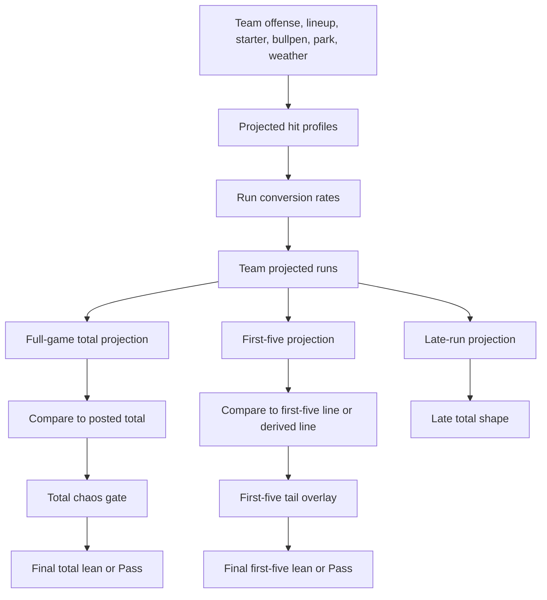
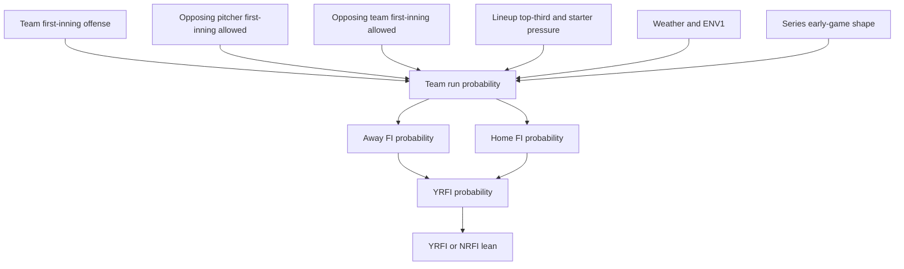

# M2 Bet Audit: Totals, First Five, First Inning, And Environment

This document audits full-game totals, first-five totals, late scoring shape, first-inning YRFI/NRFI, and the park/weather/umpire/late-start factors that feed them.

## Main files

- `models/mlb/cartridges/MLB-M2/lib/mlb-analysis-context.js`
- `models/mlb/cartridges/MLB-M2/lib/analysis-model.js`
- `models/mlb/cartridges/MLB-M2/lib/mlb-game-shape.js`
- `models/mlb/cartridges/MLB-M2/lib/mlb-simulation.js`
- `models/mlb/cartridges/MLB-M2/MODEL_NOTES.md`

## Total calculation overview



## Posted lines

M2 looks for:

- Full-game total from game odds.
- Full-game total from lineup-board market context if needed.
- First-five total from markets labeled first five/1st 5.
- First-five total from lineup-board fields if available.

If no first-five total line is available, M2 derives one from the full-game total and projected first-five share.

Late total line is then derived as:

```text
lateTotalLine = postedFullGameTotal - derivedFirstFiveTotalLine
```

## Projected hit profiles

Projected team hits are the backbone of totals.

For each team, M2 estimates:

- Full-game projected hits.
- First-five projected hits.
- Late projected hits.
- Hit efficiency.
- Lineup confidence.

Inputs include:

| Factor | How it affects projected hits |
| --- | --- |
| Team baseline hits | Starting team hit volume |
| Home/away split hits | Adjusts for venue context |
| Recent last-three hit form | Captures short-term trend |
| Statcast BA/xBA | Raises or lowers expected hit quality |
| Statcast hard-hit pct | Adds contact authority |
| Statcast barrel pct | Adds extra-base/HR pressure |
| Statcast xwOBA | Adds overall expected offensive quality |
| Daily lineup matchup grade | Direct daily lineup fit |
| Platoon pressure | Handedness fit vs starter |
| Pitch-type pressure | Fit vs starter arsenal |
| Bullpen pitch-type pressure | Fit vs likely reliever mix |
| Opposing starter hits/9 | Adds traffic allowed by starter |
| Opposing starter WHIP | Adds baserunner traffic |
| Opposing starter BB/9 | Adds reach/pressure context |
| Opposing starter K/9 | Suppresses balls in play |
| Starter recent form | Recent hits/ER/HR/WHIP/short-start/QS |
| Starter WAR and WAR trend | Quality adjustment |
| Opposing bullpen ERA/WHIP | Late traffic adjustment |
| Bullpen chain score | Late bridge adjustment |
| Park run/wOBA index | Venue hit/run shape |
| Weather | Temperature, wind, precipitation, dome |
| ENV1 | HR force, weather/park deltas, multipliers |
| RP2 | Late relief adjustment and bridge stress |
| Sun/visibility | Late start hit/HR/run multipliers |

The model estimates first-five coverage by starter and then late hits by bullpen phase.

## Starter phase coverage

Starter coverage controls how much of the first-five projection is assigned to the starter.

It uses:

- Average innings/start.
- Recent form.
- WAR and WAR trend.
- Lineup pressure.
- Opposite-handed pressure.
- Pitch-type pressure.
- Recent short starts.
- Recent quality starts.

The first-five starter coverage is clamped to a safe range. This stops the model from assuming a starter covers too much or too little without enough evidence.

## Run conversion rates

Projected hits become projected runs through conversion rates.

The base run conversion starts with:

```text
0.47
+ (offenseScore - 56) * 0.0015
+ (savantScore - 56) * 0.0018
+ (parkRunIndex - 100) * 0.0008
```

Then each phase adjusts separately.

First-five conversion adjusts for:

- Starter profile.
- Starter recent earned runs.
- Starter recent HR allowed.
- Short-start risk.
- Quality-start indicators.
- Weather first-five run boost.
- ENV1 high HR force.
- ENV1 run lift or run drag.

Late conversion adjusts for:

- Bullpen exhaustion.
- Bullpen pitch-type pressure.
- RP2 late delta.
- Weather late run boost.
- ENV1 high HR force.
- ENV1 run lift or run drag.

Full-game conversion uses the phase blend.

## Team projected runs

For each team:

```text
firstFiveRuns = firstFiveProjectedHits * firstFiveConversionRate + sunFirstFiveRunLift
lateRuns = lateProjectedHits * lateConversionRate + sunLateRunLift
fullGameRuns = firstFiveRuns + lateRuns
```

Those team projections produce:

- Away projected runs.
- Home projected runs.
- Full-game projected total runs.
- First-five projected total runs.
- Late projected total runs.
- Team total shape.

## Basic total lean

The base total lean is:

```text
edge = projectedRuns - postedLine

if edge >= 0.45:
  lean = Over
else if edge <= -0.45:
  lean = Under
else:
  lean = Pass
```

Strength:

- Absolute edge `>= 1.2`: Strong.
- Absolute edge `>= 0.7`: Clear.
- Absolute edge `>= 0.45`: Lean.
- Otherwise: Thin/Pass.

This base lean is not final.

## Total chaos gate

M2 then applies a total chaos gate. This is one of the most important parts of the totals audit.

The gate can convert an Over or Under into Pass when the environment and game shape contradict the raw edge.

Over chaos inputs:

- Team mistake chaos.
- One-bad-inning risk.
- Run clustering.
- Bullpen meltdown.
- Bullpen chaos.
- Weather carry.
- ENV1 high HR force.
- ENV1 run lift.
- ENV1 HR lift.
- RP2 late risk.
- RP2 watch/high relief projection flags.
- Crosswind volatility.
- Projected traffic.
- High/low line context.

Under drag inputs:

- Quiet first five.
- Scoreless first three.
- Dead-bat traffic.
- Traffic without conversion.
- Low lineup conversion.
- Weather suppressing carry.
- ENV1 run drag.

## Under veto

An Under can be vetoed when:

- The lean is Under.
- The edge is not large enough to overpower risk.
- Over chaos score is high enough.
- ENV1 or RP2 creates a direct conflict with the Under.

Examples:

- Under edge is thin but HR force is high.
- Under edge is thin but RP2 says late bridge stress is high.
- Under edge is thin but game has projected traffic and bullpen chaos.

The output can become:

- `Pass`.
- Strength label such as `ENV/RP2 veto` or `Chaos veto`.
- Original lean stored in `originalLean`.
- Original strength stored in `originalStrength`.

## Over veto

An Over can be vetoed when:

- The lean is Over.
- Under drag score is high.
- The edge is not large enough to overpower drag.

Examples:

- Projected traffic exists but conversion is weak.
- Quiet-start pattern is strong.
- Weather suppresses carry.
- ENV1 says run drag.

The output can become Pass even if projected runs are above the posted line.

## First-five totals

First-five total projection is based on:

- First-five projected hits.
- Starter phase coverage.
- Starter profile.
- Starter recent form.
- Lineup pressure against starter.
- First-five run conversion.
- Weather first-five effect.
- ENV1 first-five effect.
- Early-game state context.
- First-five posted line or derived line.

Base first-five lean uses the same projected-runs-minus-line idea as full-game totals.

But it has an additional overlay.

## First-five tail overlay

The first-five tail overlay checks whether the first five innings have validated upside or drag.

Tail score inputs:

- Mistake chaos.
- Run clustering.
- Big-inning risk.
- First-five projected hits.
- Bullpen chaos if early bridge risk exists.
- Weather carry.
- ENV1 carry.
- RP2 early bridge stress when projected outs indicate early relief risk.
- Sun/visibility jolt.

Strand score inputs:

- Quiet first-five pattern.
- Dead traffic.
- Traffic without conversion.
- Low lineup conversion.
- Weather suppression.
- Low first-five hit projection.

Shapes include:

- Over-tail.
- Strand-tail.
- Unsupported-over.
- Live-only fork.
- Balanced.

The overlay can:

- Add tail lift to first-five projection.
- Apply strand drag.
- Convert unsupported Over to Pass.
- Convert conflicted tail to Pass.
- Revive an Over only when tail risk is clearly validated.

## First-five O/U caution

`MODEL_NOTES.md` says first-five O/U was downgraded to research-only after a May 31 value-board failure.

Current state:

- M2 still computes first-five total projections.
- M2 still computes first-five total leans.
- Value-board promotion should be treated as restricted unless the row is explicitly model-owned and gated.

Audit interpretation:

- First-five total numbers are useful context.
- First-five O/U should not be assumed fully bet-grade just because the projection exists.

## Late total shape

Late total shape is:

```text
lateProjectedRuns = fullGameProjectedRuns - firstFiveProjectedRuns
lateLine = postedFullGameTotal - derivedFirstFiveLine
lateEdge = lateProjectedRuns - lateLine
```

Late totals are heavily affected by:

- Bullpen follow-through.
- Bullpen chain.
- RP2.
- Reliever fatigue.
- Lineup bullpen pitch-type pressure.
- Weather late boost.
- ENV1 late carry or drag.
- Late-start visibility.

The model uses this more as a shape and risk input than as a standalone bet family unless a model-owned lane publishes it.

## First-inning YRFI/NRFI

First-inning logic is separate from first-five totals.



Per-team first-inning profile blends:

- Projected first-five runs.
- Team first-inning runs per game.
- Opposing pitcher recent first-inning runs/start.
- Opposing pitcher season first-inning runs/start.
- Opposing team first-inning runs allowed.
- Baseline probability.
- Series scored/allowed context when sample exists.

Adjustments include:

- Top-third score.
- Starter pressure.
- Overall lineup pressure.
- Pitch-type pressure.
- Platoon pressure.
- Top-six heat.
- Top-six cold.
- First-inning jolt.
- Quiet first-five.
- Snapback.
- Multi-run rate.
- Team scoring index.
- Opposing pitcher reach, walks, HR pressure.
- Opposing pitcher season walk/HR rates.
- Pitcher WAR and WAR trend.
- Cold team/series/dead early flags.
- Weather.
- ENV1 first-inning addendum.

YRFI probability:

```text
YRFI = 1 - (1 - awayRunProbability) * (1 - homeRunProbability)
NRFI = 1 - YRFI
```

Pick:

- YRFI if YRFI probability is at least 50 percent.
- NRFI otherwise.

Strength:

- Edge `>= 12` points from 50 percent: Strong.
- Edge `>= 8`: Clear.
- Edge `>= 4`: Lean.
- Otherwise: Thin.

Special cap:

- If both teams show dead-early series context, YRFI can be capped lower.

## First-inning board calibration

The app-level first-inning value summary uses shadow calibration notes:

- NRFI with model confidence at least 60 has stronger evidence in the current note.
- YRFI is treated more cautiously as research-only in the shadow note.

This means:

- First-inning model output exists.
- Board treatment can differ between NRFI and YRFI.
- YRFI should not be considered equally trusted unless the model row and calibration support it.

## Weather profile

Weather profile adjusts hits, runs, and volatility.

Temperature:

- Hot weather boosts hit and run carry.
- Cold weather suppresses hit and run carry.

Wind:

- Wind out boosts hit and run carry.
- Wind in suppresses hit and run carry.
- Crosswind increases volatility.

Precipitation:

- Higher precipitation can suppress hits/runs and add volatility.

Dome:

- Dome reduces weather volatility.
- Dome/N/A also matters for HR force interpretation.

## ENV1 total context

ENV1 total context computes:

- HR force.
- Effective HR force.
- Dome/N/A status.
- High HR force flag.
- Lower weather carry flag.
- Run lift.
- Run drag.
- HR lift.

Important HR force handling:

- `hrForce >= 1.4` is treated as meaningful high HR force when not dome.
- Dome/N/A is treated as lower weather carry.
- HR force below 1.4 is treated as lower scoring/carry context.

## Umpire context

ENV1 can include:

- Umpire name.
- Umpire exactness/confidence.
- Umpire favors.
- Zone tendency.
- Run delta.
- Strikeout delta.
- Walk delta.

Current M2 usage:

- Umpire data affects M2 through normalized ENV1 adjustments.
- It is most relevant to totals, first inning, pitcher K context, walk/run environment, and game-shape interpretation.
- It is not a separate standalone umpire bet model.

## Park context

Park factors include:

- Run index.
- wOBA index.
- HR index.
- Park run delta from ENV1.
- Park HR delta from ENV1.

Park effects touch:

- Projected hit profiles.
- Run conversion.
- HR candidates.
- Totals.
- First inning.
- Game shape.

## Late-start visibility

User hypothesis:

- Games after 8 PM local time can reduce hits by about 10 percent and HR by about 20 percent because of stadium lights/visibility.

Current M2/ENV1 treatment:

- Late-start visibility can be attached through `environmentAdjustmentContext`.
- The scoring layer reads late-start visibility fields as multipliers/deltas for:
  - Hits.
  - HR.
  - Runs.
  - Late scoring.
  - Sun/visibility risk.

Important distinction:

- The model can consume the factor if ENV1 attaches it.
- The exact 10 percent hits / 20 percent HR assumption should be validated and calibrated separately.

## Total bet factor checklist

A current M2 total can account for:

- Posted full-game total.
- Posted or derived first-five total.
- Team projected hits.
- Team hit efficiency.
- Team offense score.
- Statcast quality.
- Daily lineup status.
- Daily lineup pressure.
- Pitch-type pressure.
- Platoon pressure.
- Starter profile.
- Starter recent form.
- Starter leash/coverage.
- Starter HR, walk, hit, K context.
- Bullpen ERA/WHIP.
- Bullpen exhaustion.
- Bullpen chain.
- RP2 relief projection.
- Reliever fatigue and bridge stress.
- Park run/wOBA/HR context.
- Temperature.
- Wind speed and direction.
- Precipitation.
- Dome/roof context.
- HR force.
- Effective HR force.
- Umpire factors through ENV1.
- Late-start visibility.
- Team mistake chaos.
- Run clustering.
- Quiet-start state.
- Dead-bat traffic.
- Traffic without conversion.
- Weather carry/suppression.
- ENV1 run lift/drag.
- ENV1 HR lift.
- Total chaos gate.

## Total bet factors not fully active

- Direct raw FIC page scraping inside M2 scoring.
- Direct raw FanGraphs page scraping inside M2 scoring.
- Fully trained late-start visibility coefficient.
- Fully trusted first-five O/U value-board lane.
- Batter-vs-pitcher historical AB adjustment as a direct total input.

