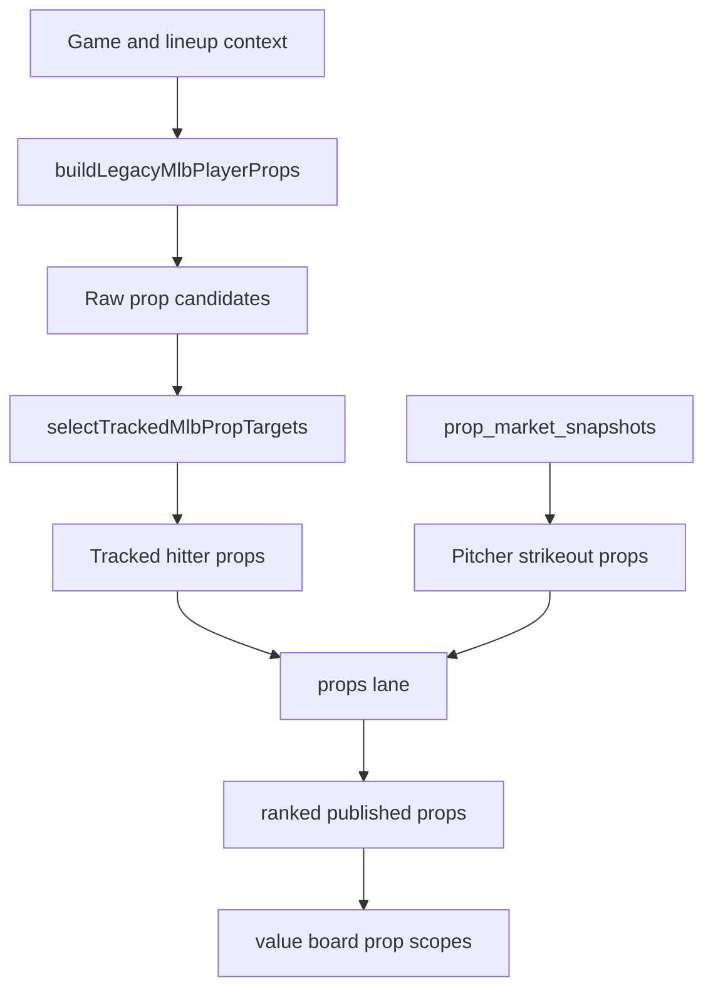

# M2 Bet Audit: Player Props And Batter H2H

This document audits batter props, tracked prop rows, pitcher strikeout props, batter H/R/RBI style rows, and the current state of batter-vs-pitcher H2H handling.

## Main files

- `models/mlb/cartridges/MLB-M2/lib/mlb-props.js`
- `models/mlb/cartridges/MLB-M2/lanes/props.mjs`
- `models/mlb/cartridges/MLB-M2/lib/mlb-analysis-context.js`
- Web value-board code that consumes `playerProps`, `trackedProps`, batter rows, and prop market rows.

## Prop system overview



## Raw batter prop types

The raw candidate builder can create:

| Type | Label | Bucket | Probability weight | Base offset |
| --- | --- | --- | ---: | ---: |
| `homeRun` | Over 0.5 HR | Power | 0.72 | 11 |
| `rbi` | RBI | Production | 0.66 | 8 |
| `runs` | Run scored | Production | 0.72 | 10 |
| `hitRunRbi` | H+R+RBI | Combo | 0.86 | 13 |
| `totalBases` | Total bases | Contact/power | 0.84 | 13 |
| `hits` | Hits | Contact | 0.88 | 14 |
| `walks` | Walks | Discipline | 0.80 | 11 |
| `singles` | Singles | Contact | 0.85 | 12 |

Raw candidates are not all tracked or published.

## Tracked prop board configuration

Tracked prop targets have stricter gates:

| Type | Min confidence | Min support | Max per team | Max per game | Priority | Min tracking score | Current status |
| --- | ---: | ---: | ---: | ---: | ---: | ---: | --- |
| `totalBases` | 68 | 3 | 2 | 4 | 6 | 74 | Active |
| `singles` | 66 | 3 | 1 | 3 | 5 | 72 | Active |
| `walks` | 66 | 3 | 1 | 2 | 4 | 71 | Active |
| `rbi` | 71 | 4 | 1 | 2 | 3 | 76 | Active |
| `runs` | 68 | 3 | 1 | 2 | 4 | 73 | Active |
| `hitRunRbi` | 70 | 4 | 2 | 4 | 7 | 76 | Active |
| `hits` | disabled | disabled | disabled | disabled | disabled | disabled | Disabled in tracked board |
| `homeRun` | disabled | disabled | disabled | disabled | disabled | disabled | Disabled in tracked board |

This means HR and hits can exist in raw candidate space but are not selected into the tracked prop board by this function.

## Batter rate inputs

For each hitter, M2 builds weighted rates:

```text
weightedRate =
seasonRate * 0.46
+ recentRate * 0.32
+ splitRate * 0.22
```

Then career shrinkage can apply:

- If career sample is usable and season PA is tiny, blend more career in.
- If season PA is moderate, blend less career in.
- If season PA is large, mostly current season.

Rates can include:

- Hit rate.
- Singles rate.
- Walk rate.
- Total bases rate.
- Home run rate.
- RBI rate.
- Runs rate.

## Batter approach state

The prop model builds an approach/repeatability read from:

- Career profile.
- Season plate appearances.
- Statcast trend.
- Role stability.
- Contact risk.
- Power index.
- Total-base rate.
- HR rate.
- Rolling xwOBA.
- Rolling xSLG.
- Rolling hard-hit rate.
- Rolling barrel rate.
- Trend signal.

This produces:

- Approach confidence.
- Career-power-backed flag.
- Career-volatile flag.
- Tiny-sample carry flag.
- Tracking penalty.

Tiny samples are penalized unless there is enough career/power/matchup support to carry the candidate.

## Statcast prop signal

Statcast can move different prop types in different ways.

Total bases:

- Rolling xwOBA.
- Rolling xSLG.
- Hard-hit rate.
- Barrel rate.
- xwOBA trend.
- Improving/fading flag.

Singles:

- Sweet-spot rate.
- Contact trend.
- xBA.
- Fading flag.

Home runs:

- Hard-hit rate.
- Barrel rate.
- Barrel trend.
- Hard-hit trend.
- Fading flag.

The output includes:

- TB multiplier.
- Singles multiplier.
- HR multiplier.
- Confidence deltas.

## Expected plate appearances

Expected PA is based on lineup slot and team environment:

```text
expectedPA =
slotBaseline
+ (projectedTeamRuns - 4.3) * 0.11
+ (topThirdScore - 50) * 0.004
```

Then it is clamped.

Top lineup spots receive more expected PA than lower lineup spots.

## Shared batter factors

Candidate scoring uses these common multipliers:

| Factor | Formula idea |
| --- | --- |
| Matchup factor | Higher matchup score boosts hitter |
| Contact factor | Higher contact score boosts hits/singles |
| Power factor | Higher power score boosts TB/HR/RBI |
| Patience factor | Higher patience boosts walks and run reach |
| Form factor | Recent form above 50 boosts |
| Team traffic | Team projected hits and runs boost production |
| Slot pressure | Top/middle order gets better opportunity |
| HR target boost | HR board support can boost power outputs |
| Starter walk pressure | Opposing starter BB/9 and WHIP boost walks |
| Weather run lift | Run environment supports production |
| Sun/visibility | Extra-base/hit effects when attached |

## Hits expected value

Raw hits candidate:

```text
expectedHits =
expectedPA
* hitRate
* contactFactor
* formFactor
* matchupFactor
* teamTraffic
* 0.98
```

Probability is modeled from expected hits using a Poisson-style over calculation.

Current board caveat:

- Hits are disabled in tracked prop selection.
- Hits can still influence other rows and batter displays.

## Singles expected value

```text
expectedSingles =
expectedPA
* singlesRate
* contactFactor
* formFactor
* matchupFactor
* singlesPowerShape
* teamTraffic
* statcastSinglesMultiplier
```

Singles receive support from:

- Clean contact.
- Sweet-spot/contact Statcast.
- Team hit volume.
- Lineup slot.
- Middle-order contact shape.

## Walks expected value

```text
expectedWalks =
expectedPA
* walkRate
* patienceFactor
* formFactor
* (1 + starterWalkPressure)
* slotPressure
```

Walks receive support from:

- Patient batter.
- Wild or traffic-prone starter.
- Team script where pitcher is expected to work carefully.
- Top-third opportunity in certain shapes.

## Total bases expected value

```text
expectedTotalBases =
expectedPA
* totalBasesRate
* powerFactor
* formFactor
* matchupFactor
* teamTraffic
* (1 + hrBoost * 0.6)
* statcastTBMultiplier
* approachMultiplier
* sunExtraBaseMultiplier
```

Tiny-sample caps and volatility penalties can apply:

- Tiny sample without strong shadow/career backing is capped.
- Volatile tiny sample gets reduced.
- Career-power-backed hitters can carry more.

## Home run expected value

Raw HR candidate:

```text
expectedHR =
expectedPA
* homeRunRate
* powerFactor
* formFactor
* matchupFactor
* slotPressure
* overperformBoost
* (1 + hrTargetBoost)
* pitcherHR9Multiplier
* statcastHRMultiplier
```

Important:

- This raw candidate builder can produce HR props.
- Tracked prop selection disables `homeRun`.
- The dedicated home-run lane is audited separately in `bet_audit_05_home_runs_batter_value_rows.md`.

## RBI expected value

```text
expectedRBI =
(projectedTeamRuns / 4.8)
* slotPressure
* powerFactor
* formFactor
* matchupFactor
* aheadTraffic
* overperformBoost
```

RBI props need stronger support than several other prop types.

Support includes:

- Projected team runs.
- Batting order.
- Power lane.
- Traffic ahead.
- Team script.
- Expected value threshold.

## Runs expected value

```text
expectedRuns =
expectedPA
* reachComposite
* formFactor
* matchupFactor
* teamRunPressure
* slotPressure
* overperformBoost
```

Where reach composite blends:

- Hit rate.
- Walk rate.
- Patience pressure.

Runs props are helped by:

- Top lineup slot.
- Good team projected runs.
- Strong reach skills.
- Clean team script.

## H+R+RBI expected value

```text
expectedHrr =
expectedHits + expectedRuns + expectedRBI
```

Probability is modeled against a 1.5-style threshold.

H+R+RBI is supported by:

- Team projected runs.
- Team projected hits.
- Lineup slot.
- Multi-category batter shape.
- Team script.
- Expected value above threshold.

## Batter prop confidence

Confidence starts with:

```text
34
+ max(probability - 0.46, 0) * 72 * probabilityWeight
+ baseOffset * 0.45
```

Then it adjusts for:

- Matchup grade.
- Recent form.
- Pitch-type grade.
- Top-third score.
- Lineup status.
- Pitch-type coverage.
- Bullpen carry.
- Statcast confidence deltas.
- Career power backing.
- Career volatility.
- Tiny-sample penalty.
- Approach confidence.
- Weather run lift.
- Sun/visibility.
- HR board support or HR drought.
- Walk patience.
- Contact quality.
- Prop type caps.

Type-specific caps:

- RBI confidence is capped lower and penalized.
- Runs confidence has a cap.
- H+R+RBI gets a small boost.
- Final prop confidence is clamped.
- Candidates below the confidence floor are dropped.

## Tracked prop support gates

Tracked prop selection requires:

- Prop type not disabled.
- Minimum confidence.
- Minimum support count.
- Minimum tracking score.
- Per-team cap.
- Per-game cap.
- No duplicate player in final selection.

Support can come from:

- Posted lineup.
- Game confidence.
- Low game volatility.
- Projected team runs.
- Projected team hits.
- Slot.
- Power lane.
- Clean traffic lane.
- Statcast trend.
- Career power backing.
- Starter walk pressure.
- Team script.
- Expected value.
- Calibration tags.

Negative gates include:

- Pending lineup.
- Tiny sample without carry.
- High volatility.
- Weak calibration tags.
- Statcast fade.
- Lack of support count.
- Low tracking score.

## Calibration layer

Tracked props can be adjusted by `mlbPropCalibration`.

Calibration can check:

- Overall tag performance.
- Team tag performance.
- Reason tag performance.
- Script tag performance.

Strong tags can increase tracking score only when enough historical support exists.

Weak tags subtract from tracking score.

This layer is a guardrail to avoid trusting attractive but historically weak reason patterns.

## Published props lane

`lanes/props.mjs` combines:

- Ranked tracked hitter props.
- Pitcher strikeout props from market snapshots.

It excludes home-run props from the generic ranked prop list.

The combined list is sorted by:

- Confidence.
- Expected value.
- Probability.

## Pitcher strikeout props

Pitcher K props use `prop_market_snapshots` where `market_key = pitcher_strikeouts`.

Expected strikeouts:

```text
expectedK =
adjustedWorkloadIP
* (baseKPer9 / 9)
* whiffResistance
* runPressure
* trafficPenalty
```

Base K/9:

- Recent K/9 weighted more than season K/9 when both exist.
- Season-only or recent-only can be used if one is missing.

Workload adjusts for:

- Expected innings.
- Usage status.
- Debut/tiny sample.
- Starter leash where available.

Opponent whiff resistance:

```text
whiffResistance =
1
+ (55 - opponentContactAverage) / 105
+ (50 - opponentPatienceAverage) / 210
```

Run pressure:

- Projected runs against the pitcher reduce expected workload/K opportunity.

Traffic penalty:

- Higher WHIP reduces expected K output.

K prop gates:

- Must have a prop line.
- Absolute edge must be at least around 0.35 K.
- Confidence must clear threshold.
- Lineup status, sample, and usage can penalize.

## Batter H/R/RBI value-board rows

Separate from tracked props, the app/value layer can show batter H/R/RBI-style rows.

Important gates seen in app logic:

- Projected team full-game result should be a win for clean H/R/RBI board.
- Confidence threshold around 70 for clean board.
- Recent at-bats at least 30.
- Row must not be marked filtered.

Mike's BOTD-style board:

- Projected team win.
- Confidence threshold around 60.
- Recent at-bats at least 30.
- FIC gate required.
- Manual Mike's list or FIC pass can qualify.

Interpretation:

- These are app/value-layer rows and gates.
- They are not the same as the generic tracked prop selector.

## Current batter-vs-pitcher H2H handling

This is the most important gap in this document.

What M2 does use:

- Batter handedness.
- Pitcher handedness.
- Batter split rates.
- Batter recent form.
- Batter season and career shrinkage.
- Pitch-type matchup.
- Lineup matchup score.
- Opposing starter profile.
- Opposing starter HR/BB/K/hit context.
- Opponent context fields if already present in hitter data.
- Team projected traffic and run environment.
- Statcast batter trends.

What M2 does not currently enforce:

- No hard rule checks "batter has more than 5 AB vs this pitcher."
- No direct formula found that adjusts hits/runs/bases/RBI/HR/OPS from a BvP table at that threshold.
- No direct pitcher adjustment found for hits allowed or earned runs allowed based on that batter-vs-pitcher sample.

Audit conclusion:

- M2 has matchup context.
- M2 does not yet have the requested direct BvP H2H adjustment.

## Desired BvP rule not yet active

The desired future rule should likely be:

```text
if batterVsPitcherAB >= 5:
  adjust batter prop expectations using:
    hits
    runs
    total bases
    RBI
    HR
    OPS or xwOBA-like matchup result
  adjust pitcher/game expectations using:
    hits allowed to these batters
    earned-run pressure
    HR pressure
    traffic pressure
```

It should be shrinked by sample size so 5 AB does not dominate the whole model.

Suggested future shape:

- 5 to 9 AB: small contextual nudge.
- 10 to 19 AB: medium nudge if performance is extreme.
- 20-plus AB: stronger nudge, still bounded.
- Always adjust for date recency and pitcher/batter current form.

## Prop factor checklist

A current M2 batter prop can account for:

- Batter lineup slot.
- Expected PA.
- Season rate.
- Recent rate.
- Split rate.
- Career shrinkage.
- Contact score.
- Power score.
- Patience score.
- Form score.
- Matchup score.
- Pitch-type grade.
- Pitch-type coverage.
- Posted/partial/pending lineup status.
- Top-third score.
- Team projected hits.
- Team projected runs.
- Team traffic.
- Opposing starter BB/9.
- Opposing starter WHIP.
- Opposing starter HR/9.
- Opposing starter K/9 indirectly through matchup.
- HR board support.
- Statcast xwOBA/xSLG/hard-hit/barrel/sweet-spot/xBA trends.
- Career power backing.
- Tiny-sample risk.
- Role stability.
- Contact risk.
- Weather run lift.
- Sun/visibility multipliers.
- Prop calibration tags.
- Game confidence.
- Game volatility.

A current pitcher K prop can account for:

- Prop line.
- Season K/9.
- Recent K/9.
- Expected workload.
- Opponent contact.
- Opponent patience.
- Projected runs against.
- Pitcher WHIP.
- Usage/debut/tiny-sample status.
- Lineup status.

## Prop factors not fully active

- Direct BvP over-5-AB adjustment.
- Direct raw FIC umpire strike-zone adjustment inside K prop formula unless normalized into environment/market context.
- Direct raw FanGraphs batter/pitcher page references inside prop formula.
- Home runs in the generic tracked prop board.
- Hits in the generic tracked prop board.

