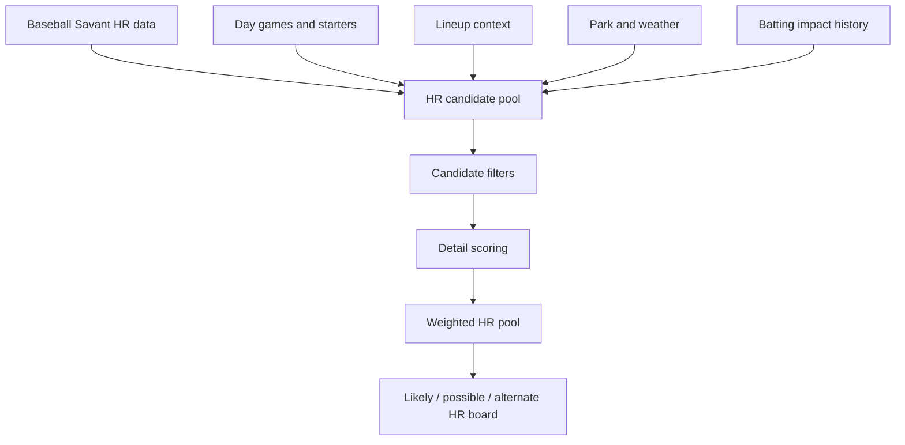

# M2 Bet Audit: Home Runs And Batter Value Rows

This document audits the dedicated home-run lane, batter HR scoring, and related batter value-board rows.

## Main files

- `models/mlb/cartridges/MLB-M2/lanes/home-runs.mjs`
- `models/mlb/cartridges/MLB-M2/lib/mlb-props.js`
- Lineup/value-board app code that builds batter rows and HR scopes.

## Home-run lane overview



## HR prototype

The lane identifies itself as:

```text
statcast-hr-prototype-v3
```

It is separate from the generic tracked prop selector.

This matters because:

- Generic tracked props disable `homeRun`.
- HR board rows come from the dedicated HR lane and app batter row logic.

## HR data sources

The HR lane can use:

- Baseball Savant HR leaderboard data.
- Baseball Savant player detail data.
- Day game schedule.
- Listed starters.
- Lineup boards.
- Daily lineup context.
- Batting impact history.
- Game feed/live events for HR context.
- Park HR factors.
- Weather context.
- Starter HR allowed profile.
- Relief mismatch context when available.

## Base HR candidate score

The candidate base score uses:

```text
baseScore =
xHR * 2.15
+ HR * 1.05
+ opposingPitcherHR9 * 6.8
+ (parkHRIndex - 100) * 0.11
+ max(0, -xHRDiff) * 2
+ lineup power/matchup/form boosts
+ battingImpactPriority
+ weatherBoost
+ lineupPriority * 0.55
- max(0, xHRDiff) * 0.7
- slotPenalty
```

Interpretation:

- A batter with strong xHR and actual HR gets a base boost.
- Pitchers allowing HRs raise candidate score.
- HR-friendly parks raise score.
- Weather can boost or suppress.
- Strong lineup priority helps.
- Poor slot can penalize.
- Overperformance can penalize if xHR gap is unfavorable.

## Weather boost in HR lane

Weather boost can account for:

- Wind out.
- Wind in.
- Temperature.
- Posted total environment.

Examples:

- Hot temperatures boost HR carry.
- Cold temperatures suppress.
- Wind out boosts.
- Wind in suppresses.
- Higher game total can add small support.
- Low total can subtract.

This is separate from ENV1 but can coexist with it if normalized weather fields are present.

## Lineup priority

Lineup priority can include:

- Batting slot.
- Power score.
- Matchup score.
- Split fit.
- Form.
- Recent HRs.
- Split HR profile.
- Tag boosts.
- Projection/coverage penalty.

Higher-order hitters and strong matchup bats are favored.

## Candidate filters

Candidate filters include:

- If current lineup restrictions are active, candidate should be in lineup context.
- Candidate generally needs at least one of:
  - Enough season HR.
  - Enough season xHR.
  - Strong batting-impact support.
- Supplemental candidates can be added from lineup context if lineup priority is high.
- Batting impact candidates can enter if appearance/impact thresholds are met.
- Per-team and overall scan limits are applied.

This prevents every batter in a game from becoming an HR candidate.

## Detail scoring

After base candidate selection, the HR lane adds detailed scoring.

Positive factors:

- Recent HR since May 1.
- Last-7 HR burst.
- No-doubter rate.
- Exit velocity above power threshold.
- Pitcher HR/9 above danger thresholds.
- Recent burst shape.
- Carry quality.
- Batting impact.
- Home/away fit.
- Starter hunter.
- Relief hunter.
- Timing shape.
- Streak shape.
- Relief mismatch.
- Statcast HR boost.

Negative factors:

- Low pitcher HR/9.
- Cooldown.
- False carryover.
- Volatile star penalty.
- Top pitch trap.
- Poor timing.
- Overperformance penalty.

Score bands:

- Premium.
- Strong.
- Live.
- Thin.

Burst tags:

- Heater.
- Cooling.
- Active.
- Carry.
- Watch.

Avoid-HR-chase flag can activate when false carryover, volatility, pitch trap, and score all warn against chasing.

## Weighted HR pool

Candidates are converted into a weighted pool.

Rough flow:

```text
eligible if score >= candidate floor
rawWeight = power transform of score above base threshold
modelShare = rawWeight / totalWeight
```

Board labels:

- Lane anchor: highest share tier.
- Secondary: second tier.
- Live: lower but still meaningful tier.
- Thin: watch-only.

Game board output:

- Likely HR candidate.
- Possible HR candidates.
- Alternate HR candidates.

## HR row factors checklist

A dedicated HR candidate can account for:

- Season HR.
- Season xHR.
- xHR minus actual HR gap.
- Pitcher HR/9.
- Park HR index.
- Weather boost.
- Temperature.
- Wind direction and speed.
- Posted total context.
- Lineup slot.
- Power score.
- Matchup score.
- Split fit.
- Recent HRs.
- Batting impact.
- Recent burst/cooldown.
- Exit velocity.
- No-doubter rate.
- Starter hunter profile.
- Relief hunter profile.
- Relief mismatch.
- Top pitch trap.
- False carryover.
- Volatile star penalty.
- Statcast HR boost.

## App batter HR scoring

The app/value layer also builds batter rows that can include HR-style scoring.

The row can use:

- Rolling xwOBA.
- Barrel rate.
- Exit velocity.
- Hard-hit rate.
- Launch angle.
- Power score.
- Matchup score.
- Batted-ball-event sample.
- Opposing starter HR multiplier.
- Team promotion multiplier.

## Opposing pitcher HR multiplier

The app row calculates a pitcher HR multiplier from opposing starter HR/9.

Shape:

- Very low HR/9 suppresses.
- Low HR/9 suppresses.
- Average HR/9 slightly suppresses.
- Elevated HR/9 boosts.
- Very elevated HR/9 boosts more.

Recent HR/9 can be blended with season HR/9 when available.

This helps prevent blindly targeting HRs against pitchers who do not allow HR contact.

## Batted-ball sample multiplier

Batted-ball-event sample matters.

Examples:

- No BBE sample gets a major penalty.
- Very small sample gets a major penalty.
- Moderate sample gets partial trust.
- Larger sample gets near-full trust.

This is important for call-ups or role-change players.

## Hot hitter rows

The app can score hot hitter rows using:

- Rolling xwOBA.
- Recent xOPS.
- Launch angle.
- Exit velocity.
- Recent form.

These are not automatically HR bets. They are hitter-state rows that may support prop or HR consideration.

## Under-target rows

The app can also identify under-target batter rows using:

- Low weighted OPS.
- Bad pitch fit.
- Bad matchup.
- Cold form.
- Lower-order slot.

These can be used to avoid overs or support unders, but they are separate from the active tracked prop board.

## Batter H/R/RBI rows

H/R/RBI-style rows use batter confidence and context to identify playable hitter production spots.

Important gates from app logic:

- Projected team full-game result should be a win for the clean board.
- Confidence should meet threshold.
- Recent at-bat sample should be high enough.
- Row should not be filtered.
- FIC or manual gate can matter for Mike's BOTD rows.

These rows account for:

- Weighted batter output.
- Recent sample.
- Team win projection.
- Board confidence.
- FIC gate where applicable.
- Manual Mike list where applicable.

## Mike's BOTD and FIC context

The value layer has special handling for Mike's BOTD-style rows.

Current implications:

- FIC Daily Matchup can act as a gate.
- Manual Mike list can override or qualify rows.
- These rows are value-board surfaces, not core M2 side/totals formulas.

Audit warning:

- Do not assume FIC Daily Matchup equals FIC Umpire Factors.
- FIC Umpire Factors should feed ENV1.
- FIC Daily Matchup/Mike's BOTD is a separate hitter-value lane.

## HR and environment relationship

HR candidates can be affected by:

- Park HR index.
- Weather boost.
- Wind.
- Temperature.
- Posted total environment.
- ENV1 HR force if passed into the relevant context.
- Late-start visibility if included in ENV1/app row context.

The dedicated HR lane and ENV1 should be reconciled carefully so the same weather factor is not double-counted.

Current safe interpretation:

- HR lane has its own weather scoring.
- ENV1 adds normalized environmental context elsewhere.
- If both are used in one final board row, verify whether the row used one or both.

## HR bet factors not fully active

- Generic tracked props do not publish HR picks.
- Direct BvP over-5-AB HR adjustment is not active.
- Exact reliever identity is not high-confidence, so relief HR matchup is only as good as the context feeding it.
- FIC HR force is not directly scraped in HR lane scoring unless it is normalized into the context being read.
- Late-start 10 percent hit / 20 percent HR suppression should be calibrated before being treated as final truth.

