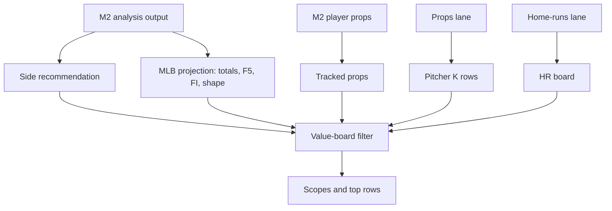

# M2 Bet Audit: Value Board Publication And Gaps

This document audits what actually reaches the value board, how rows are ranked/filtered, and what is still missing.

## Main references

- `models/mlb/cartridges/MLB-M2/MODEL_NOTES.md`
- `models/mlb/cartridges/MLB-M2/lib/sports-model.js`
- `models/mlb/cartridges/MLB-M2/lib/analysis-model.js`
- `models/mlb/cartridges/MLB-M2/lib/pick-rankings.js`
- `models/mlb/cartridges/MLB-M2/lanes/props.mjs`
- `models/mlb/cartridges/MLB-M2/lanes/home-runs.mjs`
- Web value-board code that builds `topRows`, scopes, and row groups.

## Value-board principle

The key model note:

- The web value board is a filter, not a model.
- It may display model-owned rows.
- It may filter model-owned prop rows.
- It should not create bet-grade rows from raw projections unless the cartridge publishes them.

This is especially important for:

- First-five moneyline.
- First-five totals.
- Full-game totals EV rows.
- Scalp rows.
- Any priced row created from raw app projection math.

## Publication overview

## Top-row composition

The app value summary combines row families such as:

- Total-bases backed rows.
- Pitcher K rows.
- Pitcher earned-run rows when present.
- Team totals when present.
- First-five moneyline rows when present.
- First-five totals rows when present.
- Full totals rows when present.
- Side rows.
- Moneyline shape rows.

Rows are sorted and limited for display.

Important:

- The model notes require rows to be model-owned before promotion.
- App helper rows should be treated as display/filter unless cartridge ownership is clear.

## Value-board scopes

The board exposes scopes including:

- ML shape.
- Totals.
- 1st 5.
- 1st inning.
- Team totals.
- TB.
- Pitcher ER.
- K O/U.
- Batter H/R/RBI.
- Mike's BOTD.
- HR.
- Scalp.

Each scope can have different trust level depending on whether the row comes from:

- Core M2 analysis.
- M2 prop builder.
- Props lane.
- HR lane.
- App-level display helper.
- Shadow calibration.
- External/manual gate.

## Side rows

Side rows should be based on:

- Final M2 side recommendation.
- Final confidence.
- Final volatility.
- Final model edge.
- Tier.
- Tier 1 controls.
- Research veto status.
- Ranking safety score.

Do not treat raw side score as the published side bet.

Published side confidence should reflect:

- Base confidence formula.
- MLB decision indicator deltas.
- Tier 1 controls.
- Veto layer.

## Totals rows

Totals rows should be based on:

- M2 projected full-game runs.
- Posted full-game total.
- Total lean.
- Chaos gate.
- ENV1/RP2 vetoes.
- Strength.
- Original lean if vetoed.

Do not publish a raw Over/Under solely because projected runs are above/below the line. The chaos gate can turn it into Pass.

## First-five rows

First-five outputs exist, but trust is restricted.

Current known note:

- First-five O/U was downgraded to research-only after May 31 value-board failure.

Safe board rule:

- Show first-five projection and lean as context.
- Promote only if a cartridge-owned first-five row explicitly passes gates.
- Do not let app code invent bet-grade F5 O/U rows from raw first-five projection.

First-five moneyline rows also need explicit model ownership and gating.

## First-inning rows

First-inning rows should use:

- M2 first-inning YRFI probability.
- M2 NRFI probability.
- Team run probabilities.
- Confidence.
- Shadow calibration.
- YRFI/NRFI caution split.

Current note:

- NRFI at higher model confidence has stronger shadow evidence.
- YRFI is more cautious/research-only in current calibration note.

## Prop rows

Tracked hitter prop rows should come from:

- `buildLegacyMlbPlayerProps`.
- `selectTrackedMlbPropTargets`.
- `lanes/props.mjs` ranking.

They should have:

- Prop type active.
- Confidence over type threshold.
- Support count over type threshold.
- Tracking score over type threshold.
- Team/game caps respected.
- Tiny-sample gate passed.
- Calibration checked.

Disabled in tracked board:

- Home runs.
- Hits.

## Pitcher K rows

Pitcher K rows should come from market snapshots and props lane logic.

They need:

- Market line.
- Expected K.
- Edge of at least around 0.35.
- Confidence threshold.
- Workload context.
- K-rate context.
- Opponent whiff/contact/patience context.
- Run-pressure context.
- Usage/tiny-sample adjustment.

## HR rows

HR rows should come from:

- Dedicated home-run lane.
- HR board labels.
- App batter HR scoring when clearly scoped as HR board context.

They should not be confused with:

- Generic tracked prop rows.
- H/R/RBI rows.
- Hot hitter rows.

## Batter H/R/RBI rows

Batter H/R/RBI rows are value-board/app surfaces.

Important current gates:

- Team projected full-game result should be a win for clean board.
- Confidence threshold.
- Recent AB sample threshold.
- Row not filtered.
- FIC/Mike gate where relevant.

These rows are not proof that direct BvP over-5-AB logic is active.

## Payoff/playability helper

The app has a helper for whether payoff looks playable.

It can mark playable when:

- Grade/payoff action says bet-grade or thin value.
- EV per 100 clears threshold.
- Playable edge exists.
- Underdog value exists.
- Confidence minus price percentage clears threshold.

It rejects or avoids:

- Pass rows.
- Tiny/watch rows.
- Rows without enough edge.

Audit warning:

- Payoff helper is not a substitute for model-owned row generation.
- It should be applied after row ownership is clear.

## Shadow calibration

Some board rows are sorted or marked with shadow calibration.

This is useful for:

- Ranking.
- Showing which tags have performed.
- Separating context from bet-grade picks.

But:

- Shadow calibration is not the same as a retrained production model.
- Shadow success notes should not override active vetoes or disabled-lane rules.

## What every published row should expose

For auditability, every bet row should ideally expose:

- Bet family.
- Model owner.
- Source lane.
- Game id.
- Team/player.
- Market line and price if applicable.
- Projection.
- Edge.
- Confidence.
- Volatility where applicable.
- Tier.
- Gates passed.
- Vetoes applied.
- Active addendums used.
- Lineup status.
- Starter context status.
- Bullpen/RP2 context status.
- Environment/ENV1 status.
- Calibration status.
- Research-only flag if applicable.

If a row cannot answer those, it should not be promoted as a clean bet.

## Current strongest lanes

Based on code maturity and gating:

- Team sides are heavily gated and audited with confidence/volatility/Tier 1 controls.
- Full-game totals have detailed projection and chaos gate logic.
- Tracked hitter props have meaningful support/tracking gates.
- Pitcher K props have market-line and workload-based edge logic.
- HR lane has a dedicated candidate model and board labels.

## Current restricted lanes

These need extra caution:

- First-five O/U.
- First-five moneyline if app-generated rather than model-published.
- YRFI rows unless calibration supports them.
- Scalp rows.
- Any row created from raw projection math by the UI.
- Exact first-reliever identity.

## Current gaps and action items

### Gap 1: Direct BvP over-5-AB rule

Current state:

- Not active as a direct formula.

Needed:

- Warehouse batter-vs-pitcher matchup rows.
- Add sample-size threshold.
- Add shrinkage and recency.
- Apply to batter hits, runs, bases, RBI, HR, OPS.
- Apply to pitcher hits allowed, HR pressure, traffic, earned-run pressure.
- Expose in audit output.

### Gap 2: FanGraphs advanced reliever fields

Current state:

- M2 consumes normalized RP2/relief contexts.
- Raw FanGraphs advanced reliever columns are not referenced directly in scoring files.

Needed:

- Confirm warehouse tables for daily FanGraphs reliever leaderboards/projections.
- Normalize FIP, xFIP, SIERA, WAR, WPA/LI, K-BB%, GB%, HR/FB, splits, leverage, role into RP2.
- Expose which of those features changed bridge/risk/run projection.

### Gap 3: Exact first reliever

Current state:

- `identityConfidence: "low"`.
- Projection-only.

Needed:

- Train candidate model on historical game state.
- Include starter leash, score state, inning, handedness pocket, upcoming batter handedness, rest/pitches, role, leverage, team tendency.
- Backtest top-1/top-2/top-3 and confidence calibration.
- Only then expose exact first reliever beyond shadow.

### Gap 4: FIC Umpire Factors

Current state:

- Consumed only after ENV1 normalization.

Needed:

- Confirm daily warehouse snapshot.
- Preserve raw FIC values and normalized ENV1 values.
- Expose HR force, runs, zone, SO, walks, dome/N/A logic in row audit.
- Backtest HR force thresholds, especially 1.4 and above.

### Gap 5: Late-start visibility

Current state:

- Can be consumed through ENV1.
- Coefficients need validation.

Needed:

- Store local start time and visibility flag.
- Backtest after-8-PM-local hits and HR deltas by park, roof, weather, and month.
- Calibrate hit multiplier and HR multiplier.

### Gap 6: First-five O/U promotion

Current state:

- Research-only caution in model notes.

Needed:

- Separate model-owned F5 O/U row generation from UI helpers.
- Backtest by line bucket, projection edge, chaos gate, starter profile, lineup status.
- Re-enable only with clear evidence.

### Gap 7: Row-level audit trace

Current state:

- Formulas exist but row traces are not guaranteed complete.

Needed:

- Add row-level `auditFactors` object to every published row.
- Include exact active factors and inactive/missing flags.
- Make board render factor trace on demand.

## Board factor checklist by row type

| Row type | Must include before trust |
| --- | --- |
| Side | Final M2 confidence, volatility, edge, Tier 1 controls, late stability, relief risk, lineup status |
| Full total | Projection, line, edge, chaos gate, ENV1, RP2, weather, park, umpire status |
| First-five total | Projection, line, starter coverage, tail overlay, research-only flag |
| First inning | YRFI/NRFI probability, team FI probs, calibration status, dead-early flags |
| Batter prop | Expected value, probability, confidence, support count, tracking score, sample gate |
| Pitcher K | Line, expected K, edge, workload, K rates, opponent contact/patience, run pressure |
| HR | Candidate score, band, model share, pitcher HR/9, park/weather, lineup slot, Statcast power |
| H/R/RBI | Confidence, recent AB sample, team win projection, FIC/Mike gate, filtered status |

## Bottom line

M2 currently accounts for a lot of the baseball context the user expects:

- Team quality.
- Starter.
- Bullpen.
- RP2 relief stress.
- Lineup matchup.
- Market.
- Park.
- Weather.
- Umpire through ENV1.
- Late visibility through ENV1.
- Team state.
- Statcast.
- Prop sample and calibration.

But three user-critical expectations are not yet fully true:

- Direct BvP over-5-AB adjustment is not active.
- Exact first-reliever prediction is still shadow/low-confidence.
- Some value-board scopes can only be trusted if they are model-owned, not UI-created from raw projections.

