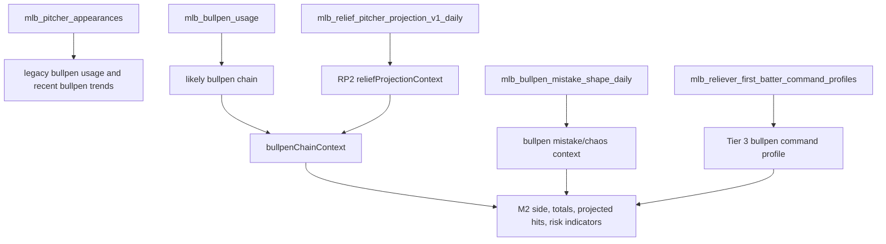

# M2 Bet Audit: Relief Pitcher

This document is the focused relief-pitcher audit. It separates three things that are easy to blur:

- Team bullpen quality.
- Relief projection/RP2 bridge stress.
- Exact first reliever identity.

Current bottom line:

- M2 does use relief pitching in live scoring.
- M2 uses relief most strongly as team bullpen and late-game bridge context.
- RP2 is consumed as a shadow/addendum context for downgrades, totals caution, and late-game path explanation.
- Exact first reliever identity is not production-trusted yet.

## Main files

- `models/mlb/cartridges/MLB-M2/lanes/generate-day-files.mjs`
- `models/mlb/db/day-games.mjs`
- `pipeline/lib/load-mlb-day-games.mjs`
- `models/mlb/cartridges/MLB-M2/lib/mlb-analysis-context.js`
- `models/mlb/cartridges/MLB-M2/lib/mlb-decision-indicators.js`
- `models/mlb/cartridges/MLB-M2/lib/mlb-side-controls.js`
- `models/mlb/cartridges/MLB-M2/components/relief-addendum/README.md`
- `models/mlb/cartridges/MLB-RP2/MODEL_NOTES.md`
- `models/mlb/cartridges/MLB-RP2/research/first_reliever_candidate_model.py`

## Relief data flow



## Warehouse tables and contexts

Relief pitching can enter through:

| Source/table | What it provides | Active use |
| --- | --- | --- |
| `mlb_pitcher_appearances` | Reliever appearances, pitches, outs, runs, entry order | Recent bullpen trend, reliever reuse profile, first-reliever research |
| `mlb_bullpen_usage` | Likely role, first-reliever likelihood, availability, bridge score, recent pitches | Legacy bullpen chain and heavy-use filtering |
| `likely_relief_chains` | DB-first likely chain rows | DB path bullpen chain |
| `team_bullpen_shape_snapshots` | Team bullpen run/outs shape | DB bullpen context |
| `mlb_bullpen_mistake_shape_daily` | First-batter reach, walk, meltdown, inherited traffic, lead-loss, bridge-clean, chaos | Total chaos and risk context |
| `mlb_reliever_first_batter_command_profiles` | First-pitch ball/strike, ball rate, reached rate, free-pass rate, command risk | Tier 3 bullpen command mismatch |
| `mlb_relief_pitcher_projection_v1_daily` | RP2 projected relief runs, outs, relievers used, bridge stress, availability, fatigue, quality, candidates | RP2 addendum context |
| FanGraphs/RosterResource upstream | Depth chart, role, freshness, team RP quality | Only if normalized into RP2/context rows |

## Legacy bullpen chain

The generated-file path builds a legacy chain from `mlb_bullpen_usage`.

It reads:

- Team name.
- Pitcher id/name.
- Likely role.
- Last-three appearances.
- Last-three pitches.
- First-reliever likelihood.
- Availability score.
- Bridge score.
- Worked-yesterday flag.
- Back-to-back flag.
- Last appearance date.
- Days since last appearance.
- Average outs per appearance.
- Raw JSON payload.
- Last appearance pitches.
- Last appearance outs.

It filters out:

- Listed starters.
- Pitchers whose average outs per appearance look starter-like.

Then it applies heavy-use reset logic.

## Heavy-use reset logic

The reset profile is one of the most important active pieces.

Inputs:

- Days since last appearance.
- Last appearance pitches.
- Pitcher quick-reuse history.
- Team quick-reuse history.
- Worked yesterday.
- Back-to-back.
- Appearances last three.
- Pitches last three.

Adaptive pitch reset threshold:

```text
reuseCeiling = pitcher quick-reuse P90 if sample >= 3, else team quick-reuse P90
adaptiveThreshold = clamp(reuseCeiling + 5, 30, 42)
```

Pitch pressure:

- If days since last appearance is 0 or 1:
  - Pressure rises when last appearance pitches exceed roughly `adaptiveThreshold - 8`.
- If days since last appearance is 2 and pitches were very high:
  - Smaller pressure remains.

Appearance pressure:

- Back-to-back adds more pressure.
- Worked yesterday adds smaller pressure.

Recent-load pressure:

- Two or more appearances in last three and at least 45 pitches adds pressure.

Reset score:

```text
heavyUseResetScore = clamp((pitchPressure + appearancePressure + recentLoadPressure) * 100, 0, 100)
heavyUseResetFlag = heavyUseResetScore >= 70
```

If flagged relievers can be removed while still leaving alternatives, they are removed from the ranking pool.

This is the active version of the practical rule:

- A reliever who threw 20-plus to 40-plus pitches is less likely to be available the next day.
- It is not a hard-zero, because teams still reuse arms when depleted.

## Legacy chain output

The chain keeps the top two relievers after filtering.

For each:

- Pitcher id.
- Name.
- Role.
- First-reliever likelihood.
- Availability score.
- Bridge score.
- Expected outs.
- Worked yesterday.
- Back-to-back.
- Last appearance date.
- Days since last appearance.
- Last appearance pitches.
- Last appearance outs.
- Adaptive pitch reset threshold.
- Quick-reuse sample.
- Quick-reuse pitch ceiling.
- Heavy-use reset score.
- Heavy-use reset flag.

It also stores remaining depth:

- Removed heavy-use count.
- Remaining top-three availability average.
- Remaining top-three bridge score average.
- Remaining top-three expected outs average.

## RP2 contract

RP2 is the replacement candidate for RP36.

RP2 outputs:

- Projected relief runs allowed.
- Projected relief outs.
- Projected relievers used.
- Bridge stress.
- Leverage availability.
- Fatigue.
- Quality score.
- Run risk tier.
- First-up lead.
- Top cluster/candidates.
- Top-two share.
- Reasons.
- Feature snapshot.

RP2 inputs according to its notes:

- Legacy bullpen usage snapshots.
- Team bullpen shape.
- Settled reliever appearances.
- Scheduled starters.
- Starter leash and rolling form.
- FanGraphs/RosterResource bullpen depth, usage, and team RP rankings.
- Current lineup handedness.
- Prior pitcher outcomes by batter side.

RP2 first-up scoring includes:

- Yesterday relief workload rest penalties at 20, 30, and 40-plus pitches.
- Recent team first-up trend.
- Same-starter first-reliever history when available.
- Starter leash role context.
- Small lineup-handedness fit adjustment.

The handedness fit adjustment is in RP2, not recalculated by M2. M2 receives the normalized RP2 result.

## RP2 current backtest status

From `MLB-RP2.2026-06-12.v3` notes:

- Relief-runs MAE: `1.713`.
- Baseline relief-runs MAE: `1.764`.
- MAE lift: `2.9%`.
- First-up exact: `19.4%`.
- First-up top-2: `35.0%`.
- First-up top-3: `47.5%`.

Promotion rule says RP2 can replace RP36 only after:

- At least 300 usable team-side samples.
- Relief-runs MAE beats rolling team baseline.
- First-up top-3 coverage is at least 50%.

Current audit interpretation:

- Team-side relief-runs projection is directionally useful.
- First-up identity is still below promotion threshold.
- The exact first reliever should stay shadow.

## DB path relief projection

`models/mlb/db/day-games.mjs` reads `mlb_relief_pitcher_projection_v1_daily` and builds:

- `projectedReliefRunsAllowed`
- `projectedReliefOuts`
- `projectedRelieversUsed`
- `bridgeStressScore`
- `leverageAvailabilityScore`
- `fatigueScore`
- `qualityScore`
- `runRiskTier`
- `topTwoSharePct`
- `lead`
- `candidates`
- `reasons`
- `confidenceScore`

Then it can build an RP2 bullpen chain if no better explicit chain exists.

Each RP2 top reliever is marked:

- `source: "MLB-RP2"`
- `identityConfidence: "low"`
- `projectionOnly: true`

That is deliberate. It prevents the board from treating candidate rank 1 as a confirmed first reliever.

## Where relief affects team sides

Relief affects side bets through several layers.

### Bullpen follow-through signal

Inputs:

- Bullpen ERA.
- Bullpen WHIP.
- Bullpen strikeouts.
- Bullpen walks.

Formula shape:

```text
ERA score  = clamp(96 - ERA * 11)
WHIP score = clamp(114 - WHIP * 35)
KBB score  = clamp(28 + K/BB * 18)

bullpenSignal = ERA score * 0.46 + WHIP score * 0.34 + KBB score * 0.20
```

Signal weight: about `0.13`.

### Likely bridge chain signal

Inputs:

- First-reliever likelihood.
- Availability.
- Bridge score.
- Expected outs.
- Role.
- Fatigue/worked-yesterday/back-to-back.
- Recent bullpen summary.

Reliever score shape:

```text
relieverScore =
firstRelieverLikelihood * 0.24
+ availability * 0.31
+ bridgeScore * 0.31
+ expectedOuts * 4.2
+ roleBonus
- fatiguePenalty
```

Team chain score:

```text
primary * 0.62 + secondary * 0.38
```

Signal weight: about `0.11`.

### MLB decision indicators

Relief also affects:

- Late-inning stability index.
- Relief pitching risk.
- Coinflip pressure.
- Starter-to-late split.
- Tier 1 pass/downgrade logic.
- Expensive favorite danger.
- Underdog proof requirement.

This is where a side with good starter edge can still be downgraded if the bullpen path is fragile.

## Where relief affects totals

Relief affects totals through both projection and chaos gates.

### Projected hits

Opponent bullpen effect includes:

- Opposing bullpen ERA.
- Opposing bullpen WHIP.
- Opposing bullpen chain score.
- Lineup bullpen pitch-type pressure.
- RP2 projected relief runs/bridge stress/quality.

RP2 hit adjustment shape:

```text
rp2HitAdjustment =
(projectedReliefRunsAllowed - 1.75) * 0.14
+ (bridgeStressScore - 52) * 0.006
- (qualityScore - 55) * 0.004
```

Clamped roughly between `-0.26` and `+0.36`.

### Late run conversion

RP2 late run conversion delta:

```text
delta =
(projectedReliefRunsAllowed - 1.75) * 0.009
+ (bridgeStressScore - 52) * 0.00045
+ (fatigueScore - 50) * 0.00028
- (qualityScore - 55) * 0.00024
+ taxed bridge adjustment
- fresh bridge adjustment
```

Clamped roughly between `-0.016` and `+0.024`.

### Total chaos gate

The total gate builds a relief total context.

High late-run risk turns on when:

- Max bridge stress is at least about `64`.
- Max projected relief runs allowed is at least about `2.25`.
- Combined projected relief runs allowed is at least about `4.25`.
- Any side has a taxed/watch risk tier.

Watch late-run risk turns on when:

- High late-run risk is already true.
- Bridge stress is at least about `56`.
- Projected relief runs allowed is at least about `2.0`.
- Fatigue is at least about `62`.
- Minimum quality is at or below about `42`.

Effects:

- Full-game and late Over chaos can increase.
- Thin Unders can be vetoed.
- First-five can be affected only when projected relief outs imply the bridge may enter early.

## Where relief affects props and HR

Relief affects batter props mostly indirectly:

- Team projected hits.
- Team projected runs.
- Team traffic.
- Bullpen pitch-type pressure.
- Game volatility.
- Late run shape.

Relief affects HR:

- HR lane can account for relief-hunter and relief mismatch concepts.
- M2 lineup fit includes likely reliever arsenal fit.
- Exact reliever identity is not trusted enough to make a hard individual reliever-vs-batter HR call.

## First-reliever ML research model

The research model in `first_reliever_candidate_model.py` explores a trainable first-reliever classifier.

Feature groups:

- Game state:
  - Entry inning.
  - Score margin.
  - Base state.
  - Outs before entry.
  - Entry batter side.
- Starter:
  - Starter outs.
  - Starter pitches.
  - Starter runs.
  - Starter out bucket.
- Candidate rest:
  - Pitches yesterday.
  - Pitches last two.
  - Pitches last three.
  - Rest days.
- Candidate usage:
  - Appearances last 7/14/30.
  - First-up history.
  - Average entry order.
  - Average outs.
  - Average pitches.
  - Average runs allowed.
- State affinity:
  - Same starter first-up count.
  - Same score-state first-up count.
  - Same starter-out-bucket first-up count.
- Categorical:
  - Team.
  - Starter out bucket.
  - Entry inning bucket.
  - Base state.
  - Score state.
  - Entry batter side.

Important limitation:

- Research uses actual starter-exit game state.
- Pregame M2 would need simulated or expected starter-exit states.
- This is why it is not ready to be treated as exact first-reliever production.

## Current relief-pitcher factors active in M2

A current M2 bet can account for:

- Bullpen ERA.
- Bullpen WHIP.
- Bullpen K/BB.
- Likely bridge chain.
- First-reliever likelihood.
- Availability score.
- Bridge score.
- Expected outs.
- Worked yesterday.
- Back-to-back.
- Last appearance pitches.
- Last-three pitches.
- Heavy-use reset.
- Recent bullpen trend.
- RP2 projected relief runs.
- RP2 projected relief outs.
- RP2 projected relievers used.
- RP2 bridge stress.
- RP2 fatigue.
- RP2 leverage availability.
- RP2 quality score.
- RP2 run risk tier.
- Bullpen mistake shape.
- Reliever first-batter command profile.
- Lineup fit vs likely bridge reliever arsenal.
- Bullpen pitch-type pressure.
- Late stability.
- Relief risk.
- Total chaos gate.

## Relief-pitcher factors not fully active

These are not fully trusted in live M2:

- Exact first reliever identity.
- Exact reliever-vs-batter matchup.
- Full individual reliever skill stack from FanGraphs by raw column.
- Individual reliever handedness splits directly recalculated by M2.
- Direct per-reliever HR/BB/K/GB profile in live prop formulas unless normalized upstream.
- Production-trained first-reliever classifier.

## Audit conclusion

Relief pitching is active in M2, but mostly at the team/bridge/risk level.

The model can correctly say:

- This bullpen is tired.
- This bridge is fragile.
- RP2 expects more late runs.
- A full-game side is risky because the starter edge may not survive.
- A thin Under is dangerous because the bridge can leak.

The model cannot yet safely say:

- This exact reliever will come in first.
- This exact reliever-vs-batter matchup should move a prop or HR bet.
- Candidate 1 in RP2 is production-confidence.

That distinction should be visible on every value-board row.

