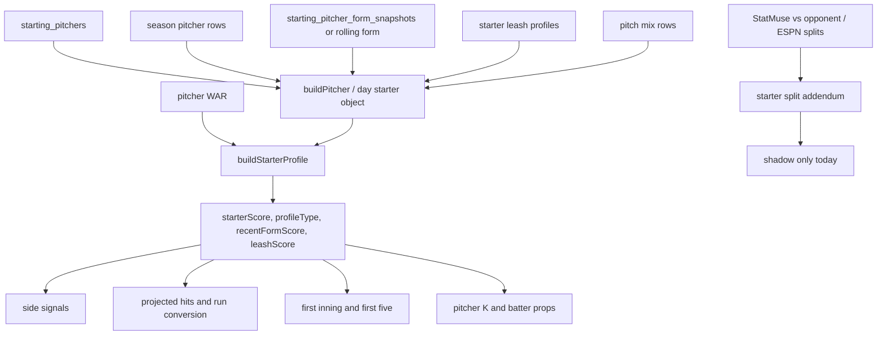
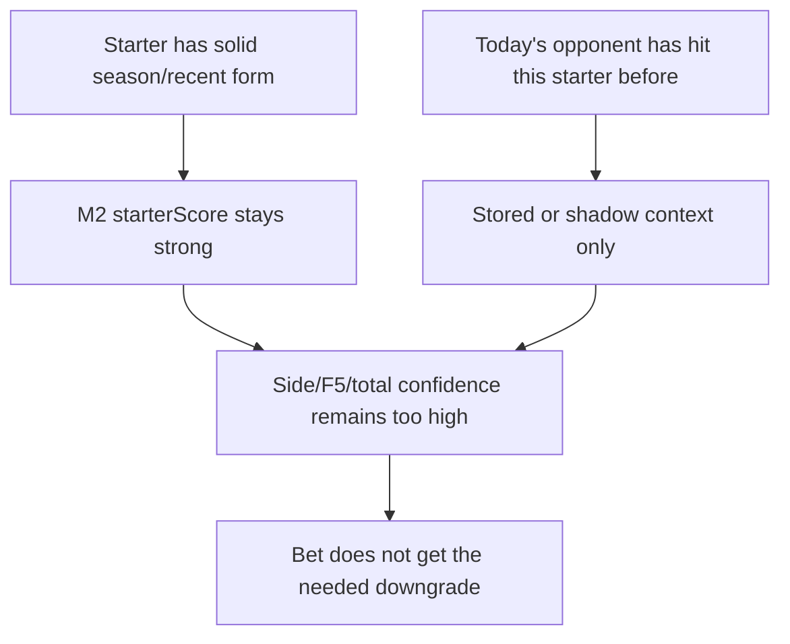

# M2 Bet Audit: Starting Pitcher

This document is the focused starting-pitcher audit.

Current bottom line:

- M2 uses starting pitchers heavily.
- It uses season quality, recent form, leash, WAR, pitch/lineup fit, first-inning tendencies, and starter-window risk.
- Workspace update: M2 now live-weights bounded starter-vs-team context in the main scoring path when same-season game logs or StatMuse opponent rows are available.
- Workspace update: M2 now live-weights lineup batting pressure against the opposing starter, including counts of blended `.300` bats, top-six traffic, high-OPS bats, recent hot bats, lineup AVG, and top-six AVG.

The original failure mode was that a good starter could still be overrated when today's opponent had either hit him before or had too much active traffic in the lineup. The current implementation makes that a bounded model input rather than a human-only concern.

## 2026-06-12 implementation update

The active patch wires two new starting-pitching pressure layers into M2.

### Starter vs opponent

DB-first day-game objects now attach:

- `statmuseVsOpponent` from `mlb_starter_vs_team_statmuse`.
- `startHistoryLast5` from `mlb_starting_pitcher_game_logs`.
- `opponentHistoryThisSeason` filtered to today's opponent.

`buildStarterProfile` converts those rows into `starterVsTeamContext`:

- `source`.
- `starts`.
- `innings`.
- `sampleWeight`.
- `runsPerIp`.
- `hitsPerIp`.
- `hrPerIp`.
- `walksPerIp`.
- `strikeoutsPerIp`.
- `firstInningRunRate`.
- `qualityStartRate`.
- `shortStartRate`.
- `runPressureIndex`.
- `projectedHitsDelta`.
- `first5RunsDelta`.
- `runConversionDelta`.
- `starterScoreAdjustment`.
- `starterHoldAdjustment`.
- `label`.

Active consumers:

- `starterScore`.
- Projected hit profile.
- First-five run conversion.
- Starter hold confidence.

Current shrinkage:

- Same-season opponent history is preferred over StatMuse.
- StatMuse is used when same-season rows are not present.
- Adjustments are capped before they enter scoring.
- The context is active only when sample weight clears the live threshold.

### Lineup batting pressure

Both DB-first lineups and generated lineup boards now emit a batting-pressure summary:

- `battingPressureIndex`.
- `highAverageCount`.
- `topSixHighAverageCount`.
- `highOpsCount`.
- `recentHotCount`.
- `lineupAverage`.
- `topSixAverage`.
- `lineupOps`.
- `topSixOps`.
- `battingPressureLabel`.
- `battingPressureReasons`.

The blended batter AVG/OPS reads season, recent, and handedness split inputs. Recent form requires at least 8 recent plate appearances; split form requires at least 10 split plate appearances.

DB-first mode now builds same-season batter AVG/OBP/SLG/OPS from `player_game_batting` using games before the slate date, so lineup pressure does not depend on the lineup snapshot being captured on the same UTC date as the game. Generated-lineup mode uses the existing lineup player season/recent/split/career context.

Active consumers:

- Projected hit profile.
- Starter coverage / first-five exposure.
- First-five run conversion.
- Starter hold confidence.
- Lineup-vs-pitching fit score.
- Lineup-vs-pitching signal labels.

Important interpretation:

- Five-plus blended `.300` bats becomes a stacked traffic pocket.
- Seven-plus blended `.300` bats becomes a high-pressure lineup state.
- This does not override starter quality by itself; it moves projected traffic, first-five conversion, and starter hold inside caps.

## Main files

- `models/mlb/cartridges/MLB-M2/lanes/generate-day-files.mjs`
- `models/mlb/db/day-games.mjs`
- `models/mlb/cartridges/MLB-M2/lib/mlb-starter-utils.js`
- `models/mlb/cartridges/MLB-M2/lib/mlb-analysis-context.js`
- `models/mlb/cartridges/MLB-M2/lib/starter-split-addendum.js`
- `models/mlb/cartridges/MLB-M2/components/starter-split-addendum/README.md`
- `models/mlb/cartridges/MLB-M2/lib/mlb-decision-indicators.js`
- `models/mlb/cartridges/MLB-M2/lib/mlb-props.js`

## Starting pitcher data flow



## Active starter object

The DB-first `buildPitcher` object includes:

- MLB id.
- Internal player id.
- Full name.
- Throwing hand.
- ERA.
- Strikeouts.
- Innings pitched.
- Hits allowed.
- Walks.
- HR allowed.
- WHIP.
- Games started.
- Probable source.
- Pitch mix summary.
- ESPN splits.
- Recent form.
- Usage context.

Generated day files can attach more:

- `startHistoryLast5`.
- `opponentHistoryThisSeason`.
- `strikeoutMarket`.
- `statmuseVsOpponent`.
- `espnSplits`.
- `recentForm`.
- `usageContext`.

Important path difference:

- Generated-file path attaches `opponentHistoryThisSeason` and `statmuseVsOpponent`.
- DB-first path currently does not attach those same fields in `buildPitcher`.
- Since the loader tries DB first, live app/model runs may not even receive starter-vs-opponent history unless that field is explicitly added to the DB path.

## Active starter profile

`buildStarterProfile` converts starter context into model features:

- Handedness.
- Wins.
- Losses.
- Decisions.
- Win percentage.
- ERA.
- Strikeouts.
- Innings.
- Walks.
- Hits allowed.
- HR allowed.
- WHIP.
- Games started.
- Expected innings.
- Leash score.
- Short-leash risk.
- Durable rate.
- Leash volatility.
- Five-plus inning rate.
- Six-plus inning rate.
- K/9.
- BB/9.
- Hits/9.
- HR/9.
- Recent form.
- Recent form weight.
- Current season WAR.
- Previous season WAR.
- WAR delta.

It creates:

- Profile type.
- Profile label.
- Sample-established flag.
- Recent form label.
- Recent form score.

## Starter profile type

Starter profile types:

- Unknown sample.
- Power.
- Volatile bat-misser.
- Contact suppressor.
- Craft.
- Traffic-risk.
- Strike-throwing.
- Balanced.

Classification uses:

- Innings sample.
- ERA.
- WHIP.
- K/9.
- BB/9.
- Hits/9.

Examples:

- High K/9, low WHIP, low ERA can become Power.
- High hits/9 or high WHIP can become Traffic-risk.
- Low hits/9 and low WHIP can become Contact suppressor.

## Recent starter form

Recent form can include:

- Window starts.
- Starts sample.
- Innings per start.
- Earned runs per start.
- Hits allowed per start.
- HR allowed per start.
- Walks allowed per start.
- Strikeouts per start.
- WHIP-like.
- Short-start rate.
- Quality-start rate.
- Run volatility.
- HR burstiness.
- Recent three-start earned-run delta.

Reliability by sample:

- 5 starts: full.
- 4 starts: high.
- 3 starts: medium-high.
- 2 starts: partial.
- 1 start: low.
- 0 starts: none.

Recent form score blends:

- Innings per start.
- Earned runs per start.
- HR allowed per start.
- Quality-start rate.
- Short-start penalty.
- Run-volatility penalty.
- Recent ER trend.

## Starter leash score

Leash score uses:

- Expected innings.
- Average innings per start.
- Short-leash risk.
- Durable rate.
- Recent short-start rate.
- Recent quality-start rate.
- Leash volatility.

It answers:

- Can this starter realistically cover the first five?
- Is this a short-leash starter who creates early bullpen exposure?

It does not answer:

- Has this starter historically struggled against today's opponent?

## Starter side scoring

Starter factors enter side bets through several signals.

### Starter record

Signal weight: about `0.16`.

Formula:

```text
recordScore = clamp(28 + winPct * 46 + min(decisions, 6) * 2)
```

### Starter ERA

Signal weight: about `0.23`.

Formula:

```text
eraScore = clamp(92 - ERA * 9)
```

### Strikeout ceiling

Signal weight: about `0.09`.

Formula:

```text
strikeoutScore = clamp(34 + strikeouts * 1.08)
```

### Recent starter form

Signal weight: about `0.11` when present.

Uses `recentFormScore`.

### Combined starter score

The general starter score is:

```text
starterScore =
recordScore * 0.24
+ eraScore * 0.36
+ strikeoutScore * 0.22
+ warScore * 0.18
```

This score is important for side confidence, starter leverage, and phase shape.

Critical limitation:

- This score does not include direct starter-vs-team history.

## Starter projected-hit effects

The opponent starter affects projected team hits.

Projected hits use:

- Starter hits/9.
- Starter WHIP.
- Starter BB/9.
- Starter K/9.
- Starter sample uncertainty.
- Current season WAR.
- Previous season WAR.
- WAR delta.
- Starter recent hits allowed per start.
- Starter recent ER per start.
- Starter recent HR allowed per start.
- Starter recent WHIP-like.
- Starter recent short-start rate.
- Starter recent quality-start rate.
- Starter recent ER trend.

Formula examples:

```text
starterPhaseProjection += (hitsPerNine - 8.6) * 0.25
starterPhaseProjection += (WHIP - 1.28) * 1.1
starterPhaseProjection += (BB/9 - 3.1) * 0.08
starterPhaseProjection -= (K/9 - 8.6) * 0.07
```

Recent form example:

```text
starterPhaseProjection += (recentHitsAllowedPerStart - 5.5) * weight
starterPhaseProjection += (recentEarnedRunsPerStart - 2.6) * weight
starterPhaseProjection += (recentHomeRunsAllowedPerStart - 0.65) * weight
starterPhaseProjection += (recentWhipLike - 1.28) * weight
starterPhaseProjection += recentShortStartRate * weight
starterPhaseProjection -= recentQualityStartRate * weight
```

This is active, but it is generic recent form. It is not today's opponent-specific form.

## Starter run-conversion effects

First-five run conversion adjusts for:

- Starter profile type.
- Starter recent ER per start.
- Starter recent HR allowed per start.
- Starter recent short-start rate.
- Starter recent quality-start rate.
- Weather.
- ENV1.

Examples:

- Traffic-risk starter raises first-five conversion.
- Contact suppressor lowers first-five conversion.
- Recent HR allowance raises conversion.
- Quality starts lower conversion.

Again:

- This is not directly keyed to today's opponent.

## Starter hold confidence

Starter hold confidence asks whether the starter can suppress or hold the game shape.

Inputs:

- Expected innings.
- Average innings per start.
- Profile type.
- Recent innings/start.
- Recent short-start rate.
- Recent quality-start rate.
- Recent run volatility.
- Recent HR allowed per start.
- Current WAR.
- Previous WAR.
- WAR delta.
- Opponent lineup starter pressure.
- Opponent lineup platoon pressure.

It can downgrade:

- Traffic-risk profiles.
- Volatile bat-missers.
- Short-leash starters.
- Starters with HR leakage.
- Starters facing a lineup with pressure/platoon fit.

It does not downgrade directly from:

- "This opponent has already hit this starter hard."

## First inning and first five

Starting pitcher factors affect:

- First-inning YRFI/NRFI.
- First-five projected runs.
- First-five totals.
- First-five side/lead shape.
- Starter-window traffic.
- Starter-window conversion.
- Starter-to-bullpen flip.

Inputs include:

- First-inning pitcher profiles.
- Season first-inning profile.
- Recent first-inning runs allowed.
- Starter profile.
- Starter recent form.
- Starter leash.
- Opposing lineup top-third pressure.
- Opposing lineup pitch-type pressure.
- Weather/ENV1.

The starter split addendum can compute shadow YRFI/F5 deltas, but it is not active.

## Pitcher K props

Pitcher strikeout props use:

- Market line.
- Recent K/9.
- Season K/9.
- Adjusted workload innings.
- Opponent contact.
- Opponent patience.
- Projected runs against.
- Traffic penalty from WHIP.
- Usage/debut/tiny-sample status.
- Lineup status.

Expected K:

```text
expectedK =
adjustedWorkloadIP
* (baseKPer9 / 9)
* whiffResistance
* runPressure
* trafficPenalty
```

No direct starter-vs-team K history is active here.

## Batter props and HR

Starting pitchers affect batter props through:

- Pitcher handedness.
- Starter walk pressure.
- Starter HR/9.
- Starter WHIP.
- Starter profile.
- Pitch-type matchup.
- Lineup matchup grade.
- Team projected hits/runs.
- HR board pitcher HR multiplier.

But direct batter-vs-pitcher and starter-vs-team history are not live-weighted in the core prop formula.

## Starter-vs-team data exists

Generated day files build:

### `opponentHistoryThisSeason`

Built from `mlb_starting_pitcher_game_logs`.

Fields include:

- Game date.
- Opponent.
- Venue role.
- Innings pitched.
- Outs.
- Runs allowed.
- Earned runs.
- Hits allowed.
- Walks.
- Strikeouts.
- HR allowed.
- Pitches.
- Team runs.
- Opponent runs.
- Team result.
- Quality start.
- First-inning runs allowed.
- First-inning outcome.

It is filtered to starts against today's opponent.

### `statmuseVsOpponent`

Built from `mlb_starter_vs_team_statmuse`.

Fields include:

- Pitcher.
- Pitcher team.
- Opponent team.
- Source URL.
- Answer text.
- Appearances.
- Games started.
- Wins.
- Losses.
- ERA.
- Strikeouts.
- Innings pitched.
- Hits allowed.
- Earned runs.
- Runs allowed.
- HR allowed.
- Walks.
- Batters faced.
- Total row.
- Game rows.

### `espnSplits`

Built from `mlb_pitcher_espn_splits`.

Fields include:

- Source URL.
- Source status.
- Venue.
- Opponent team.
- Categories.
- Insights.

These fields are real. The issue is promotion into active scoring.

## Starter split addendum

`starter-split-addendum.js` scores:

- ESPN by-inning pitch splits.
- ESPN home/away split.
- ESPN day/night split.
- ESPN park split.
- StatMuse starter-vs-opponent history.
- Expected innings.
- Short-leash risk.

It computes:

- `earlyLeakageScore`.
- `f5StabilityScore`.
- `f5SideScore`.
- Game-level YRFI probability adjustment.
- Game-level first-five total runs adjustment.
- Game-level first-five lead probability adjustment.

It explicitly includes StatMuse vs opponent:

```text
statmuseRunsPerIp
statmuseHrPerIp
statmuseBbPerIp
```

And it creates reasons like:

```text
vs opponent runs/IP ...
```

## Starter split addendum is shadow-only

The component README says:

- Status: shadow only.
- Do not wire into live M2 scoring until shadow reports prove improvement.
- When promoted, keep capped deltas visible for audit.

Impact caps:

- YRFI/NRFI probability: max plus/minus 4 percentage points.
- First-five total projection: max plus/minus 0.35 runs.
- First-five lead probability: max plus/minus 3 percentage points.

Current audit conclusion:

- The starter-vs-team data is not absent.
- The active scoring layer is not using it as a live adjustment.
- So a starter's poor history vs today's opponent can be visible in display/shadow but still fail to move the bet enough.

## DB-first gap

The active loader tries DB day games first.

In the DB path:

- `buildPitcher` attaches season stats.
- It attaches rolling recent form.
- It attaches usage context.
- It attaches pitch mix summary.
- It attaches ESPN splits.

But it does not attach:

- `opponentHistoryThisSeason`.
- `statmuseVsOpponent`.
- Generated-file starter start history.

This creates a practical live gap:

- Even before scoring, the DB-first game object may not carry the starter-vs-team history that generated files can attach.

## Active starting-pitcher factors checklist

A current M2 bet can account for:

- Starter hand.
- Starter ERA.
- Starter WHIP.
- Starter wins/losses.
- Starter decisions.
- Starter strikeouts.
- Starter innings.
- Starter hits allowed.
- Starter walks.
- Starter HR allowed.
- Starter K/9.
- Starter BB/9.
- Starter hits/9.
- Starter HR/9.
- Starter games started.
- Starter profile type.
- Starter sample size.
- Starter recent form.
- Recent innings/start.
- Recent ER/start.
- Recent hits/start.
- Recent HR/start.
- Recent walks/start.
- Recent strikeouts/start.
- Recent WHIP-like.
- Recent short-start rate.
- Recent quality-start rate.
- Recent run volatility.
- Recent HR burstiness.
- Recent three-start ER trend.
- Expected innings.
- Leash score.
- Short-leash risk.
- Durable rate.
- Five-plus inning rate.
- Six-plus inning rate.
- Leash volatility.
- Current season WAR.
- Previous season WAR.
- WAR delta.
- First-inning pitcher profiles.
- Third-time-through penalty profiles.
- Opponent lineup pressure.
- Opponent platoon pressure.
- Opponent pitch-type pressure.
- Top-third lineup pressure.
- Park.
- Weather.
- ENV1.

## Starting-pitcher factors not live-weighted

These are not fully active in live M2 scoring:

- Starter past performance vs today's team.
- StatMuse vs opponent history as a live adjustment.
- Generated `opponentHistoryThisSeason` as a live adjustment.
- ESPN starter split addendum as a live adjustment.
- Batter-vs-pitcher direct over-5-AB matchup.
- Lineup-overlap-adjusted starter history vs current version of opponent.

## Why this can lose bets

The failure mode is simple:



If the starter historically struggles against this opponent, but:

- Season ERA is fine.
- Recent form is fine.
- Leash is fine.
- Lineup aggregate pressure is not extreme.

Then active M2 can still like:

- The starter's team.
- First-five Under.
- NRFI.
- Pitcher K Over.
- Opponent batter unders.

That is exactly the kind of miss the starter-vs-team addendum was meant to catch, but it is shadow-only today.

## Required fix

M2 needs an active starter-vs-team context, not only a shadow/display context.

Minimum required object:

```js
starterVsTeamContext: {
  starts: 0,
  innings: 0,
  runsAllowed: 0,
  earnedRuns: 0,
  hitsAllowed: 0,
  walksAllowed: 0,
  strikeouts: 0,
  homeRunsAllowed: 0,
  firstInningRunsAllowed: 0,
  pitchesPerStart: 0,
  qualityStartRate: 0,
  shortStartRate: 0,
  recencyWeight: 0,
  lineupOverlapWeight: 0,
  source: "mlb_starting_pitcher_game_logs + statmuse"
}
```

Then use it in:

- Starter score.
- Projected hit profile.
- First-five run projection.
- First-inning probability.
- Starter hold confidence.
- Pitcher K props.
- Batter props.
- HR board.
- Side confidence and volatility.
- Total chaos gates.

## Suggested shrinkage rule

Do not let one ancient start hijack the model.

Suggested sample control:

- 1 start or under 5 IP: display only or tiny nudge.
- 2 starts or 8-plus IP: active small nudge.
- 3-plus starts or 15-plus IP: active medium nudge.
- Same-season starts get more weight.
- Prior-season starts get smaller weight.
- Current lineup overlap boosts weight.
- Major roster turnover reduces weight.

Suggested bounded adjustments:

- First-five total: max plus/minus 0.35 to 0.45 runs.
- Full total: max plus/minus 0.55 runs.
- Side confidence: max plus/minus 4 to 7 points.
- Pitcher K: max plus/minus 0.3 to 0.6 Ks.
- Batter prop confidence: max plus/minus 3 to 5 points.
- HR probability: max plus/minus small capped probability lift.

## Audit row requirement

Every bet row that depends on starting pitching should expose:

- Starter name.
- Starter profile type.
- Starter score.
- Recent form score.
- Leash score.
- Opponent history sample.
- Opponent history effect.
- Whether opponent history was active or shadow-only.
- ESPN split status.
- StatMuse status.
- First-inning starter status.
- Third-time-through status.
- Lineup pressure against starter.

If the row cannot say whether starter-vs-team history was active, the row is not auditable enough.

## Audit conclusion

Starting pitching is one of M2's biggest active inputs, and the specific thing that mattered today has now been promoted into live scoring with bounded impact.

The model currently knows a lot about a starter in general:

- Quality.
- Recent form.
- Workload.
- Leash.
- Pitch fit.
- First-inning tendencies.
- Lineup pressure.

It now also actively trusts, when the sample is available and passes shrinkage:

- This starter vs this opponent.
- This starter vs the actual projected lineup's batting-pressure shape.

Remaining gap:

- Batter-vs-pitcher head-to-head still needs a separate calibrated prop and lineup adjustment layer.
- Starter-vs-opponent should be backtested now that the live features exist.
