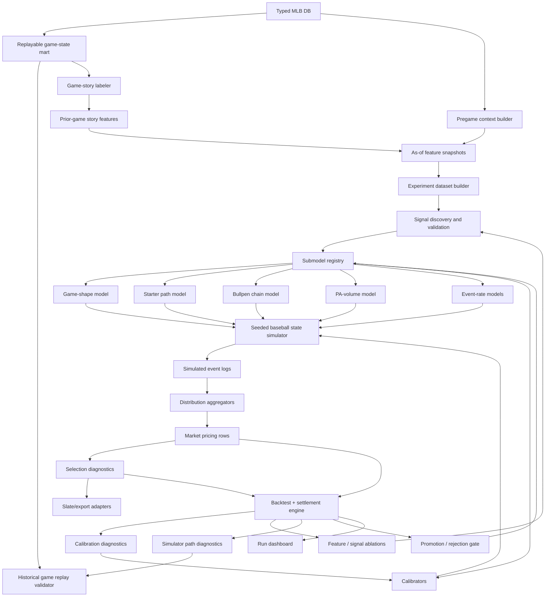
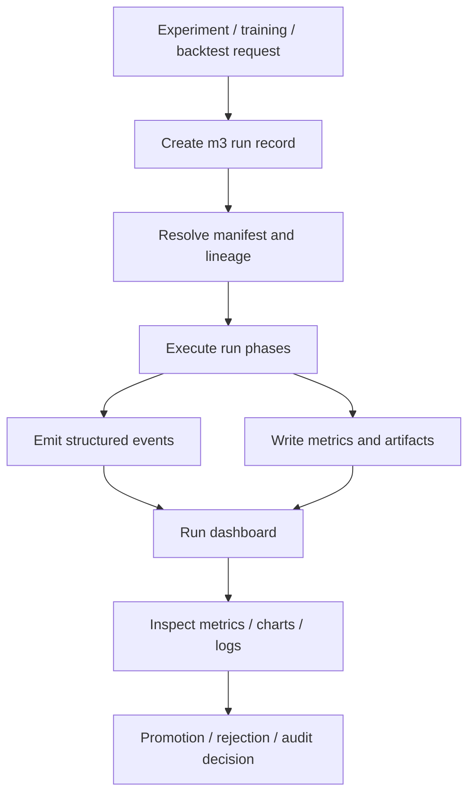
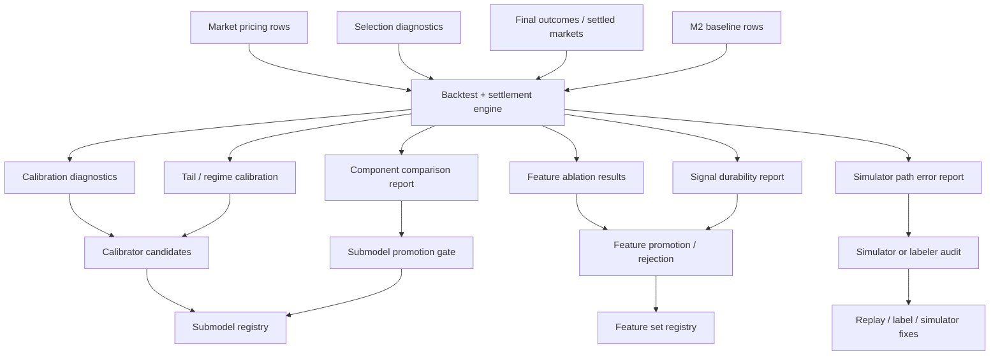

# MLB-M3 Alpha Design

Status: alpha design

Scope: MLB pregame research/model system

## Decision

M3 should not use the MLB-M2 hot-swappable cartridge format.

M3 is a different kind of system. The hot-swappable unit is not the whole model cartridge. The hot-swappable unit is a submodel family member or component artifact:

- game-shape model
- starter path model
- bullpen chain model
- PA-volume model
- batter/pitcher event model
- soft-signal encoder
- calibrator
- market aggregator
- selection policy

M3 is best described as a baseball research/model system:

```text
typed MLB DB
-> replayable game state
-> game-story labels
-> as-of feature snapshots
-> experiment datasets
-> swappable component models
-> baseball state simulator
-> market aggregators
-> backtest and diagnostics
```

## Non-Goals

- Do not preserve MLB-M2 cartridge compatibility.
- Do not build one giant "baseball model" that outputs every market directly.
- Do not move M2 weights into JSON and call it M3.
- Do not let presentation artifacts become source of truth.
- Do not let selection policy alter model probabilities.
- Do not read legacy `sports.db` once the required PA/pitch state is migrated into the typed MLB DB.
- Do not trust hidden correlations until they survive time-split validation and market tests.

## Alpha Architecture



## Layer 0: Typed DB Source Of Truth

The typed MLB DB is the only M3 source of truth.

Required grains:

- pitch
- plate appearance
- pitcher appearance
- player game
- team game
- game
- market snapshot
- slate snapshot

Required replay fields:

- ordered PA index
- ordered pitch index
- inning and half inning
- base state before and after
- outs before and after
- count before or final count
- score before and after
- batter, pitcher, teams
- pitcher entry/exit context

The alpha blocker is making typed DB state replayable enough to reconstruct historical game paths.

## Layer 1: Replayable Game-State Mart

This layer turns typed DB facts into model-ready state views.

Proposed views/tables:

```text
m3_replay_plate_appearances
m3_replay_pitch_events
m3_replay_half_innings
m3_pitcher_appearance_paths
m3_team_game_paths
m3_market_snapshots
```

Purpose:

- fast historical lookup
- deterministic replay
- label generation
- simulator validation

This is not ML yet. This is the baseball state foundation.

## Layer 2: Game-Story Labeler

The labeler creates postgame baseball-native targets:

- dead bats
- traffic without conversion
- traffic conversion
- two-out avalanche
- starter cruise
- starter stress
- starter collapse
- bullpen debt
- bullpen collapse
- reliever chain break
- PA-volume spike
- lineup turnover pressure
- late add-on
- walk cluster
- GIDP escape
- hard-contact suppression
- sequencing luck
- chaos game

The labeler should be deterministic and versioned.

Output contract:

```text
m3_game_story_labels
  game_id
  team_id
  entity_id optional
  label_name
  label_value
  label_strength
  label_version
  source_replay_hash
```

These labels do not say what to bet. They describe what happened in baseball terms.

## Layer 3: As-Of Feature Snapshots

Feature snapshots are historically knowable pregame state.

Feature families:

- calendar and schedule
- travel and rest
- series state
- team streak and form
- starter form and prior stress
- bullpen compressed-stretch usage and debt
- lineup and handedness context
- pitch-type matchup context
- park/weather/umpire context
- market lines and movement
- prior-game story labels
- soft signals with provenance and expiry

All features need:

```text
feature_snapshot_id
game_id
entity_type
entity_id
feature_name
feature_value
as_of_timestamp
source
lineage_hash
feature_version
```

Rule:

```text
Pitch data explains how past games became what they became.
Pregame aggregates describe the state before the next game.
The feature snapshot is the bridge.
```

## Layer 4: Experiment System

M3 should not become a pile of one-off Python scripts.

Python, Pandas, DuckDB, and scikit-style libraries are fine under the hood. The user-facing workflow should be manifest-driven and reproducible.

Proposed experiment shape:

```text
research-m3/experiments/
  game_shape_v0.yaml
  starter_path_v0.yaml
  bullpen_chain_v0.yaml
```

Each experiment manifest declares:

```text
target
feature_set
training_period
validation_period
split_strategy
model_family
calibrator
metrics
artifact_outputs
```

Experiment outputs:

```text
m3_experiment_runs
m3_feature_sets
m3_training_datasets
m3_model_artifacts
m3_calibration_reports
m3_backtest_reports
```

Every experiment run should register itself with the M3 run dashboard. The terminal should show high-level progress and a dashboard/report path, not every table, metric slice, traceback, and diagnostic row.

The goal is fast iteration:

- freeze dataset
- train candidate
- backtest
- compare to baseline
- promote only if durable

## Layer 4A: Run Dashboard

The run dashboard is the notebook-like control surface for M3.

Training, simulation, feature-building, calibration, and backtesting jobs should emit structured run events and persistent artifacts. They should not rely on console scrollback as the primary way to inspect work.



Minimum run records:

```text
m3_runs
m3_run_events
m3_run_metrics
m3_run_artifacts
m3_run_warnings
```

The dashboard should show:

- active phase and progress
- manifest and feature snapshot lineage
- train/validation/backtest metrics
- calibration and tail diagnostics
- feature ablation results
- simulator path diagnostics
- component comparisons
- artifact links
- filtered log/event tail
- promotion or rejection decision

Console output should stay thin:

```text
run_id
phase
progress
critical warnings/errors
dashboard/report path
```

## Layer 5: Submodel Registry

Hot swapping happens here.

The registry maps each component slot to a concrete artifact:

```text
game_shape: game_shape_histgb_v0
starter_path: starter_path_survival_v0
bullpen_chain: bullpen_chain_rules_plus_ml_v0
pa_volume: pa_volume_quantile_v0
event_rate: event_rate_pitchfit_v0
calibrator: isotonic_by_regime_v0
```

Each submodel must declare:

```text
component_id
component_slot
artifact_uri
input_contract
output_contract
feature_set_id
training_dataset_id
calibration_id
created_at
metrics
status
```

The simulator should not care whether a component was trained with rules, gradient boosting, survival modeling, Bayesian methods, or a neural net. It only cares that the output contract is valid.

## Layer 6: Component Outputs

Alpha component contracts:

`latent_forecast.game_shape`

```text
low_run_probability
normal_probability
high_run_probability
chaos_probability
blowout_probability
bullpen_collapse_probability
calibration_version
```

`latent_forecast.starter_path`

```text
expected_batters_faced
expected_outs
early_exit_probability
third_time_through_probability
stress_probability
collapse_probability
```

`latent_forecast.bullpen_chain`

```text
expected_first_reliever
first_reliever_probabilities
bridge_quality
bullpen_debt_index
late_inning_fragility
emergency_usage_probability
```

`latent_forecast.pa_volume`

```text
team_plate_appearance_distribution
fifth_pa_probability_by_lineup_slot
lineup_turnover_probability
extra_pa_spike_probability
```

`latent_forecast.event_rates`

```text
walk_rate_distribution
strikeout_rate_distribution
single_rate_distribution
extra_base_rate_distribution
home_run_rate_distribution
in_play_out_rate_distribution
```

## Layer 7: Baseball State Simulator

The alpha simulator should be simple, deterministic, and inspectable.

It should simulate:

- inning
- half inning
- base state
- outs
- count or count bucket
- batter order
- pitcher state
- score state
- pitcher changes

Output:

```text
m3_simulated_event_logs
  simulation_run_id
  game_id
  seed
  world_index
  event_index
  inning
  half_inning
  batter_id
  pitcher_id
  event_type
  base_state_before
  base_state_after
  outs_before
  outs_after
  score_before
  score_after
```

Engineering determinism:

```text
same slate snapshot
same feature snapshot
same registry
same artifact versions
same seed
-> same event-log ensemble
```

## Layer 8: Market Aggregators

Market outputs are aggregations over simulated event logs.

Alpha market contracts:

- full-game total
- first-five total
- moneyline
- first-five moneyline
- small player-prop subset if it falls naturally out of PA logs

Later:

- hits
- total bases
- RBI
- walks
- pitcher strikeouts
- pitcher outs
- home runs
- first inning
- alt/team totals

Rule:

```text
No market should be priced from a private one-off score if it can be priced from shared simulated worlds.
```

This keeps related outputs coherent.

## Layer 9: Selection And Diagnostics

Selection is not the model.

Selection consumes market pricing rows and decides:

- eligible
- pass
- hard pass
- watch only
- needs live confirmation
- edge too fragile
- market stale
- incoherent with related outputs

Diagnostics should show:

- feature snapshot used
- submodel registry used
- simulated distribution
- fair price
- market price
- edge
- calibration bucket
- veto/pass reason
- comparable historical games

## Layer 10: Backtesting Feedback Loop

Backtesting is not a final report. It is the control loop for M3.

The loop should compare predicted distributions, selected plays, skipped plays, M2 baselines, and final outcomes. It should then feed the results back into calibration, feature validation, simulator diagnostics, and submodel promotion decisions.



Backtest outputs:

```text
m3_backtest_runs
m3_settlement_rows
m3_backtest_slices
m3_calibration_diagnostics
m3_tail_diagnostics
m3_feature_ablation_reports
m3_signal_durability_reports
m3_simulator_path_diagnostics
m3_component_comparison_reports
m3_promotion_decisions
```

Backtest runs should write dashboard-ready summaries, charts, and slice tables. The default workflow should be "open the run dashboard/report," not "read a wall of console output."

The feedback loop has five jobs:

1. Calibration loop: update or reject calibrators when probabilities are miscalibrated by market, regime, team, park, or price bucket.
2. Signal loop: promote, demote, or reject candidate features based on time-split and ablation performance.
3. Component loop: compare submodel artifacts and promote only through the registry gate.
4. Simulator loop: compare simulated paths to real game-story labels, not only final score.
5. Data loop: flag replay, as-of, or settlement problems before they contaminate experiments.

Promotion rule:

```text
No signal, feature set, calibrator, market aggregator, or submodel artifact becomes active because it looked good once.
It must pass the promotion gate with lineage, backtest slices, calibration checks, and baseline comparison.
```

## Fast Lookups

Fast lookup strategy:

- SQLite remains canonical typed storage.
- DuckDB builds fast training and backtest datasets.
- Materialize M3 feature snapshots and labels.
- Index typed DB by `game_id`, `game_date`, `team_id`, `player_id`, `pitcher_id`, and `as_of_timestamp`.
- Cache frozen experiment datasets by content hash.
- Cache simulator outputs by slate snapshot, registry, artifact versions, and seed.
- Cache run dashboard summaries and report artifacts by `run_id`.

The system should optimize for:

- fast historical replay
- fast feature lookup
- fast experiment reruns
- fast comparison against old baselines
- fast verification that a candidate did not leak future data

## Quick Verification

Alpha verification gates:

1. Replay validator reconstructs final score and inning score from typed PA/pitch state.
2. As-of guard proves pregame features were knowable before first pitch.
3. Labeler snapshot is deterministic for the same replay input.
4. Feature snapshot hashes are stable.
5. Submodel output validates against contract schemas.
6. Simulator output is deterministic for a fixed seed.
7. Aggregators reconstruct totals, F5, moneyline, and prop stats from event logs.
8. Backtests report calibration, tail calibration, edge by regime, and market comparison.
9. Ablation reports show whether promoted signals actually helped.
10. Backtest feedback produces explicit promotion, rejection, or audit decisions.
11. Long runs create dashboard records, structured events, metrics, warnings, and artifact links.

## Alpha Build Order

1. Finish typed DB migration for replayable PA/pitch state.
2. Build replay validator.
3. Build game-story labeler v0.
4. Build as-of feature snapshot builder.
5. Build run dashboard records, structured events, and artifact registry.
6. Build experiment manifest/runner.
7. Build submodel registry and contract validators.
8. Train/prototype first game-shape, starter-path, bullpen-chain, PA-volume, and event-rate components.
9. Build simple seeded state simulator.
10. Build market aggregators for full-game total, F5 total, moneyline, and first-five moneyline.
11. Build backtest + settlement engine.
12. Add calibration, feature-ablation, simulator-path, and component-comparison reports.
13. Add registry promotion/rejection gates.
14. Backtest against market contracts and current M2 baseline.

## Alpha Success Criteria

M3 alpha is useful if it can:

- replay historical games from typed DB state
- label game stories in baseball-native terms
- build leak-safe pregame feature snapshots
- run fast, reproducible experiments
- inspect long-running work through a run dashboard instead of console dumps
- swap component artifacts without rewriting the simulator
- simulate coherent game paths
- price at least full-game total, F5 total, and moneyline from shared worlds
- compare those prices against M2 and market contracts
- explain edges in baseball language, not just model scores

The first alpha does not need to beat every M2 lane. It needs to prove the architecture can learn baseball stories, preserve tails, and support fast iteration.
