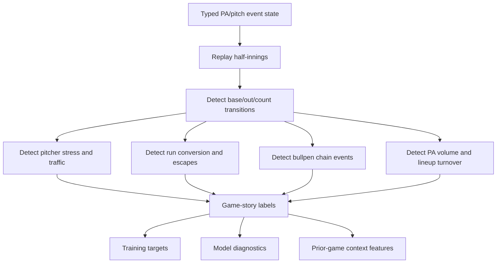

# M3 Game Story Labels

## Purpose

Game-story labels turn pitch and plate-appearance data into baseball-native training targets.

M3 should not only learn from final score, box score, ERA, or simple rolling averages. It should learn the path:

```text
base/out/count/score state
-> event sequence
-> pitcher stress
-> traffic creation
-> traffic conversion or escape
-> bullpen exposure
-> game shape
```

These labels are not picks. They are a vocabulary for training and diagnostics.

## Labeler DAG



## Core Labels

Dead bats:

- Low run output.
- Low traffic or low-quality contact.
- Few extended innings.
- Few high-leverage baserunner states.

Traffic without conversion:

- Multiple innings with runners on.
- Low or zero run conversion.
- GIDP, strikeouts, weak contact, or stranded runners erase scoring paths.

Traffic conversion:

- Baserunners repeatedly become runs.
- Singles, walks, hit-by-pitch, extra-base hits, sacrifices, or errors extend innings.

Two-out avalanche:

- Two outs recorded.
- Multiple consecutive batters reach or drive in runs.
- Inning flips from nearly dead to high damage.

Starter cruise:

- Starter keeps low PA count.
- Low walk traffic.
- Few long counts.
- Limited hard contact or damage.

Starter stress:

- High pitches per inning or per batter.
- Repeated baserunner states.
- Long counts.
- Traffic escaped or converted.
- Early hook risk rises.

Starter collapse:

- Starter allows clustered damage.
- Hook comes earlier than expected.
- Damage may be single-inning collapse or gradual erosion.

Bullpen debt:

- Prior game used key relievers.
- Multiple recent appearances or high pitch counts.
- Bridge to late innings weakens.

Bullpen collapse:

- Reliever allows traffic and damage quickly.
- Walks, hard contact, HR, or repeated baserunners break the chain.
- Game shape changes after starter exit.

Reliever chain break:

- Expected bridge fails.
- Emergency or lower-quality reliever enters earlier than expected.

PA volume spike:

- Team gets extra lineup turns.
- High plate appearances from extended innings.
- Fifth PA probability rises for top/middle lineup.

Lineup turnover pressure:

- Starter faces lineup third time under stress.
- Later lineup turns hit weaker bullpen arms.

Blowout/substitution risk:

- Score state creates removal risk for regulars or changes bullpen usage.

Late add-on:

- Team extends lead after F5 or after opponent bullpen entry.

Walk cluster:

- Multiple walks/HBP/long counts create traffic even without strong contact.

GIDP escape:

- Traffic forms, then double play erases a run-scoring path.

Hard-contact suppression:

- Team creates quality contact but little run output.
- Useful for distinguishing unlucky dead scoreboard from genuinely dead bats.

Sequencing luck:

- Outcome was driven by event ordering more than base event volume.
- Useful for avoiding false confidence from final score alone.

## Example: Giants at Rockies, 2026-05-30

Game: `mlb-824352`

Final:

- Rockies 8, Giants 3
- F5: Rockies 5, Giants 0

Story labels:

- Giants dead bats through F5.
- Giants traffic without conversion, including GIDP escapes.
- Rockies starter cruise from Ryan Feltner.
- Giants starter stress from Adrian Houser.
- Rockies traffic conversion in the 1st, 4th, and 5th.
- Rockies late add-on in the 7th.

Why this matters:

The Giants were not simply "bad offense." They produced some traffic, but it was erased or failed to convert. Feltner kept the game under control, while Colorado created early pressure and converted enough to control the script.

## Example: Giants at Rockies, 2026-05-31

Game: `mlb-824354`

Final:

- Giants 19, Rockies 6
- F5: Giants 11, Rockies 5

Story labels:

- Giants avalanche game.
- Massive PA volume spike.
- Two-out damage sequence.
- Rockies starter stress.
- Rockies bullpen collapse.
- Intentional walk into grand-slam conversion.
- Coors-style chaos regime.
- Rockies traffic response, but not enough to control the script.

Why this matters:

The next-day game was not a mild adjustment from the prior game. It was a different state path. Averaging the two games hides the signal M3 needs to learn.

## Required Typed State

The labeler needs typed DB fields that can reconstruct the game path:

- ordered PA index
- inning and half inning
- batter and pitcher IDs
- batting and pitching team IDs
- outs before and after
- base state before and after
- score before and after
- balls and strikes
- pitch order within PA
- pitch result and pitch type
- event type
- RBI and runs scored
- pitcher entry/exit context

The typed DB currently has useful PA/pitch rows, but the richer legacy state fields should be promoted into typed tables before the simulator depends on them.

## How Labels Feed M3

Labels can be used as:

- training targets for game-shape models
- prior-game context features
- evaluation slices
- diagnostics for why a market moved
- checks for whether simulated worlds resemble real baseball paths

Example:

```text
prior_game_label = traffic_without_conversion
plus bullpen_debt
plus park_carry
plus starter_stress_matchup
-> higher chaos probability
-> wider total distribution
-> more correlated player-prop upside
```

The labeler should never be allowed to directly say "bet over." It should describe baseball state. Pricing and selection happen later.
