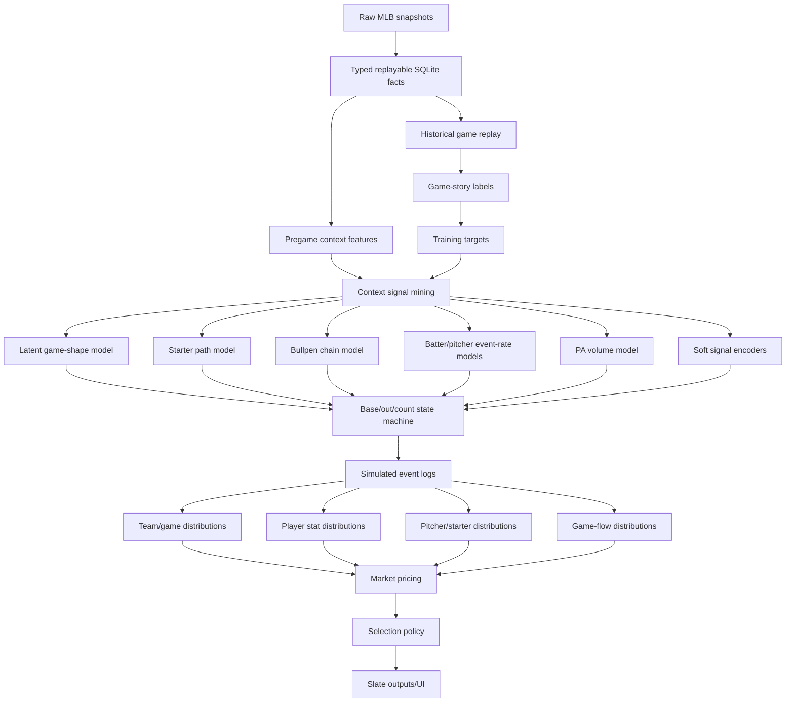
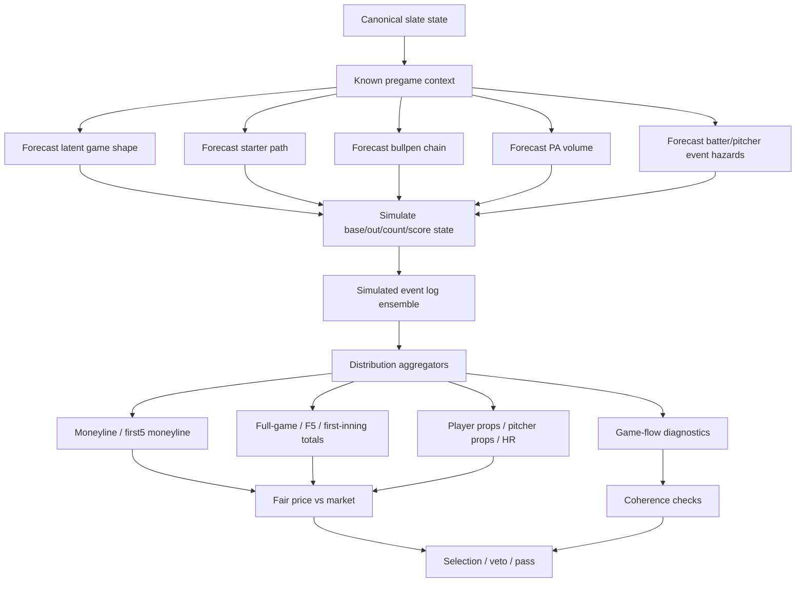

# M3 Model Architecture Notes

## Core Idea

M3 is a baseball state and simulation system, not a single predictive head.

The model should take typed, replayable historical baseball data and learn how game stories form. Market predictions should be produced by aggregating simulated baseball outcomes, not by directly hand-scoring picks.

```text
typed replayable DB
-> game-story labels
-> context signal mining
-> latent game-shape / state forecasts
-> PA/base-out/count simulator
-> simulated event logs
-> distribution aggregators
-> market pricing
-> selection policy
-> presentation
```

## Important Correction

The market heads are not the core model.

Moneyline, full-game total, F5 total, first-inning, home run, total bases, hits, walks, RBI, pitcher strikeouts, and related props are pricing views over shared simulated baseball event logs.

Bad architecture:

```text
features -> moneyline head
features -> total head
features -> player prop head
```

Better architecture:

```text
features -> game-shape + event-rate models -> baseball state machine -> event logs -> market aggregators
```

This matters because player props are not separate from game flow. A player's chance of extra plate appearances, RBI, runs, total bases, walks, and even substitutions changes when the game becomes a pitcher duel, normal script, blowout, bullpen collapse, or Coors-style chaos script.

## Main DAG



## Runtime Shape



## Determinism

M3 should be deterministic in the engineering sense:

- same input snapshot
- same feature version
- same model artifact
- same calibration version
- same seed

gives the same distribution and selection output.

That does not mean the model predicts one exact final score. It means the simulator produces a reproducible ensemble of possible game paths. The edge comes from whether the market is mispricing the distribution, especially the tails.

## Probability Warning

Smooth probabilities are dangerous if they erase baseball chaos.

Bad:

```text
Game 1 total misses high by 4.
Game 2 total misses low by 4.
Average error looks fine.
```

Good:

```text
Model learns which pregame states imply:
  dead-game risk
  normal-game risk
  high-run risk
  chaos-game risk
  starter-failure risk
  bullpen-collapse risk
  PA-volume spike risk
```

The model can use probabilities, but they must be probabilities over baseball states and state transitions, not only a smoothed final-score mean.

## Component Modules

These modules should be swappable:

- game-shape model
- starter path model
- bullpen chain model
- batter event model
- pitcher event model
- PA-volume model
- soft signal encoders
- calibrators
- selection policies
- presentation adapters

They should be bound by contracts, not by shared implementation details.

## Contract Boundaries

Contracts should describe baseball semantics, not one model's internal math.

Good contract shape:

```text
latent_forecast.game_shape
  low_run_probability
  normal_probability
  high_run_probability
  chaos_probability
  blowout_probability
  bullpen_collapse_probability
  calibration_version
  feature_snapshot_id
```

Bad contract shape:

```text
game_score = 0.2 * starter + 0.3 * bullpen + 0.5 * bats
```

The first can survive new model types. The second recreates M2 with cleaner folders.

## Outputs To Support

The current output inventory shows M3 needs to support:

- moneyline
- first5 moneyline
- full-game total
- first5 total
- first-inning markets
- player props
- pitcher props
- home run candidates/pricing
- reliever shadow / first-up reliever forecasts
- selection policy rows
- experiment/backtest artifacts
- presentation exports

These outputs should agree because they come from the same simulated baseball worlds.

## First Practical Slice

The first working M3 should not attempt every market at once.

Recommended v0:

1. Build typed replay/state extraction for historical games.
2. Label historical game stories.
3. Build canonical slate state from typed DB.
4. Train or prototype game-shape, starter-path, bullpen-chain, and PA-volume forecasts.
5. Build a small state-machine simulator.
6. Aggregate full-game total, F5 total, moneyline, and a small prop subset from the same event logs.
7. Compare against M2 outputs and market contracts.

Player props should enter as aggregations over simulated plate appearances, not as an isolated prop-only model.

## Relationship To M2

M2 is valuable because it already contains baseball instincts and story logic. The problem is that much of that logic is mixed into scripts, presentation payloads, custom weights, and lane-specific code.

M3 should preserve the useful baseball vocabulary from M2 while extracting it into:

- typed DB state
- game-story labels
- feature contracts
- learned components
- calibration artifacts
- market-pricing contracts

That makes experiments faster, cheaper in tokens, and easier to validate.
