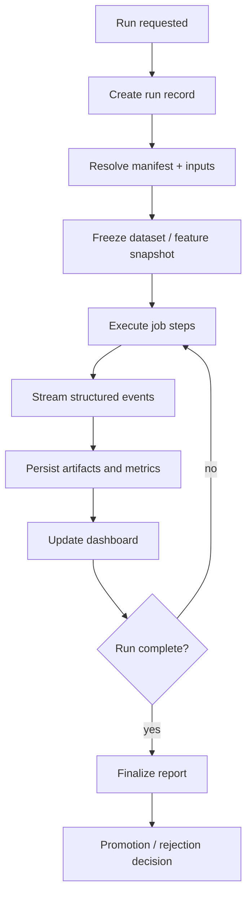

# M3 Run Dashboard Notes

## Requirement

M3 runs should behave like notebook-backed experiments, not console dumps.

Training, backtesting, simulation, and feature-building jobs will produce too much output for a terminal stream. The console should show only high-level progress and a pointer to the run dashboard. Detailed artifacts, metrics, charts, logs, and decisions should be persisted and browsable.

## Dashboard Role

The run dashboard is the working surface for:

- training runs
- feature snapshot builds
- game-story labeler runs
- simulator runs
- backtests
- calibration jobs
- ablation studies
- component comparisons
- promotion/rejection reviews

It should answer:

- What is currently running?
- What data and feature versions did it use?
- Which submodel registry was active?
- What metrics changed?
- Which slices improved or degraded?
- Did calibration improve?
- Did tail/regime behavior improve?
- What artifacts were produced?
- What should be promoted, rejected, or audited?

## Run Lifecycle



## Run Record

Every long-running M3 task should create a run record:

```text
m3_runs
  run_id
  run_type
  status
  manifest_id
  feature_snapshot_id
  training_dataset_id
  submodel_registry_id
  seed
  started_at
  finished_at
  git_sha
  code_version
  owner
```

Suggested run types:

```text
feature_build
label_build
train_component
simulate_slate
backtest
calibrate
ablation
component_compare
promotion_review
```

## Structured Events

The job runner should emit structured events instead of unstructured console logs:

```text
m3_run_events
  run_id
  event_index
  event_time
  level
  phase
  message
  payload_json
```

Examples:

```text
phase=dataset_freeze
phase=training
phase=calibration
phase=simulation
phase=backtest
phase=artifact_write
phase=promotion_gate
```

Console output should be limited to:

```text
run id
phase
percent or step count
critical warnings/errors
dashboard/report path
```

## Dashboard Views

Minimum useful views:

- Run list with status, type, start time, duration, and active phase.
- Run detail with manifest, inputs, lineage, and artifact links.
- Metrics panel with train/validation/backtest metrics.
- Calibration panel by market, regime, line bucket, team, park, and price bucket.
- Tail diagnostics panel for chaos, blowout, starter failure, and bullpen collapse.
- Feature ablation panel.
- Simulator path diagnostics comparing simulated worlds to real game-story labels.
- Component comparison panel against active baseline and M2 baseline.
- Log/event tail with filters by phase and level.
- Promotion review panel with accept/reject/audit decision.

## Artifact Contract

Runs should write artifacts with stable paths and hashes:

```text
data-private/models/mlb-m3/runs/{run_id}/
  manifest.yaml
  lineage.json
  metrics.json
  artifacts.json
  warnings.json
  report.md
  charts/
  tables/
```

Artifacts should be registered in typed storage:

```text
m3_run_artifacts
  run_id
  artifact_type
  artifact_uri
  content_hash
  created_at
  metadata_json
```

## Why This Matters

M3 is going to run large chunks of work:

- building feature matrices
- training candidate components
- simulating many worlds
- backtesting many dates
- slicing calibration and edge results

Those are notebook-like workflows. The system needs persistent run memory so we can compare, inspect, resume, and promote safely without asking the terminal scrollback to be the experiment database.
