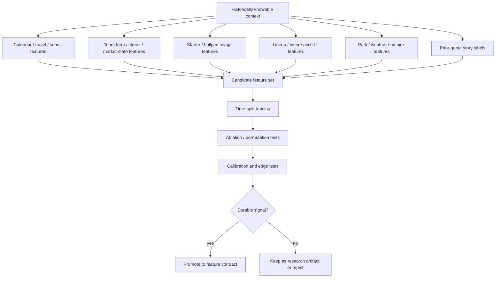

# M3 Signal Discovery Notes

## Goal

M3 should be able to test hidden baseball-context signals without hard-coding every belief into the model.

Some useful signals may look obvious only after the model combines them:

- Tuesday vs weekend game
- day game after night game
- getaway day
- third or fourth game in a series
- first game after travel
- long previous game
- bullpen-heavy previous game
- underdog/favorite state
- win streak or losing streak
- pitcher facing the same team again
- reliever usage over the last few days
- park/weather/umpire context
- market open/close movement

The point is not to assume these are edges. The point is to let the model test whether they help explain game shape, tails, and mispriced markets.

## Signal Mining DAG



## Candidate Signal Families

Calendar and schedule:

- day of week
- weekend vs weekday
- day game after night game
- getaway day
- doubleheader or second game after short rest
- series game number
- homestand length
- road-trip length
- days since off day

Travel and fatigue:

- distance traveled since prior game
- time-zone change
- late game before travel
- long game duration before travel
- extra-innings prior game
- first game after travel
- third city in compressed travel stretch

Team state:

- win streak
- losing streak
- home underdog
- road underdog
- favorite after blowout loss
- underdog after bullpen-heavy win
- team scored zero/one run yesterday
- team scored many runs yesterday
- team had traffic without conversion
- team was suppressed despite hard contact

Starter state:

- prior outing pitch count
- prior outing inning-by-inning stress
- early traffic escaped
- single-inning collapse vs full-game erosion
- command trend by count
- velocity trend
- pitch-mix change
- prior same-opponent exposure in state memory
- batter/pitch-type matchup fit

Bullpen state:

- relievers used yesterday
- relievers used repeatedly in compressed bullpen stretch
- pitch counts by reliever
- expected first-up reliever
- bridge quality
- late-inning debt
- left/right availability
- emergency long-relief risk

Hitter and lineup state:

- hard contact into outs
- dead bats with weak contact
- dead bats with traffic but no conversion
- lineup turnover path
- fifth PA probability
- handedness stack vs starter
- pitch-type fit
- batter rut/heat as a soft signal

Environment:

- park
- altitude
- wind direction and speed
- temperature
- humidity
- roof state
- umpire run/strike tendency
- carry/contact environment

Market state:

- opening line
- current line
- line movement
- implied total
- implied team total
- market disagreement by book
- price movement after lineup confirmation

Soft or unknown factors:

- pitcher stress/anger reports
- injury whispers
- lineup fatigue
- beat-report notes
- coaching usage hints

These should be encoded with provenance, confidence, expiry, and shrinkage. They should move latent state forecasts, not picks directly.

## Guardrails

M3 should be curious, but validation should be strict.

Every candidate signal needs:

- historically knowable timestamp
- leakage check
- time-split validation
- season/month split
- ablation test
- permutation importance
- calibration check
- market edge test
- closing-line value check when available
- regime-specific validation

Avoid:

- "Tuesday overs hit 57%, bet overs"
- postgame fields leaking into pregame features
- too many random features promoted without out-of-sample proof
- treating correlation as a permanent baseball law

Prefer:

```text
Tuesday is not the edge.
Tuesday may be a proxy for travel, rest, series state, bullpen state, or day-game context.
The promoted feature should represent the baseball mechanism, not just the calendar label.
```

## Promotion Standard

A signal can become a real M3 feature only if it improves at least one of:

- game-shape calibration
- tail calibration
- market fair-price accuracy
- backtested edge after price
- selection quality
- coherence between related markets

If a signal is interesting but unstable, keep it as an experiment artifact. Do not wire it into production selection.

## Why This Exists

The DB emphasis matters because the hidden edge may live in discrete state changes:

- new pitcher enters
- tired reliever forced into leverage spot
- starter survives traffic but burns pitches
- team hits into two GIDPs instead of extending innings
- prior game runs long enough to affect bullpen and travel
- same lineup flips from dead-bat script to avalanche script

M3 needs to test whether any combination of those states predicts game shape better than market pricing.
