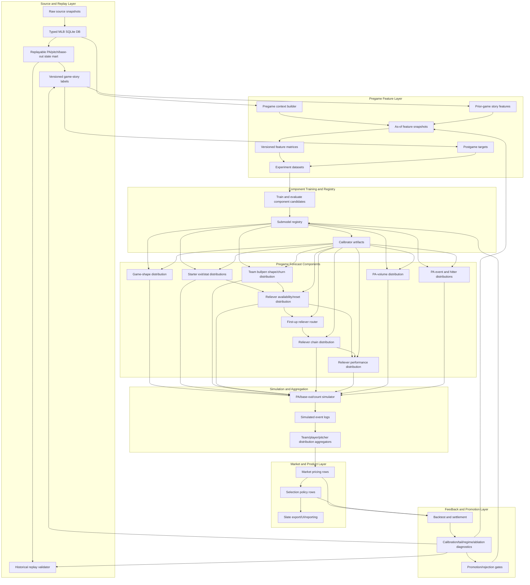
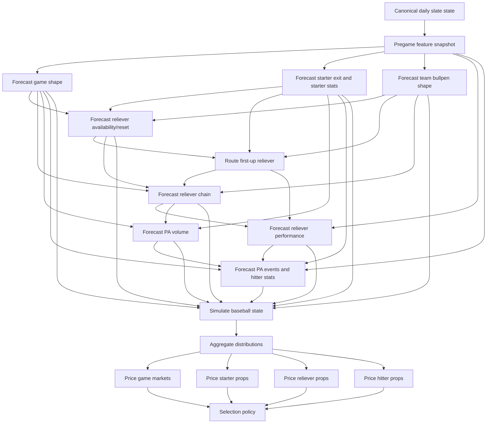
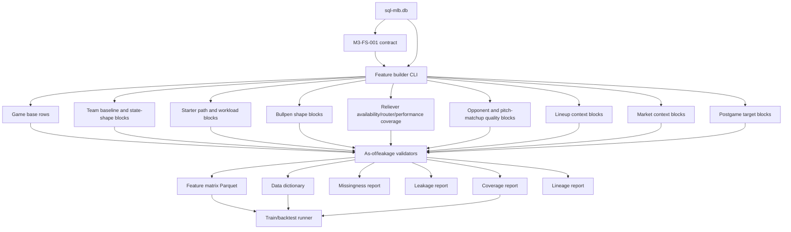
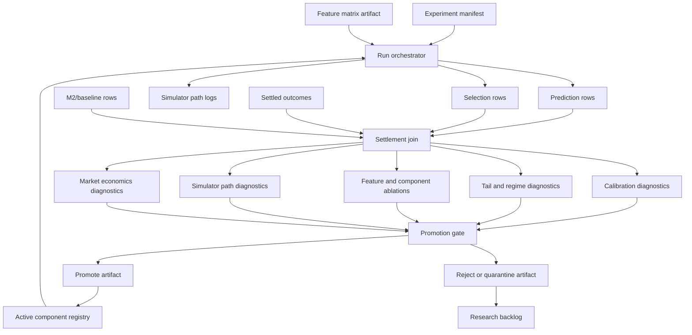

# MLB-M3 Current System Design DAG

Date: 2026-06-03

Status: current implementation design

Scope: MLB-M3 alpha architecture, dependency chart, and implementation pressure points.

## Current Evaluation

The current M3 design is no longer a simple model pipeline. It is a baseball research and simulation system with typed data, replay state, feature contracts, swappable component models, simulator outputs, market pricing, selection policy, backtesting, and run monitoring.

The high-level architecture is sound, but the diagrams need one important correction: the bullpen path cannot stay as one block. It now needs separate contract boundaries for team bullpen shape, individual reliever availability/reset, first-up reliever routing, reliever chain behavior, and reliever performance. If those are collapsed into one model, M3 will repeat the M2 problem in a cleaner folder.

The current system should be read as:

```text
typed DB
-> replayable baseball state
-> postgame story labels
-> pregame feature snapshots
-> versioned feature matrices
-> component model artifacts
-> coherent baseball-world simulator
-> distribution aggregators
-> market pricing
-> selection policy
-> settlement/backtest/diagnostics
-> promotion gates and dashboard
```

## Current Source Of Truth DAG



## Implementation Layer Chart

| Layer | Depends On | Produces | Main Risk |
| --- | --- | --- | --- |
| `L0` typed source DB | source snapshots, migrations, ingestion paths | typed baseball facts | missing replay fields or lineage gaps |
| `L1` replay mart | typed PA/pitch/game/player tables | deterministic base/out/count/score paths | invalid state reconstruction |
| `L2` game-story labeler | replay mart, game outcomes | versioned labels and targets | labels encode artifacts instead of baseball state |
| `L3` pregame snapshots | typed DB, historical labels, markets, slate state | as-of feature facts | leakage or stale source timing |
| `L4` feature matrices | feature contract, snapshots, targets | Parquet matrix and data dictionary | feature explosion without coverage reporting |
| `L5` component training | matrices, labels, manifests | candidate model artifacts | hidden fixed windows or M2-style hand weighting |
| `L6` component registry | candidate artifacts, backtest diagnostics | active component versions | promoting one lucky run |
| `L7` forecast components | active registry, daily slate snapshot | distributions, not picks | crossing component responsibilities |
| `L8` simulator | component distributions | coherent event logs | smooth average worlds that erase tails |
| `L9` aggregators | simulated event logs | stat and market distributions | props drift away from game flow |
| `L10` pricing/selection | market distributions, prices, policy | prediction and selection rows | selection mutates probabilities |
| `L11` settlement/backtest | predictions, selections, results | calibration, tail, regime, ablation reports | console-only experiments with weak lineage |
| `L12` dashboard/export | run manifests, reports, rows | UI, slates, run dashboard | presentation becomes source of truth |

## Forecast Component Boundaries

The hot-swappable unit in M3 is the component artifact, not the whole MLB model. Each component can change implementation style as long as it honors its input and output contract.

| Component | Input Contract | Output Contract |
| --- | --- | --- |
| game-shape model | game/team/starter/bullpen/market context | low, normal, high-run, chaos, blowout, late-volatility distributions |
| starter path model | starter state, opponent pressure, lineup, bullpen behind him | starter outs, hook timing, bridge entry point, starter stat distribution |
| bullpen shape model | team bullpen usage, role state, recent churn, game context | normal chain, compressed chain, scramble chain, churn regime |
| reliever availability/reset model | individual reliever usage, quick-reuse history, role, team behavior | candidate availability, reset state, exception probability |
| first-up reliever router | starter exit path, score state, bullpen shape, candidate availability | probability distribution over first-up arms |
| reliever chain model | first-up route, remaining pool, game shape, score state | chain length, second arm probability, inherited-runner state |
| reliever performance model | reliever state, workload, opponent pocket, inherited runners | outs, pitches, batters faced, damage and traffic distributions |
| PA-volume model | game shape, starter exit, lineup order, team run path | team and player PA opportunity distribution |
| PA event/hitter model | batter plus one opponent pitching path: starter phase then reliever-chain phase | PA event and hitter stat distributions |
| calibrator | raw component outputs, validation slices | calibrated component distributions |
| market aggregator | simulated event logs and known market contract | fair probability, fair line, market delta |
| selection policy | priced rows, risk rules, confidence, liquidity | show/pass/veto/watch rows |

## Runtime Forecast DAG



## Pitching Path Grain

For each batting side, there is one opponent pitching path, not a pile of independent matchup models.

```text
home offense -> away starter phase -> away reliever-chain phase
away offense -> home starter phase -> home reliever-chain phase
```

The starter is a known or unknown single-arm phase. The relief side is a probabilistic chain phase. Hitter props and player stat distributions should allocate expected plate appearances across that one path:

```text
player PA opportunity
-> probability PA occurs against starter phase
-> probability PA occurs against reliever-chain phase
-> event distribution conditional on the pitcher phase reached
-> player stat distribution
```

This means M3 should not build separate standalone "hitter versus starter" and "hitter versus reliever" products. Those are two states inside the same game path. The reliever-chain phase is different from the starter phase because the arm identity, entry state, handedness pocket, workload, inherited-runner state, and chain-break risk are all uncertain. But it is still part of the same opponent pitching path that the hitter is projected to face.

## Feature Extraction DAG For M3-FS-001

`M3-FS-001` should produce facts, baselines, residuals, state paths, coverage fields, uncertainty flags, targets, and lineage. It should not output a hand-built chaos score or any final betting conclusion.



## Backtest Feedback Loop

Backtesting is not an afterthought. It is part of the DAG because M3 only learns whether a story, feature, or component matters after it survives time-split and market-aware validation.



## Run Dashboard Dependency

The run dashboard should observe the pipeline, not replace it.

It needs to read:

- experiment manifests
- feature artifact manifests
- component registry versions
- training metrics
- backtest reports
- leakage and missingness reports
- simulator path diagnostics
- selection and settlement summaries

It should show:

- active run state
- data coverage
- leakage failures
- target distribution
- calibration by slice
- tail accuracy by regime
- component comparison
- promoted/rejected artifacts
- open follow-ups

The dashboard should not be where features, models, or picks are defined.

## Current Design Pressure Points

1. Replay state is the root dependency. If the typed DB cannot reconstruct base/out/count/score and pitcher transitions, the simulator becomes decorative.
2. Feature snapshots must be as-of clean. The same table can contain useful historical facts and illegal future facts, so validators need to enforce timing.
3. Fixed raw windows are not a design primitive. Windowed stats can be candidate evidence, but state memory, event sequences, change-point candidates, residuals, and coverage flags are the real abstraction.
4. Relievers need their own path. Availability, router, chain, and performance are different questions and should not be one score.
5. Player props are downstream of shared worlds. Hits, total bases, RBI, walks, strikeouts, and pitcher props must resolve from PA volume, event distributions, starter exit, the single opponent pitching path, and game shape.
6. Selection policy must stay downstream. It can rank, veto, hide, or flag rows, but it cannot edit fair probabilities.
7. Backtests must be artifact-driven. If a run cannot trace feature contract, artifact versions, calibration, market source, and settlement, it cannot promote anything.
8. The first implementation spine should be narrow. Build M3-FS-001, labels, run reports, baseline component outputs, and backtest plumbing before trying to model every prop family.

## First Implementation Spine

The practical build order should be:

1. Finish typed DB and replay-state audit for PA, pitch, pitcher appearance, game, team, player, market, and source snapshot lineage.
2. Build `M3-FS-001` from `sql-mlb.db` with data dictionary, leakage report, missingness report, reliever coverage, and lineage.
3. Build deterministic postgame labels for run environment, F5 shape, starter exit, bullpen churn, reliever chain break, PA volume, and chaos-game targets.
4. Add a manifest-driven run command that creates one run directory and dashboard-readable reports.
5. Train the first baseline component candidates for game shape, starter exit, bullpen churn, reliever availability, team runs, and F5/full-game totals.
6. Write prediction rows and settlement rows using typed schemas, with M2 as baseline comparison only.
7. Backtest by time split, regime, park/weather, starter confidence, bullpen churn, market line bucket, and price bucket.
8. Promote or reject artifacts through explicit gates before adding player prop components.

## What This Chart Says Not To Build

- No direct `features -> picks` shortcut.
- No isolated player prop heads that ignore game shape.
- No separate hitter-matchup islands outside the single starter-phase plus reliever-chain path.
- No hand-coded M2 score formulas inside M3 features.
- No fixed raw window as the only definition of form.
- No bullpen model that mixes availability, routing, and performance into one opaque number.
- No presentation files as source of truth.
- No console-only training jobs that cannot be resumed, audited, or compared.
