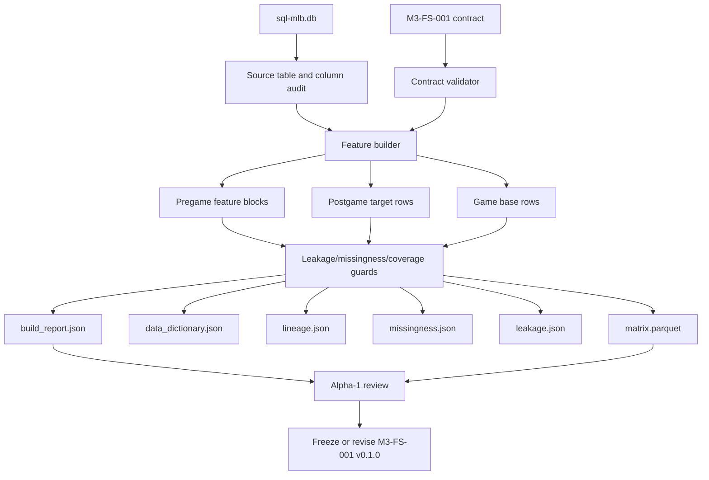

# MLB-M3 Alpha-1 Run Plan

Date: 2026-06-03

Phase ID: `mlb-m3-alpha-1`

Status: ready for implementation

Ledger: `run-plans/mlb/2026-06-03-mlb-m3-alpha-1-ledger.md`

## Mission

Alpha-1 replaces the current `M3-FS-001` skeleton with a real typed-DB feature build that produces a trustworthy game-grain matrix and reports.

This is not a training run and not a prop model. It is the first M3 data product that later training, simulation, backtesting, and dashboard work can trust.

## Locked Defaults

| Decision | Alpha-1 Lock |
| --- | --- |
| Source DB | `data-private/warehouse/sports/mlb/sql-mlb.db` only |
| Legacy DB | no reads from `data-private/warehouse/sports.db` |
| M2 artifacts | no generated M2 artifacts as inputs |
| Feature set | `m3_fs_001_game_shape_starter_v1` |
| Grain | one row per completed MLB game |
| Date range for dry run | `2026-03-26` through `2026-05-31` |
| First scope | game shape, full-game totals, F5 totals, team runs, starter path, bullpen/reliever-chain coverage |
| Out of scope | training, picks, selection policy, player prop pricing, simulator event generation |
| Hand-built scores | forbidden |
| Fixed windows | not a truth primitive |
| AB/PA | derived from lineup/state path later, not hand-authored input truth |
| Batting-side path | one opponent pitching path: starter phase then reliever-chain phase |

## Hard Rules

- Feature extraction may define factual columns, baselines, residuals, evidence counts, uncertainty flags, and lineage.
- Feature extraction must not define final betting conclusions.
- No M2 weights, multipliers, confidence boosts, or copied score formulas.
- No fixed `last5` or `last10` memory as the definition of form.
- Any sparse or missing data becomes coverage, missingness, or tech debt; it must not silently fall back to legacy sources.
- Selection policy is downstream and cannot alter model probabilities.
- Presentation/export files are not source of truth.

## Alpha-1 DAG



## Required Outputs

Feature artifact directory:

```text
data-private/models/mlb-m3/features/
  m3_fs_001_game_shape_starter_v1/
    <run_id>/
      matrix.parquet
      data_dictionary.json
      lineage.json
      missingness.json
      leakage.json
      coverage.json
      build_report.json
```

Report mirror:

```text
data-migration/reports/
  m3_fs_001_game_shape_starter_v1_<start>_to_<end>.json
```

The first real run must also print a short summary to stdout, but stdout is not the artifact.

## CLI Contract

The user-facing command stays one job. The Python environment must have `duckdb==1.5.3` installed from `data-migration/requirements.txt`, or use the bundled Codex Python runtime that already provides DuckDB.

```bash
python3 -m pipeline.mlb.features.builders.build_game_shape_starter_v1 \
  --start-date 2026-03-26 \
  --end-date 2026-05-31 \
  --as-of-policy pregame \
  --db data-private/warehouse/sports/mlb/sql-mlb.db \
  --output-dir data-private/models/mlb-m3/features/m3_fs_001_game_shape_starter_v1 \
  --report data-migration/reports/m3_fs_001_game_shape_starter_v1_2026-03-26_to_2026-05-31.json
```

Internally the builder can use SQLite, DuckDB, Pandas, SQL modules, validators, and artifact writers. The user should not need to run a chain of scripts manually.

## Implementation Steps

1. Validate `M3-FS-001` contract and current skeleton report.
2. Audit source tables and columns in `sql-mlb.db`; record table availability, row counts, date ranges, and missing source decisions in the ledger.
3. Add game base extraction: completed games only, teams, dates, venue where available, home/away IDs, and stable primary key.
4. Add postgame targets: final total runs, F5 total runs, side runs, total bucket, F5 bucket, and chaos-game flag.
5. Add matrix writer and artifact manifest: Parquet output if supported, otherwise stop and choose a writer explicitly.
6. Add data dictionary generation for every feature and target column.
7. Add leakage checks: feature columns must be pregame-safe; target columns must be isolated under `target_`.
8. Add missingness and row lineage reports.
9. Add source coverage report for every required source table in the contract.
10. Add team baseline/state-shape blocks as factual/residual/coverage columns, not composite scores.
11. Add starter path and workload blocks: starter known flag, role context, workload path surfaces, exit/hook distribution coverage, low-evidence flags.
12. Add opponent pitch-matchup coverage: pitch mix and batter/team response availability, not a hand-built matchup score.
13. Add bullpen shape and churn coverage.
14. Add reliever availability/router/performance coverage: candidate pool, first-up router coverage, chain coverage, individual-arm coverage, uncertainty flags.
15. Add lineup context and PA-volume scaffolding: lineup completeness, known slots, home bottom-9 suppression context. Do not add hand-coded expected AB.
16. Add market context only if timestamp semantics are pregame-clean; otherwise report market coverage as deferred.
17. Run the first dry build for `2026-03-26` through `2026-05-31`.
18. Review row counts, target distributions, missingness, coverage, leakage, and lineage.
19. Update the ledger with accepted, revised, deferred, and blocked items.
20. Freeze `M3-FS-001` v0.1.0 or open a focused revision before any training/backtest work.

## Feature Block Order

Alpha-1 should build in this order because each block depends on the previous state being trustworthy:

1. base rows and targets
2. artifact writer and reports
3. leakage/missingness/lineage validators
4. team state shape
5. starter path
6. opponent matchup coverage
7. bullpen shape
8. reliever path coverage
9. lineup and PA-volume scaffolding
10. market context

## Acceptance Gate

Alpha-1 is accepted when:

- the feature build reads only `sql-mlb.db`
- the command produces a real matrix artifact and JSON reports
- every matrix column has a dictionary entry
- row counts match completed games in the requested range
- target counts and target distributions are explainable
- leakage checks pass
- missingness is explicit
- source coverage includes all required contract tables
- starter coverage is explicit
- reliever availability, first-up router, chain, and individual-arm coverage are explicit
- one opponent pitching path per batting side is preserved in the contract/report language
- no M2 weights, fixed memory truth, or hand-built conclusion scores are introduced

## Stop Conditions

Stop and update the ledger before continuing if:

- a required feature block needs `sports.db`
- a feature needs an M2-generated artifact
- same-game future information appears in a feature column
- market timestamps cannot be proven pregame-safe
- the typed DB lacks replay/state fields needed to explain the target
- Parquet writing is unavailable and no writer decision has been made
- the matrix begins to include player-prop implementation details instead of game-shape alpha fields
- implementation starts encoding expected AB as a fixed input rather than deriving PA/AB later through the game path

## Verification Commands

```bash
python3 -m pipeline.mlb.features.validators.validate_game_shape_starter_v1 --json
```

```bash
python3 -m pipeline.mlb.features.builders.build_game_shape_starter_v1 \
  --start-date 2026-03-26 \
  --end-date 2026-05-31 \
  --as-of-policy pregame \
  --db data-private/warehouse/sports/mlb/sql-mlb.db \
  --output-dir data-private/models/mlb-m3/features/m3_fs_001_game_shape_starter_v1 \
  --report data-migration/reports/m3_fs_001_game_shape_starter_v1_2026-03-26_to_2026-05-31.json
```

```bash
python3 -m json.tool data-migration/reports/m3_fs_001_game_shape_starter_v1_2026-03-26_to_2026-05-31.json >/tmp/m3_alpha_1_report_check.json
```

## Commit Cadence

Commit in stable checkpoints:

1. run plan and ledger
2. source audit/report schema
3. base rows, targets, and artifact writer
4. validators and data dictionary
5. starter/team blocks
6. bullpen/reliever coverage blocks
7. lineup/market blocks
8. first dry-run artifact review
