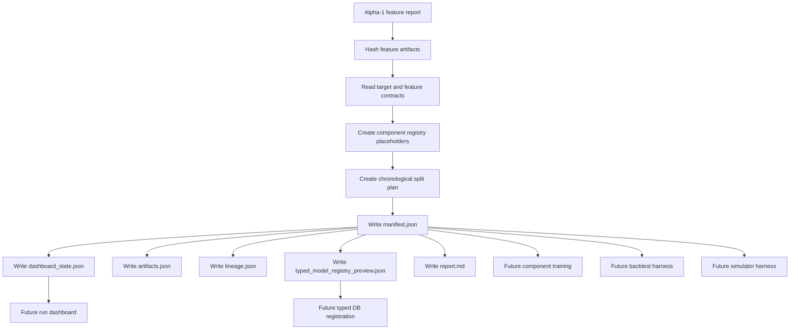

# MLB-M3 Alpha-2 Infrastructure Run Plan

Date: 2026-06-03

Phase ID: `mlb-m3-alpha-2-infrastructure`

Status: ready for implementation

Ledger: `run-plans/mlb/2026-06-03-mlb-m3-alpha-2-infrastructure-ledger.md`

## Mission

Alpha-2 builds the reproducible run spine for M3 before any model training starts.

Alpha-1 produced the first typed-DB feature artifact. Alpha-2 makes that artifact usable by future training, backtesting, simulator, calibration, and dashboard jobs without turning the terminal into the experiment database.

The deliverable is infrastructure, not prediction quality.

## Locked Boundary

| Item | Alpha-2 Rule |
| --- | --- |
| Source feature artifact | `M3-FS-001` alpha-1 matrix and reports |
| Source DB | `data-private/warehouse/sports/mlb/sql-mlb.db` lineage only |
| Legacy DB | no `sports.db` reads |
| Model training | out of scope |
| Backtest edge claim | out of scope |
| Simulator | out of scope |
| Picks/selection | out of scope |
| Player prop pricing | out of scope |
| M2 migration | forbidden as implementation shortcut |
| Run output style | persisted manifest/dashboard state first, terse console second |

## What Alpha-2 Should Produce

Alpha-2 should create the first M3 run directory shape:

```text
data-private/models/mlb-m3/runs/
  <run_id>/
    manifest.json
    dashboard_state.json
    lineage.json
    artifacts.json
    typed_model_registry_preview.json
    warnings.json
    report.md
```

The manifest should be enough for a future runner to answer:

- Which feature artifact was used?
- Which exact files were hashed?
- Which feature set and version were active?
- Which targets are available?
- Which component families are expected, and which are still placeholders?
- What chronological split plan will future training/backtests use?
- What typed DB model-run tables will eventually receive registration rows?
- What is explicitly not claimed by this run?

## Alpha-2 DAG



## Typed DB Integration

The typed DB already has normalized model-run metadata tables. Alpha-2 should reuse that shape conceptually instead of inventing an unrelated M3-only ledger.

| Typed Table | Alpha-2 Usage |
| --- | --- |
| `model_runs` | one row per M3 run, with manifest path, input hash, output hash, artifact summary, and source detail |
| `model_run_artifacts` | one row per file in the run directory and linked feature artifact |
| `model_component_runs` | one row per component family placeholder or trained component later |
| `model_run_lanes` | one row per future lane such as full-game total, F5 total, starter props, hitter props, reliever props |

Alpha-2 should not write those tables automatically yet. The first implementation should emit `typed_model_registry_preview.json` so we can inspect the intended rows before allowing DB writes.

## Manifest Contract

`manifest.json` should include these sections:

```text
manifest_version
run_id
run_family
sport
status
created_at
feature_artifact
artifact_hashes
target_contract
component_registry
data_split_plan
dashboard
typed_model_metadata_mapping
non_goals
warnings
git
```

The important design choice is that component families are registered even when they are untrained. This lets future work fill in the game-shape, starter path, reliever chain, PA event, and calibration slots without changing the overall run contract.

## Component Registry Placeholders

Alpha-2 should declare these as `placeholder_not_trained`:

| Component Family | Why It Exists |
| --- | --- |
| `game_shape_distribution` | latent run environment, chaos, blowout, and late volatility |
| `team_run_distribution` | full-game runs, F5 runs, late runs, team PA volume |
| `starter_exit_distribution` | starter outs, hook timing, bridge entry point, workload path |
| `starter_stat_distribution` | starter strikeouts, runs allowed, walks, hits, home runs |
| `bullpen_shape_distribution` | team bullpen churn, compressed/scramble chain regimes |
| `reliever_availability_distribution` | individual arm reset, quick reuse, availability exceptions |
| `first_up_reliever_router` | probability over first reliever from starter exit and bullpen state |
| `reliever_chain_distribution` | chain length, inherited-runner state, second-arm probability |
| `reliever_stat_distribution` | reliever pitches, outs, batters faced, damage, traffic |
| `pa_event_distribution` | PA event types conditional on game path and opponent pitching path |
| `hitter_stat_distribution` | hitter hits, total bases, HR, RBI, runs, walks, strikeouts |
| `calibration_layer` | probability calibration by market/regime/slice |

These are not separate "models" from the user's point of view. They are swappable submodel families inside one M3 baseball system.

## Lane Placeholders

Alpha-2 should define lane placeholders, not predictions:

| Lane | Status |
| --- | --- |
| `full_game_total` | contract only |
| `f5_total` | contract only |
| `moneyline` | deferred |
| `team_total` | deferred |
| `starter_props` | deferred |
| `reliever_props` | deferred |
| `hitter_props` | deferred |

The first executable model lane later should still begin with full-game total and F5 total because they force the shared game-state layers, but prop lanes must already be represented as downstream distribution consumers.

## Chronological Split Plan

Alpha-2 may define a split plan, but it must not train against it.

The default split for the alpha-1 artifact is:

```text
train_candidate_range: 2026-03-26 through 2026-05-15
validation_candidate_range: 2026-05-16 through 2026-05-31
```

This is a temporary harness plan, not a claim that those dates are enough. Later backtesting must use walk-forward folds, regime slices, tail diagnostics, and market timing rules.

## Dashboard State

`dashboard_state.json` should be a small, UI-friendly summary:

- run id
- status
- active phase
- artifact paths
- row count and column count
- feature/target counts
- warnings
- non-goals
- next recommended actions

The console should print only that summary and the run directory.

## Implementation Steps

1. Create the alpha-2 run plan and ledger.
2. Add an M3 run package under `pipeline/mlb/m3/runs`.
3. Add a manifest generator that reads an alpha-1 feature report and writes a run directory.
4. Hash all referenced feature artifacts and the report mirror.
5. Read the data dictionary to enumerate feature and target columns.
6. Add component-family placeholders and lane placeholders.
7. Add a chronological split plan with explicit training/backtest non-claims.
8. Add dashboard state, artifact index, lineage, warnings, registry preview, and report outputs.
9. Validate JSON output and run Python compile checks.
10. Generate the first alpha-2 infrastructure manifest from the alpha-1 artifact.
11. Review the generated manifest for missing hashes, accidental predictions, or hidden model claims.
12. Commit stable checkpoints with detailed messages.

## Acceptance Gate

Alpha-2 is accepted when:

- the manifest generator reads the alpha-1 feature report successfully
- every referenced artifact has an existence flag and hash when present
- generated outputs are JSON-valid
- component registry entries are placeholders, not fake trained models
- lane entries are contract placeholders, not predictions
- dashboard state can summarize the run without console scrollback
- typed DB registration is previewed but not written
- no M2 weights, picks, simulator output, player prop pricing, or backtest edge claims appear

## Stop Conditions

Stop and update the ledger if:

- the alpha-1 feature artifact cannot be found or hashed
- the feature report omits the matrix path or data dictionary path
- the manifest generator needs to read `sports.db`
- a generated run artifact includes picks or fair probabilities
- the component registry starts encoding model weights or hand-built conclusion scores
- the split plan is treated as a validated training design instead of a temporary harness plan

## Verification Commands

```bash
python3 -m py_compile pipeline/mlb/m3/runs/create_alpha2_manifest.py
```

```bash
python3 -m pipeline.mlb.m3.runs.create_alpha2_manifest \
  --feature-report data-migration/reports/m3_fs_001_game_shape_starter_v1_2026-03-26_to_2026-05-31.json \
  --output-dir data-private/models/mlb-m3/runs
```

```bash
python3 -m json.tool data-private/models/mlb-m3/runs/<run_id>/manifest.json >/tmp/m3_alpha_2_manifest_check.json
```

## Commit Cadence

Commit in these checkpoints:

1. alpha-2 run plan and ledger
2. manifest/dashboard scaffold
3. generated first alpha-2 infrastructure artifact and review notes
