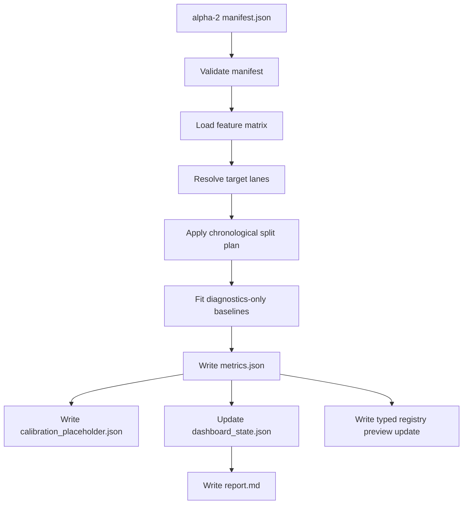

# MLB-M3 Alpha-3 Training and Backtest Harness Run Plan

Date: 2026-06-03

Phase ID: `mlb-m3-alpha-3-harness`

Status: draft for next implementation phase

Depends on:

- `mlb-m3-alpha-1`: typed-DB feature matrix exists
- `mlb-m3-alpha-2-infrastructure`: run manifest, dashboard state, registry preview, and manifest validator exist

## Mission

Alpha-3 should build the first metrics-only training and backtest harness around the alpha-2 manifest.

It should prove that M3 can load a versioned feature artifact, honor a run manifest, execute chronological split logic, write structured metrics, update dashboard state, and register artifacts without turning those metrics into picks or edge claims.

Alpha-3 is the harness that future real models will use. It is not the point where M3 claims it has an edge.

## Non-Goals

Alpha-3 must still not produce:

- picks
- selection rows
- player prop pricing
- market fair probability claims
- simulator event logs
- promotion decisions
- claims that M3 is better than M2

It may produce:

- baseline diagnostic metrics
- target distribution summaries
- chronological split summaries
- calibration placeholder reports
- artifact hashes
- dashboard state updates
- typed registry previews

## Core Design

The first harness should consume an alpha-2 `manifest.json`, not raw command-line chains.



## First Executable Scope

Alpha-3 should begin with two lanes because they exercise the shared game-shape layer without dragging in player props prematurely:

| Lane | Target Columns | Output |
| --- | --- | --- |
| `full_game_total` | `target_total_runs_final`, `target_total_bucket` | metrics-only diagnostics |
| `f5_total` | `target_total_runs_f5`, `target_f5_bucket` | metrics-only diagnostics |

This does not mean props are separate later. Props are downstream distribution contracts. Alpha-3 starts with totals because totals force the system to respect game path, starter path, bullpen chain, and target leakage before we touch hitter/starter/reliever props.

## Baseline Policy

The first harness should include non-predictive and weak predictive baselines only so the plumbing can be checked:

| Baseline | Purpose | Promotion Eligible |
| --- | --- | --- |
| target mean from train split | sanity check target leakage and split mechanics | no |
| train bucket frequency | sanity check categorical target handling | no |
| market line availability summary | coverage and timing check only | no |
| simple sklearn-style model placeholder | interface check only if dependencies are present | no |

The harness should not encode hand-built M2 weights, confidence multipliers, or fixed window truth. If a real model is added later, it must be a component artifact behind a registry slot.

## Metrics Contract

Alpha-3 metrics should be stored under the run directory:

```text
data-private/models/mlb-m3/runs/<run_id>/
  training_harness/
    metrics.json
    split_summary.json
    target_summary.json
    calibration_placeholder.json
    lane_reports/
      full_game_total.json
      f5_total.json
```

Suggested `metrics.json` shape:

```text
run_id
source_manifest_uri
feature_artifact_uri
status
started_at
finished_at
lanes
split_summary
target_summary
baseline_metrics
warnings
non_goals
```

## Split Rules

Alpha-3 should use the split plan from the manifest but keep these guardrails:

- train rows must be strictly earlier than validation rows
- target columns may be read only after the feature matrix is frozen
- feature columns cannot include `target_`
- validation metrics must not alter the feature artifact
- no row from validation dates may affect a train baseline
- market fields are coverage features unless timestamp semantics are explicitly proven

The alpha-2 split plan is still a harness placeholder. Alpha-3 should not pretend it is a final walk-forward backtest design.

## Backtest Harness Boundary

Backtest in alpha-3 means "can we score historical rows and write diagnostics." It does not mean "we have an edge."

The backtest scaffold should produce:

- per-lane row counts
- target coverage
- split coverage
- baseline errors or log-loss where applicable
- calibration placeholder slices
- warnings for sparse lanes

It must not produce:

- pick recommendations
- bankroll or staking output
- bet sizing
- PnL claims
- closing-line-value claims
- model promotion

## Typed Registry Preview Extension

Alpha-3 should extend the alpha-2 registry preview instead of writing DB rows directly:

| Typed Table | Alpha-3 Preview Addition |
| --- | --- |
| `model_runs` | run status moves from `manifest_created` to `harness_metrics_created` in preview only |
| `model_run_artifacts` | metrics and lane report artifact rows |
| `model_component_runs` | baseline diagnostic component rows, still not promoted |
| `model_run_lanes` | lane row counts and metric summaries, with no picks or PnL |

Direct DB writes should remain deferred until the preview shape has passed a focused review.

## Dashboard Update

Alpha-3 should update or write a dashboard state snapshot with:

- active phase: `harness_metrics_created`
- lane statuses
- split summary
- target summary
- metrics artifact URIs
- warnings
- next actions

The dashboard state should still be a file-first artifact. A web UI can be added after the JSON contract is stable.

## Implementation Steps

1. Add a harness package under `pipeline/mlb/m3/harness`.
2. Add a manifest loader that calls the alpha-2 manifest validator.
3. Add a feature matrix loader that reads Parquet with DuckDB.
4. Add feature/target column separation checks.
5. Add chronological split enforcement from the manifest split plan.
6. Add target summary writer.
7. Add lane summary writer for `full_game_total` and `f5_total`.
8. Add metrics-only baseline calculations.
9. Add calibration placeholder report.
10. Add dashboard state update writer.
11. Add typed registry preview extension writer.
12. Add harness validator that rejects pick, selection, prop price, simulator, and edge-claim artifacts.
13. Generate the first alpha-3 harness artifact.
14. Review and commit the artifact with detailed non-goal notes.

## Acceptance Gate

Alpha-3 is accepted when:

- the harness consumes `manifest.json` as its primary input
- alpha-2 manifest validation runs before any matrix load
- DuckDB can read the feature matrix
- feature columns and target columns are separated
- chronological split rules are enforced
- metrics JSON is valid and dashboard-readable
- lane reports exist for full-game total and F5 total
- no picks, fair probabilities, PnL, prop prices, simulator logs, or promotion decisions are generated
- typed DB writes remain preview-only

## Stop Conditions

Stop if:

- the harness needs to read `sports.db`
- it needs M2 generated artifacts
- it needs to hand-code feature weights
- validation dates leak into train summaries
- market fields are interpreted as tradable prices without timestamp proof
- any output looks like a pick, fair price, or betting recommendation
- the system starts tuning a model before the harness contract is reviewed

## Verification Commands

Initial expected commands after implementation:

```bash
python3 -m pipeline.mlb.m3.runs.validate_alpha2_manifest \
  --manifest data-private/models/mlb-m3/runs/<run_id>/manifest.json
```

```bash
python3 -m pipeline.mlb.m3.harness.run_alpha3_harness \
  --manifest data-private/models/mlb-m3/runs/<run_id>/manifest.json
```

```bash
python3 -m pipeline.mlb.m3.harness.validate_alpha3_harness \
  --harness-dir data-private/models/mlb-m3/runs/<run_id>/training_harness \
  --json
```

## First Implementation Recommendation

Do not start with scikit-learn, XGBoost, LightGBM, or neural nets.

Start with the harness:

1. validate manifest
2. load matrix
3. split rows
4. summarize targets
5. write metrics-shaped baseline summaries
6. update dashboard state

Once that is stable, plug in the first actual candidate model behind a component family.
