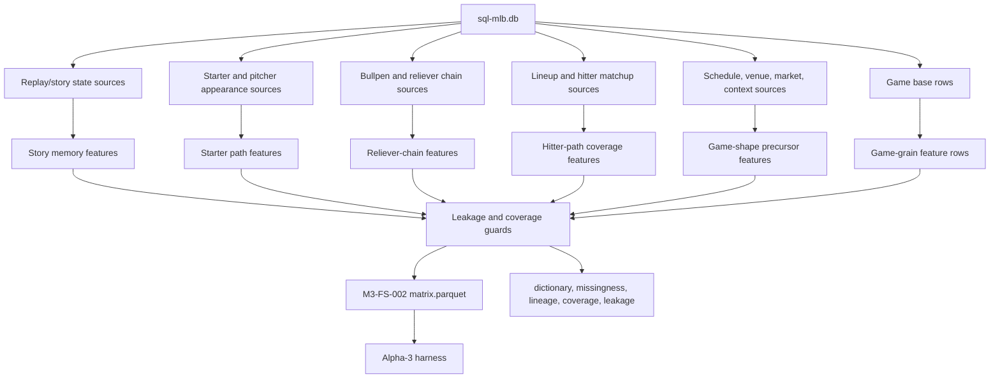

# MLB-M3 Alpha-4 Real Feature Engineering Run Plan

Date: 2026-06-03

Phase ID: `mlb-m3-alpha-4-real-feature-engineering`

Status: draft for first real feature build

Depends on:

- `mlb-m3-alpha-1`: typed-DB feature artifact exists
- `mlb-m3-alpha-2-infrastructure`: run manifest and validator exist
- `mlb-m3-alpha-3-harness`: metrics-only harness should exist before model claims

## Mission

Alpha-4 is where M3 starts getting baseball features instead of just run rails.

The immediate goal is to build a first real feature set that can feed a model run within hours while staying honest about scope. It should capture game-story, starter-path, reliever-chain, hitter-path, and context signals as typed feature facts with lineage, coverage, and leakage checks.

The output is still not picks. It is a stronger feature artifact that the alpha-3 harness can load and score.

## Current Truth

M3 currently has:

- typed DB source
- alpha-1 shallow feature artifact
- alpha-2 manifest and dashboard infrastructure
- component and lane placeholders
- alpha-3 harness plan

M3 does not yet have:

- serious state-memory features
- serious pitcher progression/regression features
- serious reliever-chain features
- serious hitter-vs-opponent-pitching-path features
- serious chaos/game-shape precursor features
- a trained model
- a backtest edge claim

## Few-Hour Path

If the goal is "get a model run in a few hours," the realistic path is:

1. Implement the alpha-3 harness so it can load a manifest, split rows, and write metrics-only outputs.
2. Build `M3-FS-002: game_story_pitching_state_v0` as the first real feature artifact.
3. Run the harness against `M3-FS-002` for full-game total and F5 total metrics.
4. Only after the harness works, add a first candidate model behind a component slot.

That first run can be useful, but it must be called a candidate diagnostic run, not M3 being "ready."

## First Real Feature Set

Proposed feature set:

```text
feature_set_id: m3_fs_002_game_story_pitching_state_v0
grain: game
targets: full-game total, F5 total, team runs, chaos flag
source: sql-mlb.db only
legacy sports.db: forbidden
M2 artifacts: forbidden
fixed last-N truth: forbidden
```

This feature set should be game-grain first because the immediate executable lanes are full-game total and F5 total. It should still preserve side-specific and path-specific detail so later prop families can consume the same distributions.

## Feature DAG



## Feature Families To Build

### 1. Replay And Story Features

These turn pitch/PA/game history into baseball story state.

Use when available:

- `game_story_labels`
- `game_story_signals`
- `phase_outcomes`
- `team_game_stats`
- `plate_appearances`
- `pitch_events`
- `pitcher_appearances`

Initial feature ideas:

| Family | Examples | Why It Matters |
| --- | --- | --- |
| prior story label memory | days since chaos game, days since dead-bat game, current same-story run length | Captures recurrence/response without pretending a fixed window is truth. |
| traffic and conversion memory | prior traffic created, prior runners stranded, prior GIDP escapes, prior two-out damage | Distinguishes "dead bats" from "traffic wasted." |
| inning volatility memory | prior crooked innings, prior late damage, prior F5 suppression vs late avalanche | Separates F5 and full-game shape. |
| collapse attribution | starter collapse, bullpen collapse, single-inning collapse, full-game erosion | ERA alone loses this distinction. |
| alternation and instability | bad-good toggles, volatility of recent story states, days since extreme outlier | Helps detect teams/pitchers with unstable state paths. |

Avoid:

- `last5_avg_runs`
- `last10_form`
- one hand-built chaos score

Allowed:

- evidence counts
- days-since-event
- current run length
- ordered-state encoders
- multiple candidate memory encoders for ablation

### 2. Starter Path Features

These should model the starter as a path/hazard problem, not an ERA average.

Use when available:

- `starting_pitchers`
- `starting_pitcher_game_logs`
- `starting_pitcher_form_snapshots`
- `pitcher_appearances`
- `pitcher_pitch_mix_snapshots`
- `pitcher_mistake_shape_snapshots`
- `team_opponent_quality_snapshots`
- `lineup_matchup_snapshots`

Initial feature ideas:

| Family | Examples | Why It Matters |
| --- | --- | --- |
| workload path | prior starts, prior pitches/outs distribution, season low floor, season high ceiling | Captures capacity and hook-risk surface. |
| exit hazard | early hook history, short-start recurrence, bridge-entry point, bulk-lane probability | Feeds F5, full-game, and reliever-chain exposure. |
| ordered start state | start-to-start direction, shock from last start, recovery after bad start, same-opponent exposure | Captures progression/regression without trusting one slope. |
| collapse type | isolated bad inning, command erosion, traffic survived, homer damage, walk clusters | Same ERA can mean different future risk. |
| pitch-mix state | pitch usage changes, pitch-type coverage, mistake-shape coverage | Links starter path to hitter event distribution. |
| low-data uncertainty | MLB start count, missing pitch mix, sparse matchup, minor sample flags | Low data must be visible, not hidden by fallback math. |

Slope can exist as one diagnostic candidate, but it must not be the only progression feature or a hand-coded truth.

### 3. Reliever Chain Features

This is a separate feature family because each batting side faces one opponent pitching path:

```text
starter phase -> reliever-chain phase
```

Use when available:

- `pitcher_appearances`
- `bullpen_usage_snapshots`
- `team_bullpen_shape_snapshots`
- `bullpen_mistake_shape_snapshots`
- `likely_relief_chains`
- `reliever_command_profiles`
- `pitcher_pitch_mix_snapshots`

Initial feature ideas:

| Family | Examples | Why It Matters |
| --- | --- | --- |
| team bullpen regime | normal chain, compressed chain, scramble chain, bulk-risk state | Different games expose different bullpen worlds. |
| individual reset | days since pitched, pitched yesterday, back-to-back, pitches last appearance, quick-reuse history | Relievers are sparse and usage-constrained. |
| first-up routing | candidate pool size, entropy, top candidate mass, role exceptions | First reliever changes hitter path and game shape. |
| chain depth | expected chain length coverage, second-arm risk, long-relief emergency coverage | A bad chain can turn normal into chaos. |
| reliever performance state | command profile coverage, traffic tendency, walk clusters, inherited-runner damage | Relief innings are high-leverage and streaky. |
| bullpen debt | prior game relief innings, bullpen-heavy prior game, long game before travel | Captures churn and forced usage. |

Avoid:

- a hard "35 pitches means unavailable" rule
- a single bullpen score
- treating the first reliever as independent from starter exit

### 4. Hitter Path Features

Hitter props come later, but the feature system must start preserving hitter-path facts now.

Use when available:

- `lineups`
- `lineup_slots`
- `lineup_matchup_snapshots`
- `player_pitch_type_response_snapshots`
- `player_statcast_snapshots`
- `player_opponent_context_snapshots`
- `player_career_profiles`
- `player_split_snapshots`

Initial feature ideas:

| Family | Examples | Why It Matters |
| --- | --- | --- |
| lineup availability | lineup known, slot known, stack shape, lineup completeness | Defines possible PA path but does not hand-code AB. |
| starter-phase fit | hitter/pitch-type coverage, handedness pocket, starter pitch-mix response | First 2-3 PA often starter-phase dependent. |
| reliever-chain fit | hitter coverage vs bullpen handedness/pitch archetype, late-inning chain coverage | Hitter props cannot ignore reliever phase. |
| outcome surfaces | hit, total bases, walk, strikeout, HR coverage by pitch type and state | Props become distribution outputs later. |
| sparse hitter uncertainty | low pitch-type sample, missing Statcast, missing split, new player flags | Prevents false precision. |

Do not add expected AB as a hand-coded feature. PA/AB opportunity should be derived later through game path, lineup turn, walks, sacs, home bottom-9 suppression, and run environment.

### 5. Game-Shape Precursors

These are candidate context features that may explain hidden regime shifts.

Use when available:

- `games`
- `venues`
- `teams`
- `team_game_stats`
- `game_story_labels`
- `market_snapshots`
- weather/umpire/travel tables if present later

Initial feature ideas:

| Family | Examples | Why It Matters |
| --- | --- | --- |
| schedule state | day of week, day/night, getaway day candidate, series game number coverage | May proxy rest/travel/routine effects. |
| travel/rest state | prior venue, days since prior game, road trip/homestand state if derivable | Baseball performance can move with fatigue and travel. |
| prior-game load | previous game duration if available, extra innings, bullpen-heavy prior game | Discrete load changes can swing next game. |
| team response state | after shutout, after blowout, after bullpen collapse, after traffic-no-conversion | Captures reaction to story, not average runs. |
| market context | pregame snapshot availability, line movement only if timestamp-clean | Market can be context, not truth. |

Calendar labels should be treated as proxy candidates. "Tuesday" is not the edge; the baseball mechanism behind it is what matters.

## Memory Policy

Fixed windows are not banned as experiments. They are banned as truth.

Preferred first encoders:

- days since event
- current story run length
- ordered event tokens
- cumulative prior-season baseline
- residual from prior-season baseline
- volatility and alternation
- evidence count and missingness
- low-data flags

If windows are used, they must be:

- explicit candidate encoders
- represented as multiple competing horizons
- ablated later
- never named "form truth"

## First Build Scope

To get something runnable in hours, `M3-FS-002` should not try to include every player prop surface.

Build in this order:

1. game rows and targets reused from alpha-1
2. prior-game story memory at team side grain
3. starter path and exit-hazard coverage
4. reliever-chain availability and churn coverage
5. lineup/hitter-path coverage, not prop outputs
6. schedule/context candidate features
7. artifact reports and validators

## Output Contract

```text
data-private/models/mlb-m3/features/
  m3_fs_002_game_story_pitching_state_v0/
    <run_id>/
      matrix.parquet
      data_dictionary.json
      lineage.json
      missingness.json
      leakage.json
      coverage.json
      build_report.json
```

Report mirror:

```text
data-migration/reports/
  m3_fs_002_game_story_pitching_state_v0_<start>_to_<end>.json
```

## Acceptance Gate

Alpha-4 is accepted when:

- `M3-FS-002` reads only `sql-mlb.db`
- feature columns are pregame-safe
- target columns are isolated under `target_`
- every column has a data dictionary entry
- missingness and coverage are explicit
- starter phase and reliever-chain phase remain separate in feature naming
- no expected AB input is hard-coded
- no M2 weights or conclusion scores are introduced
- no fixed raw window is presented as truth
- matrix can be consumed by the alpha-3 harness

## Stop Conditions

Stop if:

- a required field is only available in legacy `sports.db`
- an M2 generated artifact is needed
- a feature would leak same-game future state
- market fields lack timestamp proof
- player prop output starts appearing inside the game-grain feature builder
- feature engineering becomes a hidden betting score
- the build tries to solve every hitter prop before the game-shape lanes can run

## Immediate Next Steps

1. Implement alpha-3 harness so we can run metrics without picks.
2. Define `M3-FS-002` contract.
3. Build the `M3-FS-002` feature builder with the first real feature families.
4. Generate `M3-FS-002` artifact.
5. Create a new alpha-2-style manifest for `M3-FS-002`.
6. Run alpha-3 harness against `M3-FS-002`.
7. Review target metrics, missingness, feature coverage, and leakage before training any real model.
