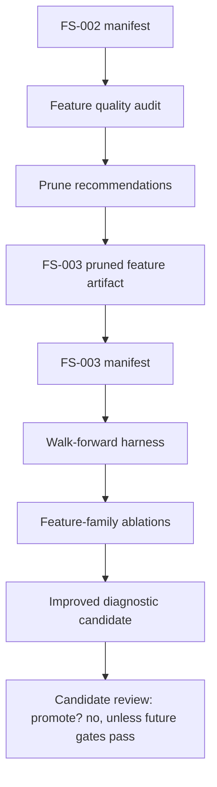

# MLB-M3 Alpha-5 Feature Audit And Harness Upgrade Run Plan

Date: 2026-06-03

Phase ID: `mlb-m3-alpha-5-audit-harness`

Status: implementation phase

Depends on:

- `M3-FS-002` feature artifact
- FS-002 alpha-2-style manifest
- alpha-3 metrics-only harness

## Mission

Alpha-5 turns the first running M3 loop into an inspectable modeling workflow.

FS-002 gave us real feature families, but the first diagnostic ridge candidate underperformed the train-mean baseline. Alpha-5 should answer why before adding more features or celebrating a model.

The phase should produce:

- FS-002 feature quality audit
- walk-forward harness diagnostics
- feature-family ablation diagnostics
- a pruned FS-003 artifact
- a better diagnostic candidate if the local stack supports it

Still no picks, prop pricing, simulator outputs, promotion decisions, or edge claims.

## Alpha-5 DAG

## Work Items

1. Audit FS-002 feature quality.
2. Upgrade harness diagnostics to support walk-forward folds and feature-family ablations.
3. Create FS-003 as a pruned artifact derived from FS-002 audit recommendations.
4. Run the upgraded harness on FS-003.
5. Run a better diagnostic candidate if available, and record whether it beats baselines.

## Feature Audit Rules

The audit should flag:

- high missingness
- constant or near-constant columns
- ID/proxy columns
- coverage-only columns
- sparse market fields
- columns with suspiciously low availability
- feature families with too little usable signal

It should not delete anything by itself. It should write recommendations and a selected-column list for FS-003.

## Harness Upgrade Rules

Walk-forward diagnostics should include:

- fold train/validation date ranges
- lane-level baseline metrics
- candidate metrics
- per-month metrics where possible
- feature-family ablation metrics
- no row-level predictions
- no prices
- no picks

## FS-003 Rules

FS-003 is a pruned artifact derived from FS-002. It may read FS-002 matrix/report artifacts, but it should preserve lineage back to FS-002 and typed `sql-mlb.db`.

FS-003 should keep:

- metadata
- targets
- useful real-valued and flag features
- feature family labels

FS-003 should exclude:

- ID-like feature columns
- high-missing columns by default
- constant/near-constant columns
- obvious coverage-only noise unless explicitly retained
- sparse market line value columns until timestamp/coverage improves

## Acceptance Gate

Alpha-5 is accepted when:

- FS-002 audit is generated and validated
- FS-003 artifact exists and has lineage to FS-002
- upgraded harness runs on FS-003
- walk-forward/family diagnostics are written
- any candidate model is explicitly diagnostic and not promoted unless future gates exist
- no picks, prices, prop rows, simulator logs, promotion decisions, or edge claims are generated

## Stop Conditions

Stop if:

- the audit cannot read FS-002 matrix/report artifacts
- FS-003 would remove target columns or identifiers needed by the harness
- harness folds leak validation rows into training
- a candidate writes row-level predictions or betting outputs
- a model is presented as an edge before walk-forward validation and calibration gates exist
