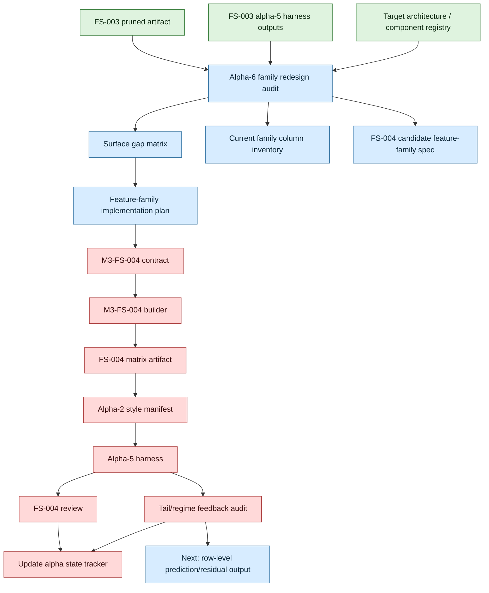

# MLB-M3 Alpha-6 Feature-Family Redesign Run Plan

Date: 2026-06-03

Phase ID: `mlb-m3-alpha-6-feature-family-redesign`

Status: opened

Ledger: `run-plans/mlb/2026-06-03-mlb-m3-alpha-6-feature-family-redesign-ledger.md`

State tracker: `run-plans/mlb/2026-06-03-mlb-m3-alpha-state-progress.md`

## Mission

Alpha-6 redesigns the baseball-state feature families that FS-002 and FS-003 proved are currently too flat.

This phase is not model tuning. It should not try a stronger learner on the same FS-003 matrix and call that progress. The harness already showed the current matrix loses to the mean baseline. Alpha-6 should change the representation of baseball state so future model families have a better substrate.

## Starting Evidence

Current accepted baseline:

- FS-003: `m3_fs_003_game_story_pitching_state_pruned_v0_20260603T162132Z`
- Rows: 886
- Columns: 271
- Features: 256
- Targets: 9
- Source: typed DB / FS-002 audit only

Alpha-5 finding:

- FS-003 pruned 24 FS-002 feature columns.
- FS-003 reduced diagnostic numeric features from 262 to 251.
- FS-003 walk-forward MAE matched FS-002 exactly.
- Diagnostic ridge candidates remain worse than mean baselines in every fold.

Conclusion:

```text
artifact hygiene improved
model signal did not
therefore feature-family representation is the next bottleneck
```

## Non-Goals

Alpha-6 must not produce:

- picks
- prop prices
- market fair probabilities
- simulator event logs
- promoted model artifacts
- selection policy rows
- claims that M3 is better

Alpha-6 should not tune a model family until the redesigned feature contract exists and is materialized.

## Core Redesign Targets

### Starter Path

Current FS-003 has starter workload, pitch mix, mistake shape, and low-evidence columns. The problem is that they are still mostly flat game-grain summaries.

Alpha-6 should separate:

- workload trajectory
- damage distribution
- pitch-shape change
- low-data uncertainty
- opponent-pressure context
- hook/exit target scaffolding

### Reliever Chain

Current FS-003 has bullpen usage, likely chain, command profile, candidate pool, and relief-last-game facts. The problem is that availability, routing, chain length, and performance are still mixed together.

Alpha-6 should separate:

- individual-arm availability/reset
- first-up reliever routing
- expected chain length and churn regime
- reliever performance volatility
- inherited-runner / traffic state
- hitter-vs-reliever-chain surface

### Hitter Path

Current FS-003 has lineup, starter-phase matchup, pitch-type response, Statcast, and opponent-context averages. The problem is that hitter interaction is not split across the single opponent pitching path.

Alpha-6 should separate:

- hitter vs starter phase
- hitter vs reliever-chain phase
- hitter talent baseline
- hitter current-state residuals
- pitch-type matchup coverage
- lineup/PA-volume context

### Story Memory

Current FS-003 has days-since, run-length, prior-rate, volatility, and alternation features. The problem is that a large flat block can still flatten story transitions.

Alpha-6 should separate:

- ordered prior-game state
- traffic conversion state
- dead-bat rebound / carryover state
- starter-crack follow-through state
- bullpen-flip follow-through state
- game-shape regime label targets

## Alpha-6 DAG



## Work Plan

1. Create Alpha-6 run plan and ledger.
2. Add a family redesign audit that reads FS-003 and its harness output.
3. Generate a machine-readable surface gap matrix.
4. Generate a current family column inventory.
5. Generate an FS-004 candidate feature-family spec.
6. Review the audit and decide which FS-004 surfaces are required for the first materialized redesign.
7. Define `m3_fs_004_state_path_redesign_v0` contract.
8. Build FS-004 feature artifact from typed DB only.
9. Create an alpha-2 style manifest for FS-004.
10. Run the alpha-5 harness on FS-004.
11. Update the state tracker after each status transition.
12. Add a tail/regime feedback audit before any promotion or calibration claims.

## Acceptance Gate

Alpha-6 planning/audit is accepted when:

- the state tracker lists Alpha-6 as opened
- the audit maps current FS-003 columns to required M3 state surfaces
- every required surface has a status and gap explanation
- FS-004 candidate spec exists as JSON
- no model tuning or promotion occurs

Alpha-6 implementation is accepted later when:

- FS-004 materializes a matrix with redesigned feature families
- the harness can run FS-004
- walk-forward diagnostics improve or clearly identify which redesigned family still fails
- tail/regime diagnostics identify whether the next blocker is representation, row-level feedback, probability output, or calibration
- no model is promoted without future calibration/promotion gates

## Commit Cadence

1. Alpha-6 plan and ledger
2. Alpha-6 redesign audit script
3. Generated audit artifacts and review
4. FS-004 contract
5. FS-004 builder
6. FS-004 artifact and manifest
7. FS-004 harness and state tracker update
8. FS-004 tail/regime feedback audit and row-level-output gate
