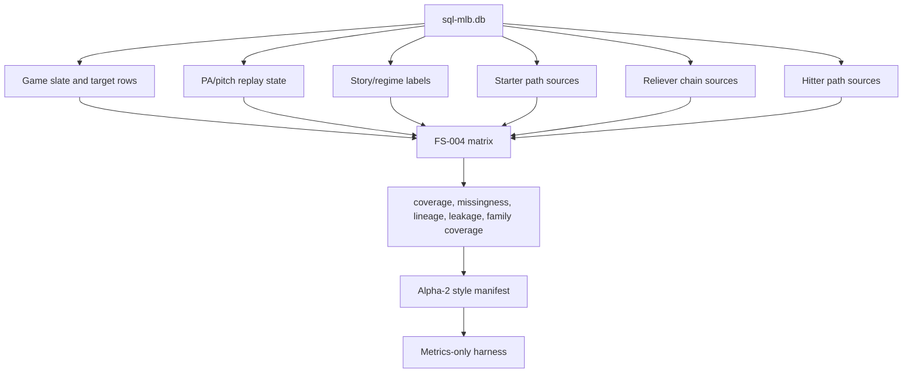

# MLB-M3 Alpha-6 FS-004 Builder Phase Plan

Date: 2026-06-03

Feature set: `m3_fs_004_state_path_redesign_v0`

Status: implementation plan, no matrix yet.

## Mission

Build FS-004 as a redesigned baseball-state matrix from typed `sql-mlb.db`, without M2 weights, fixed raw windows as truth, expected AB inputs, picks, prices, or model-promotion claims.

FS-004 is not "the model." It is the state-path feature substrate that lets later submodels learn game shape, starter path, reliever chain, PA event state, hitter stat distributions, and calibration.

## Builder DAG

## Phase 0: Preflight Gates

Required before matrix materialization:

- FS-004 contract validates.
- Source feasibility audit exists.
- No `sports.db` path is opened.
- No M2 generated artifact is read.
- `pitcher_appearances.entry_order` source decision is recorded.
- Canonical `pitcher_appearances.entry_order`, `first_inning`, and `first_half` are populated.

Reliever-chain phase features should be gated in any environment where canonical `pitcher_appearances` does not have populated `entry_order`.

## Phase 1: Replay And Regime Spine

First materialized families:

- `traffic_conversion_state`
- `ordered_story_memory`
- `game_regime_labels`

Why first:

- Typed `plate_appearances` and `pitch_events` already expose PA index, base/out state, count state, score before/after, event fields, and raw JSON.
- These families attack the exact failure mode we discussed: averaging away traffic, conversion, dead-bat, starter-crack, and chaos regimes.

Output expectation:

- game-grain state summaries that preserve sequence-derived labels
- postgame regime targets kept under `target_`
- no pregame feature leakage from postgame targets

## Phase 2: Starter Path

Families:

- `starter_workload_path`
- `starter_damage_state`
- `starter_pitch_shape_change`
- `starter_opponent_pressure_residual`
- `starter_low_data_uncertainty`

Implementation rule:

- separate baseline, residual, trajectory/change evidence, and uncertainty metadata
- do not collapse starter talent into a single score
- do not use fixed raw windows as truth

## Phase 3: Reliever Chain

Families:

- `reliever_availability_reset`
- `first_up_reliever_router`
- `reliever_chain_state`
- `reliever_performance_state`

Implementation rule:

- availability/reset, first-up route, chain length, and reliever performance are separate feature surfaces
- `entry_order`/chain phase comes from canonical `pitcher_appearances`
- if canonical entry order is unavailable in a future environment, produce a gated report instead of silently using staging rows

## Phase 4: Hitter Path

Families:

- `hitter_starter_phase_surface`
- `hitter_reliever_chain_phase_surface`
- `hitter_current_state_residual`
- `lineup_pa_volume_context`

Implementation rule:

- hitter-vs-starter and hitter-vs-reliever-chain are different surfaces
- PA volume is downstream state, not a fixed expected AB input
- hitter talent baseline, pitch response, current residual, and evidence coverage stay separated

## Phase 5: Artifact And Harness

After matrix build:

1. Write `matrix.parquet`.
2. Write `build_report.json`, `coverage.json`, `missingness.json`, `lineage.json`, `leakage.json`, `data_dictionary.json`, and family coverage.
3. Generate an Alpha-2 style manifest for FS-004.
4. Run the existing metrics-only harness.
5. Review walk-forward and family-ablation diagnostics.

The harness may reject FS-004. That is acceptable. Rejection means the feature representation still is not good enough; it does not justify model tuning on a weak substrate.
