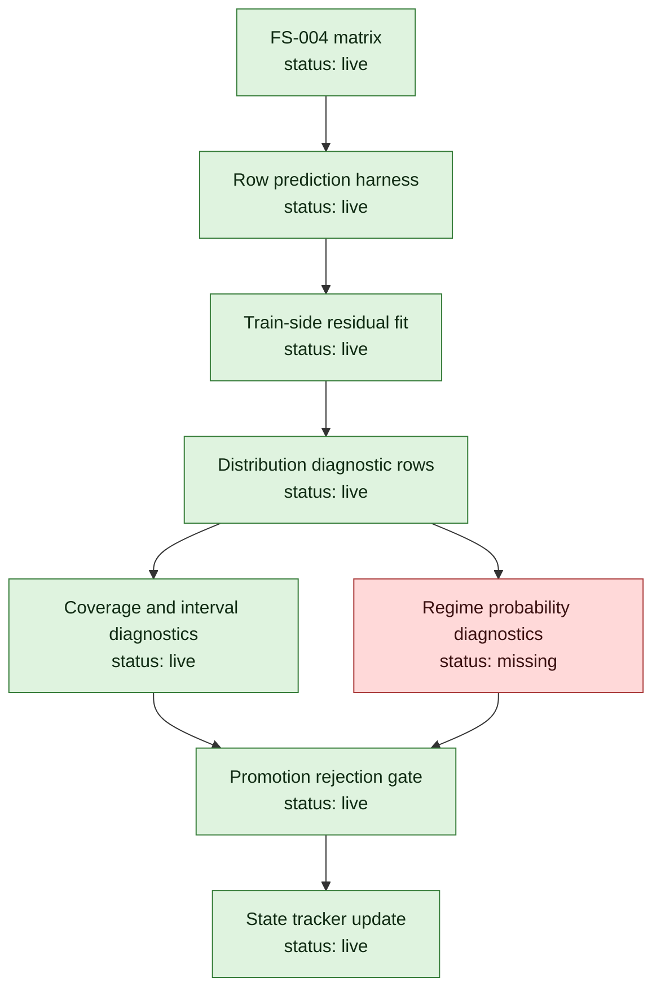

# MLB-M3 Alpha-7 Distribution Output Run Plan

Date: 2026-06-03

Phase ID: `mlb-m3-alpha-7-distribution-output`

Status: implemented as metrics-only diagnostics; promotion remains blocked

Ledger: `run-plans/mlb/2026-06-03-mlb-m3-alpha-7-distribution-output-ledger.md`

State tracker: `run-plans/mlb/2026-06-03-mlb-m3-alpha-state-progress.md`

## Mission

Alpha-7 adds honest metrics-only distribution output diagnostics on top of FS-004 row residuals.

This phase must not convert validation residuals into fake probabilities. Distribution outputs have to be fitted on the training side of each fold and then evaluated on the validation side.

## Starting Point

Starting FS-004 artifacts:

- feature matrix: `m3_fs_004_state_path_redesign_v0_20260603T174237Z`
- row harness: `training_harness_alpha6_row_predictions`
- row-aware tail audit: `tail_calibration_alpha6_row_predictions`
- residual calibration bins: `residual_calibration_bins.json`

Starting gate status:

| Gate | Status |
| --- | --- |
| Row-level predictions/residuals | live |
| Residual calibration bins | live |
| Probability/distribution outputs | missing |
| Probability calibration | missing |
| Candidate beats baseline | fail |
| Promotion | blocked |

Current Alpha-7 gate status after implementation:

| Gate | Status |
| --- | --- |
| Row-level predictions/residuals | live |
| Residual calibration bins | live |
| Probability/distribution outputs | live as diagnostic distributions |
| Probability calibration | still missing |
| Candidate beats baseline | fail |
| Promotion | blocked |

## Non-Goals

Alpha-7 must not produce:

- picks
- market prices
- fair probabilities for betting decisions
- prop prices
- simulator event logs
- promoted model artifacts
- selection policy rows
- claims that M3 is better

Diagnostic probabilities are allowed only as fold-scoped experiment outputs with explicit `not_promoted` status.

## Distribution Contract

First distribution rows should be game/lane/fold scoped.

Required fields:

- `run_id`
- `feature_set_id`
- `lane`
- `split_kind`
- `fold_id`
- `game_id`
- `game_date`
- `target_column`
- `actual`
- `point_prediction`
- `baseline_prediction`
- `distribution_family`
- `distribution_fit_scope`
- `distribution_fit_rows`
- `distribution_fit_fold_id`
- `q05`
- `q10`
- `q25`
- `q50`
- `q75`
- `q90`
- `q95`
- `prediction_interval_50_hit`
- `prediction_interval_80_hit`
- `prediction_interval_90_hit`
- `target_total_bucket`
- `target_f5_bucket`
- `target_chaos_game_flag`
- `target_bullpen_flip_flag`
- `status`
- `not_a_pick`
- `not_a_price`
- `not_a_promotion`

Allowed first distribution family:

```text
fold_train_residual_quantile_v0
```

Meaning:

- fit residual quantiles only on the training side of the fold
- add those residual quantiles to the validation point prediction
- evaluate coverage and tail behavior on validation
- do not use validation residuals to construct validation intervals

## DAG



## Work Plan

1. Extend the harness or add a companion audit to write train-side fitted residual distributions per fold/lane. Status: complete.
2. Generate diagnostic distribution rows for validation rows only. Status: complete.
3. Add interval coverage diagnostics: 50%, 80%, and 90% coverage by lane, fold, and regime. Status: complete.
4. Add bucket/regime probability diagnostics only if probabilities are trained from fold-safe data. Status: deferred; no bucket probabilities were produced.
5. Add a validator that rejects distribution artifacts if fit scope includes validation rows. Status: complete.
6. Regenerate FS-004 row-aware audit with distribution artifact awareness. Status: complete.
7. Update the state tracker and ledger. Status: complete.

## Acceptance Gate

Alpha-7 is accepted only when:

- distribution rows exist for FS-004 validation folds
- every distribution row declares train-only fit scope
- coverage diagnostics exist by lane and fold
- tail/regime coverage diagnostics exist
- validator rejects leakage-prone distribution outputs
- no picks, prices, promotion, simulator output, or edge claim exists

Acceptance result: accepted as diagnostic feedback infrastructure. It does not clear model promotion because the candidate-beats-baseline gate remains failed.

## First Implementation Slice

The safest first slice is:

```text
fold_train_residual_quantile_v0
```

It should not try to be a final baseball model. It should answer:

```text
Given this candidate point prediction and only train-fold residual behavior,
how wide should the diagnostic distribution be,
and does that interval actually cover validation outcomes?
```

If coverage fails badly in chaos/low-run slices, that is useful. It means the next model component needs better regime-conditioned distributions, not more point-estimate tuning.
