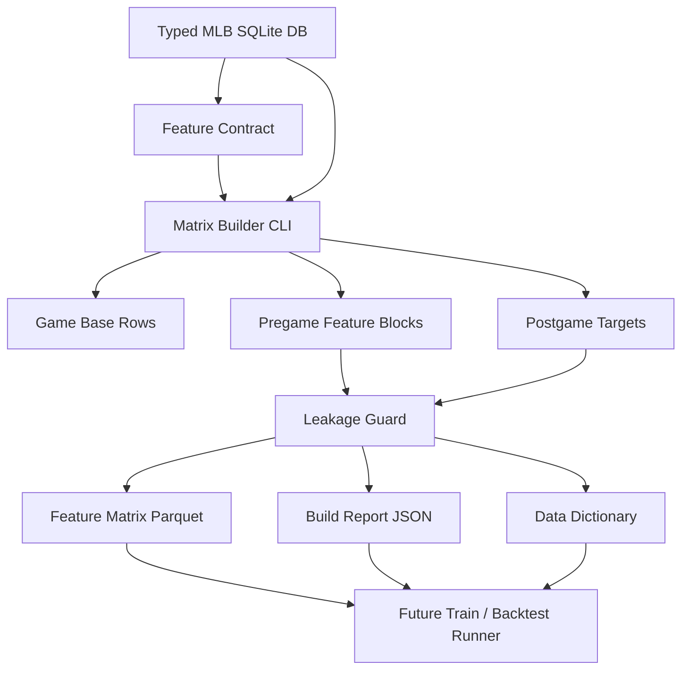
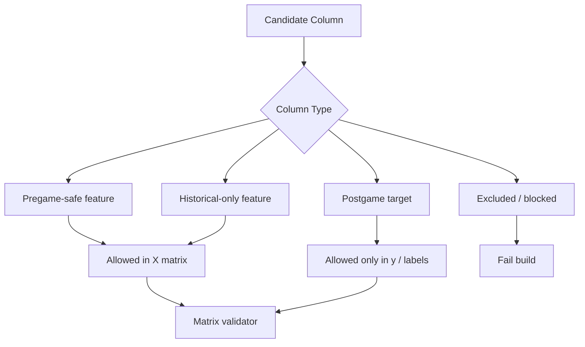
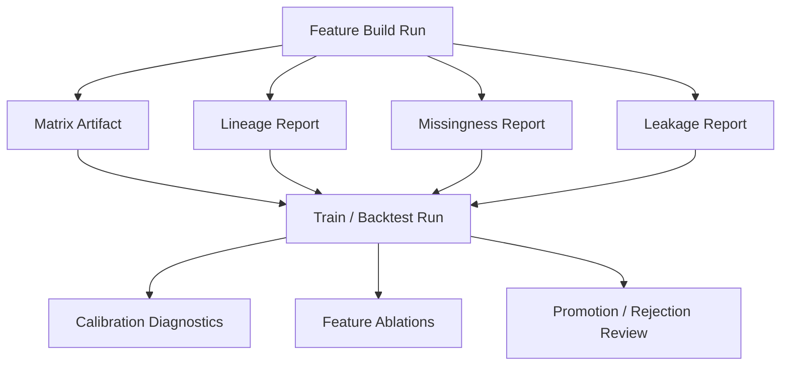

# MLB-M3 Alpha Feature Extraction Run Plan

Date: 2026-06-03

Status: alpha run plan

Scope: define the first MLB-M3 feature set and build typed feature extraction from `data-private/warehouse/sports/mlb/sql-mlb.db`.

Related docs:

- `research-m3/alpha-design.md`
- `research-m3/model-architecture-notes.md`
- `research-m3/run-dashboard-notes.md`
- `pipeline/mlb/features/README.md`
- `run-plans/mlb/2026-06-03-typed-db-cutover.md`
- `run-plans/mlb/2026-06-03-mlb-warehouse-command-ledger.md`

## Core Decision

MLB-M3 alpha starts with a clean, typed feature matrix, not a port of MLB-M2.

M3 may hand-code feature definitions. M3 must not hand-code feature conclusions.

Allowed:

- `team_runs_avg_last5`
- `team_runs_variance_last10`
- `starter_outs_avg_last5`
- `bullpen_scramble_rate_last10`
- `market_total_latest_pregame`
- `lineup_known_slot_count`

Not allowed:

- `chaos_score = 0.35 * bullpen + 0.25 * starter + 0.40 * bats`
- hidden confidence boosts
- hot/cold labels defined by arbitrary thresholds
- manually tuned prop multipliers
- copied M2 feature weights, score formulas, or selection rules

The alpha feature extractor should produce facts, windows, flags, and labels. Model training and backtests decide which columns matter.

## Alpha Objective

Build `M3-FS-001: game_shape_starter_v1`.

This is the first reusable MLB-M3 feature set. It supports game-shape and run-total research before player props.

Primary questions:

- Can typed pregame state explain full-game run totals?
- Can typed pregame state explain F5 run totals?
- Can typed pregame state identify low, normal, high, and chaos run environments better than simple averages?
- Can we produce the matrix without reading legacy `sports.db` or M2-generated artifacts?

First targets:

- `target_total_runs_final`
- `target_total_runs_f5`
- `target_home_runs_final`
- `target_away_runs_final`
- `target_home_runs_f5`
- `target_away_runs_f5`
- `target_total_bucket`
- `target_f5_bucket`
- `target_chaos_game_flag`

Out of scope for the first matrix:

- player props
- pitcher props
- home run candidate selection
- selection/veto policy
- market edge sizing
- simulator event generation
- hand-built composite scores

## Definition Of Done

The alpha feature extraction work is done when the repo has:

- a versioned feature-set contract for `m3_fs_001_game_shape_starter_v1`
- a single CLI entrypoint that builds the matrix from `sql-mlb.db`
- one row per completed MLB game in the requested date range
- pregame-safe feature columns separated from postgame target columns
- a data dictionary for every feature
- a leakage report
- a missingness report
- a row lineage report
- a local Parquet output
- a JSON report under `data-migration/reports/`
- a committed run plan and first dry-run report

The first pass does not need to train a model. It needs to produce a trustworthy matrix that a model can train on.

## System Shape



## Directory Plan

Target structure:

```text
pipeline/mlb/features/
  README.md
  contracts/
    m3_fs_001_game_shape_starter_v1.json
  builders/
    build_game_shape_starter_v1.py
  sql/
    m3_fs_001_game_base.sql
    m3_fs_001_targets.sql
    m3_fs_001_team_recent_shape.sql
    m3_fs_001_starter_path.sql
    m3_fs_001_bullpen_shape.sql
    m3_fs_001_lineup_context.sql
    m3_fs_001_market_context.sql
  validators/
    validate_game_shape_starter_v1.py
```

Output structure:

```text
data-private/models/mlb-m3/features/
  m3_fs_001_game_shape_starter_v1/
    YYYYMMDD-HHMMSS/
      matrix.parquet
      data_dictionary.json
      lineage.json
      missingness.json
      leakage.json
      build_report.json
```

Reports:

```text
data-migration/reports/
  m3_fs_001_game_shape_starter_v1_<start>_to_<end>.json
```

## First CLI Contract

```bash
python3 -m pipeline.mlb.features.builders.build_game_shape_starter_v1 \
  --start-date 2026-03-26 \
  --end-date 2026-05-31 \
  --as-of-policy pregame \
  --db data-private/warehouse/sports/mlb/sql-mlb.db \
  --output-dir data-private/models/mlb-m3/features/m3_fs_001_game_shape_starter_v1 \
  --report data-migration/reports/m3_fs_001_game_shape_starter_v1_2026-03-26_to_2026-05-31.json
```

The command should be one user-facing job. Internally it can use SQL files, Python modules, Pandas, DuckDB, SQLite, and validators.

Do not create a user workflow that requires manually running a chain of unrelated scripts.

## Feature Contract

Contract file:

```text
pipeline/mlb/features/contracts/m3_fs_001_game_shape_starter_v1.json
```

Required fields:

```json
{
  "feature_set_id": "m3_fs_001_game_shape_starter_v1",
  "version": "0.1.0",
  "grain": "game",
  "sport": "mlb",
  "source_db": "data-private/warehouse/sports/mlb/sql-mlb.db",
  "as_of_policy": "pregame",
  "primary_key": ["game_id"],
  "time_key": "game_date",
  "feature_prefixes": [
    "game_",
    "home_team_",
    "away_team_",
    "home_starter_",
    "away_starter_",
    "home_bullpen_",
    "away_bullpen_",
    "market_",
    "lineup_"
  ],
  "target_prefix": "target_",
  "leakage_classes": [
    "pregame_safe",
    "historical_only",
    "postgame_target",
    "excluded"
  ]
}
```

The contract should also include:

- source tables
- feature names
- target names
- null rules
- lookback windows
- leakage class for every column
- owner notes
- validator list

## Source Tables

Alpha source tables:

| Family | Tables | Use |
|---|---|---|
| Game base | `games`, `teams`, `venues` | row identity, teams, venue, start time, series game |
| Outcomes | `game_outcomes` | postgame targets only |
| Team results | `team_game_stats`, `game_outcomes`, `phase_outcomes` | historical rolling team shape only |
| Starter context | `starting_pitchers`, `starting_pitcher_game_logs`, `pitcher_appearances` | starter form and workload |
| Bullpen context | `bullpen_usage_snapshots`, `likely_relief_chains`, `team_bullpen_shape_snapshots` | pregame bullpen debt and chain shape |
| Lineup context | `lineups`, `lineup_slots` | known lineup state and completeness flags |
| Market context | `market_snapshots`, `market_contracts`, `market_price_ticks` | latest pregame market state when available |

Deferred source tables:

| Family | Tables | Reason |
|---|---|---|
| Replay-state features | `plate_appearances`, `pitch_events` | add after replay-state validator is trusted for feature extraction |
| Prop market context | `prop_market_snapshots` | player props are not alpha target |
| Soft signals | TBD | require provenance, expiry, and encoding policy |
| WAR and Statcast HR active adapters | `pitcher_season_value_snapshots`, `statcast_hr_leaderboard_snapshots` | existing typed rows are usable as context, but live source ingestion needs a separate adapter decision |

## Feature Groups

### 1. Game Base

Purpose: identify the game and basic schedule context.

Example columns:

```text
game_id
game_date
season
month
day_of_week
start_hour_local_or_utc
series_game_number
venue_id
home_team_id
away_team_id
```

Pregame-safe: yes.

Null rules:

- keep `series_game_number` null if unknown
- bucket start time only when `start_time_utc` exists
- no target labels in this block

### 2. Targets

Purpose: produce supervised labels from completed games.

Example columns:

```text
target_total_runs_final
target_total_runs_f5
target_home_runs_final
target_away_runs_final
target_home_runs_f5
target_away_runs_f5
target_total_bucket
target_f5_bucket
target_chaos_game_flag
```

Rules:

- targets are postgame only
- targets must never be joined into feature columns
- target buckets are labels, not betting decisions
- bucket thresholds must be declared in the contract and treated as label definitions

Initial bucket proposal:

| Label | Rule |
|---|---|
| `low` | total runs <= 5 |
| `normal` | total runs 6 to 9 |
| `high` | total runs 10 to 13 |
| `chaos` | total runs >= 14 |

This is allowed because it defines the supervised target label. It is not a feature weight.

### 3. Team Recent Run Shape

Purpose: describe recent team scoring and run prevention shape without reducing it to one average.

Use only games before the target game date.

Windows:

- last 3 games
- last 5 games
- last 10 games

Example columns for each team and window:

```text
team_runs_for_avg_last5
team_runs_for_std_last5
team_runs_for_min_last5
team_runs_for_max_last5
team_runs_for_zero_or_one_count_last5
team_runs_for_8plus_count_last5
team_runs_allowed_avg_last5
team_runs_allowed_std_last5
team_f5_runs_for_avg_last5
team_f5_runs_allowed_avg_last5
team_late_runs_for_avg_last5
team_total_runs_game_env_avg_last5
```

Rules:

- no same-day completed outcome leakage
- if not enough history, keep sample-count columns
- do not apply manual shrinkage weights in the feature builder
- expose sample size so model can learn reliability

### 4. Starter Path

Purpose: describe projected starter recent path, workload, and damage patterns.

Inputs:

- `starting_pitchers`
- `starting_pitcher_game_logs`
- `pitcher_appearances`

Example columns:

```text
starter_known_flag
starter_recent_start_count_last5
starter_outs_avg_last5
starter_outs_std_last5
starter_runs_allowed_avg_last5
starter_runs_allowed_max_last5
starter_hits_allowed_avg_last5
starter_walks_avg_last5
starter_strikeouts_avg_last5
starter_home_runs_allowed_avg_last5
starter_pitcher_appearance_count_last10
starter_short_start_count_last5
starter_5plus_ip_count_last5
```

Rules:

- derive from games before the target game
- no manual "starter stability score"
- no M2 starter labels unless rebuilt as explicit target labels later
- TBD starter gets null starter features plus `starter_known_flag = 0`

### 5. Bullpen Shape

Purpose: describe pregame bullpen debt, chain depth, and fragility.

Inputs:

- `bullpen_usage_snapshots`
- `likely_relief_chains`
- `team_bullpen_shape_snapshots`

Example columns:

```text
bullpen_snapshot_available_flag
bullpen_relievers_used_avg_last5
bullpen_relievers_used_max_last10
bullpen_first_reliever_outs_avg_last5
bullpen_total_relief_outs_avg_last5
bullpen_total_relief_runs_allowed_avg_last5
bullpen_four_plus_reliever_rate_last10
bullpen_six_plus_scramble_rate_last10
bullpen_likely_first_reliever_count
bullpen_top2_availability_avg
bullpen_top2_expected_outs_sum
bullpen_back_to_back_count
```

Rules:

- use latest snapshot with `snapshot_date <= game_date`
- preserve raw typed table values
- do not produce one composite "bullpen score" in alpha
- include availability and sample-count fields

### 6. Lineup And PA Volume Context

Purpose: describe whether the lineup context is known and whether the projected lineup is complete.

Inputs:

- `lineups`
- `lineup_slots`
- recent `player_game_batting` or team PA aggregates if available

Example columns:

```text
lineup_home_known_flag
lineup_away_known_flag
lineup_home_slot_count
lineup_away_slot_count
lineup_home_partial_flag
lineup_away_partial_flag
lineup_home_top5_known_count
lineup_away_top5_known_count
team_pa_avg_last5
team_pa_max_last5
team_extra_pa_game_count_last10
```

Rules:

- if official lineups are not known pregame, preserve nulls and known flags
- no player prop features in alpha
- no manual PA boost score

### 7. Market Context

Purpose: give the model market priors without letting market data become the answer.

Inputs:

- `market_snapshots`
- `market_contracts`
- `market_price_ticks`

Example columns:

```text
market_total_latest_pregame
market_f5_total_latest_pregame
market_home_ml_implied_latest
market_away_ml_implied_latest
market_total_open
market_total_move
market_price_snapshot_age_minutes
market_available_flag
```

Rules:

- use snapshots before scheduled start
- do not use settled outcome or post-start movement
- keep market features separable so ablations can compare "with market" vs "without market"

### 8. Replay-State Features

Status: deferred from the very first matrix unless replay-state validation is fully green.

Why deferred:

- replay-state features are the most important M3-native signal family
- they are also the highest leakage and correctness risk
- they should enter after the typed replay fields and validator are locked

Future columns:

```text
team_traffic_pa_rate_last5
team_two_out_traffic_rate_last5
team_gidp_escape_count_last10
team_crooked_inning_count_last10
starter_pitch_per_pa_avg_last5
starter_runners_on_pa_rate_last5
lineup_walk_cluster_rate_last10
```

These should be introduced as `M3-FS-002` or `M3-FS-001` v0.2.0, not quietly slipped into v0.1.0.

## Leakage Guard

Every column must be classified.



Validation rules:

- feature columns cannot come from the same game's `game_outcomes`
- feature windows must only include prior games
- market features must be timestamped before scheduled start
- target columns must use `target_` prefix
- postgame labels cannot appear in feature prefixes
- every row must include `as_of_timestamp` or an as-of policy note

## Builder Implementation Plan

### Phase A: Contract And Skeleton

Deliverables:

- feature contract JSON
- builder module skeleton
- validator skeleton
- package script alias, likely `data:m3:features:game-shape`
- first dry-run report

Gate:

- command parses args
- contract loads
- DB opens
- output directory is planned
- no feature extraction yet

### Phase B: Game Base And Targets

Deliverables:

- game base SQL
- target SQL
- row uniqueness validator
- target bucket implementation

Gate:

- one row per completed game
- no duplicate `game_id`
- target totals match `game_outcomes`
- report includes row count by date

### Phase C: Team Recent Shape

Deliverables:

- rolling team windows
- sample counts
- no same-game leakage check

Gate:

- every rolling feature declares window
- each game only uses prior games
- missing sample count is explicit

### Phase D: Starter Path

Deliverables:

- starter identity join
- recent starter path features
- TBD starter handling

Gate:

- unknown starters do not drop games
- starter features are null-safe
- report includes starter-known rate

### Phase E: Bullpen Shape

Deliverables:

- latest snapshot join
- bullpen table aggregation
- relief-chain summary features

Gate:

- no future snapshot dates
- report includes bullpen snapshot coverage
- null-safe rows for missing snapshots

### Phase F: Lineup Context

Deliverables:

- lineup known/completeness flags
- slot counts
- team PA volume proxies

Gate:

- official lineup absence is represented as unknown, not zero
- partial lineups are flagged

### Phase G: Market Context

Deliverables:

- latest pregame total and moneyline features
- market availability flags
- optional market/no-market ablation marker

Gate:

- no post-start snapshots
- market timestamp age is reported

### Phase H: Matrix Write And Validation

Deliverables:

- Parquet matrix
- data dictionary JSON
- lineage JSON
- missingness JSON
- leakage JSON
- build report JSON

Gate:

- validator passes
- report is committed
- matrix path is stable and content-hashed

## Package Script Plan

Add after skeleton exists:

```json
{
  "data:m3:features:game-shape": "python3 -m pipeline.mlb.features.builders.build_game_shape_starter_v1"
}
```

Do not route this through `mlb_typed_warehouse.py`. The warehouse CLI is for typed ingestion/readiness and compatibility reports. M3 feature jobs live under `pipeline/mlb/features/`.

## Validation Report

Minimum JSON report:

```json
{
  "feature_set_id": "m3_fs_001_game_shape_starter_v1",
  "feature_set_version": "0.1.0",
  "start_date": "2026-03-26",
  "end_date": "2026-05-31",
  "row_count": 0,
  "game_count_by_date": {},
  "feature_count": 0,
  "target_count": 0,
  "source_tables": [],
  "missingness": {},
  "leakage_checks": {},
  "lineage": {},
  "warnings": [],
  "ok": false
}
```

Required checks:

- `game_id` unique
- requested date range honored
- no feature column starts with `target_`
- no target column lacks `target_`
- no same-game outcome values in feature columns
- no future snapshots
- feature dictionary covers every feature
- null rates are reported
- matrix row count matches completed target rows

## Run Dashboard Hook

The first builder can write files only, but it should shape its report so the future dashboard can ingest it.

Fields to include now:

```text
run_id
run_type = feature_build
feature_set_id
feature_set_version
status
started_at
finished_at
git_sha
source_db
output_uri
report_uri
artifact_hashes
warnings
```

Future dashboard DAG:



## Backtest Feedback Loop

Backtesting is not in the first feature extraction implementation, but the feature set must be built so the next step can backtest cleanly.

Next run plan after this:

```text
M3-BT-001: game shape baseline backtest
```

Baseline models to compare later:

- naive mean total by season/month
- market total only
- team recent shape only
- typed feature matrix without market
- typed feature matrix with market
- M2 baseline where comparable

Metrics later:

- MAE/RMSE for run totals
- log loss for buckets
- Brier score for chaos flag
- calibration by total bucket
- tail recall for high and chaos games
- market line residual by line bucket

## M2 Use Policy

M2 is allowed as:

- a source of ideas
- a baseline to beat
- a warning about what not to do
- a historical compatibility path through `archive-m2`

M2 is not allowed as:

- source code to copy
- fixed feature weights
- hidden label thresholds
- package path for M3 jobs
- source of truth for typed data

If an M2 idea is useful, rewrite it as:

```text
typed source facts -> explicit feature definition -> validator -> backtest
```

## Known Non-Blockers

These do not block `M3-FS-001`:

- active Baseball-Reference WAR ingestion is still legacy-only
- active Statcast HR leaderboard ingestion is still legacy-only
- player props are not modeled yet
- simulator is not built yet
- run dashboard UI is not built yet

Why:

- existing typed context rows are enough for the first matrix
- the first alpha target is game shape and totals
- the first deliverable is a trustworthy matrix, not production picks

## Known Blockers

These block later M3 stages:

- replay-state fields must remain validator-clean before replay features join the matrix
- model-output writer and settlement tables need M3 contracts
- active WAR and Statcast HR source adapters need a source decision
- dashboard storage needs run/artifact schema before long training runs

## First Implementation Order

1. Add contract and builder skeleton.
2. Add game base and target extraction.
3. Add matrix writer with Parquet and report JSON.
4. Add validator for primary key, target prefix, feature dictionary, and leakage classes.
5. Add team recent shape.
6. Add starter path.
7. Add bullpen shape.
8. Add lineup context.
9. Add market context.
10. Run first matrix build for `2026-03-26` through `2026-05-31`.
11. Review missingness and leakage report.
12. Freeze `M3-FS-001` v0.1.0 and open the backtest run plan.

## Stop Conditions

Stop and revisit the plan if:

- feature extraction needs `sports.db`
- a feature requires M2 score formulas
- same-game outcome leakage appears in feature columns
- replay-state features are needed before replay validation is trusted
- market data cannot be timestamp-filtered pregame
- the first matrix becomes too broad to explain

## Alpha Acceptance Gate

The first M3 feature set is accepted when:

- `M3-FS-001` builds from typed DB only
- row and target counts are explainable
- all feature columns have dictionary entries
- all target columns are isolated
- leakage report passes
- missingness report is reviewed
- no M2 weights or hard-coded composite scores are present
- the output can be consumed by a future training/backtest runner

