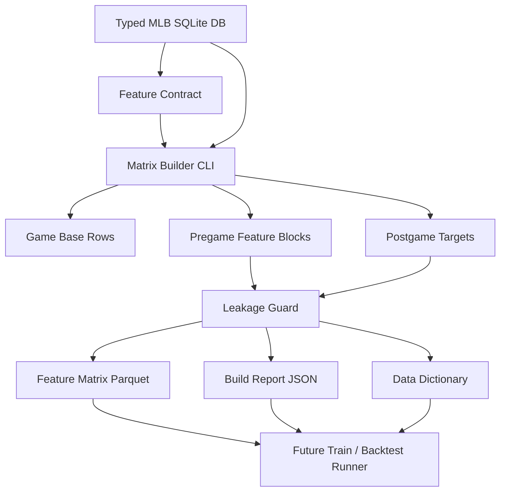
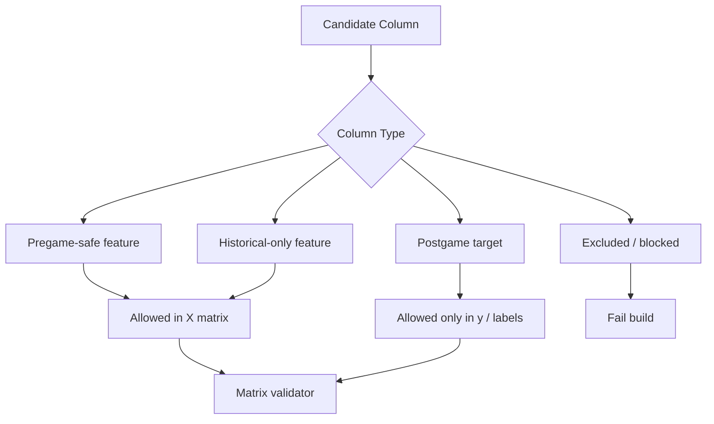
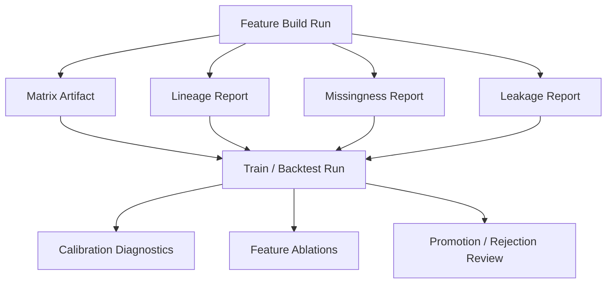

# MLB-M3 Alpha Feature Extraction Run Plan

Date: 2026-06-03

Status: alpha run plan

Audit status: reviewed 2026-06-03; naming, packaging, market-source, and follow-up corrections applied.

Scope: define the first MLB-M3 feature set and build typed feature extraction from `data-private/warehouse/sports/mlb/sql-mlb.db`.

Related docs:

- `research-m3/alpha-design.md`
- `research-m3/model-architecture-notes.md`
- `research-m3/run-dashboard-notes.md`
- `pipeline/mlb/features/README.md`
- `run-plans/mlb/2026-06-03-typed-db-cutover.md`
- `run-plans/mlb/2026-06-03-mlb-warehouse-command-ledger.md`

## Core Decision

MLB-M3 alpha starts with a clean, typed feature matrix, not a port of MLB-M2.

M3 may hand-code feature definitions. M3 must not hand-code feature conclusions.

Allowed:

- `home_team_runs_avg_last5`
- `away_team_runs_allowed_avg_last5`
- `away_team_runs_variance_last10`
- `home_starter_outs_avg_last5`
- `home_starter_runs_allowed_slope_last5`
- `away_starter_runs_allowed_last1_vs_prev4_delta`
- `home_starter_batters_faced_sample_count_last5`
- `away_lineup_pitch_type_damage_vs_starter_mix`
- `home_starter_unforced_walk_rate_last3`
- `away_bullpen_scramble_rate_last10`
- `market_total_latest_pregame`
- `home_lineup_known_slot_count`

These are example factual columns, not a claim that `last5` or `last10` is the right window. Window sizes must come from the declared window policy and be tested.

Not allowed:

- `chaos_score = 0.35 * bullpen + 0.25 * starter + 0.40 * bats`
- hidden confidence boosts
- hot/cold labels defined by arbitrary thresholds
- manually tuned prop multipliers
- copied M2 feature weights, score formulas, or selection rules

The alpha feature extractor should produce facts, windows, flags, and labels. Model training and backtests decide which columns matter.

Important: M3 must preserve trajectory, not just aggregate form. Recent-path feature families should include ordered last-N values, last-vs-baseline deltas, simple slopes, volatility, tail counts, and sample counts. Averages alone flatten the exact streak/progression patterns this architecture is meant to expose.

Also important: raw outcomes are not enough. M3 must encode opponent quality, pitch-matchup quality, evidence reliability, and event attribution. A walk, a clean inning, or a blowup is not one universal thing; the feature layer should preserve enough context for the model to learn the difference.

## Alpha Objective

Build `M3-FS-001: game_shape_starter_v1`.

This is the first reusable MLB-M3 feature set. It supports game-shape and run-total research before player props.

Primary questions:

- Can typed pregame state explain full-game run totals?
- Can typed pregame state explain F5 run totals?
- Can typed pregame state identify low, normal, high, and chaos run environments better than simple averages?
- Can opponent pitch-matchup quality separate real pitcher form from weak-opponent noise?
- Can evidence-reliability fields prevent thin samples from pretending to be stable form?
- Can event attribution separate unforced pitcher walks from batter-forced walks?
- Can we produce the matrix without reading legacy `sports.db` or M2-generated artifacts?

First targets:

- `target_total_runs_final`
- `target_total_runs_f5`
- `target_home_team_runs_final`
- `target_away_team_runs_final`
- `target_home_team_runs_f5`
- `target_away_team_runs_f5`
- `target_total_bucket`
- `target_f5_bucket`
- `target_chaos_game_flag`

Out of scope for the first matrix:

- player props
- pitcher props
- home run candidate selection
- selection/veto policy
- market edge sizing
- simulator event generation
- hand-built composite scores

## Definition Of Done

The alpha feature extraction work is done when the repo has:

- a versioned feature-set contract for `m3_fs_001_game_shape_starter_v1`
- a single CLI entrypoint that builds the matrix from `sql-mlb.db`
- one row per completed MLB game in the requested date range
- pregame-safe feature columns separated from postgame target columns
- a data dictionary for every feature
- a leakage report
- a missingness report
- a row lineage report
- a local Parquet output
- a JSON report under `data-migration/reports/`
- a committed run plan and first dry-run report

The first pass does not need to train a model. It needs to produce a trustworthy matrix that a model can train on.

## System Shape



## Directory Plan

Target structure:

```text
pipeline/
  __init__.py
  mlb/
    __init__.py
    features/
      __init__.py
      README.md
      contracts/
        m3_fs_001_game_shape_starter_v1.json
      builders/
        __init__.py
        build_game_shape_starter_v1.py
      sql/
        m3_fs_001_game_base.sql
        m3_fs_001_targets.sql
        m3_fs_001_team_recent_shape.sql
        m3_fs_001_starter_path.sql
        m3_fs_001_bullpen_shape.sql
        m3_fs_001_lineup_context.sql
        m3_fs_001_market_context.sql
      validators/
        __init__.py
        validate_game_shape_starter_v1.py
```

Output structure:

```text
data-private/models/mlb-m3/features/
  m3_fs_001_game_shape_starter_v1/
    YYYYMMDD-HHMMSS/
      matrix.parquet
      data_dictionary.json
      lineage.json
      missingness.json
      leakage.json
      build_report.json
```

Reports:

```text
data-migration/reports/
  m3_fs_001_game_shape_starter_v1_<start>_to_<end>.json
```

## First CLI Contract

```bash
python3 -m pipeline.mlb.features.builders.build_game_shape_starter_v1 \
  --start-date 2026-03-26 \
  --end-date 2026-05-31 \
  --as-of-policy pregame \
  --db data-private/warehouse/sports/mlb/sql-mlb.db \
  --output-dir data-private/models/mlb-m3/features/m3_fs_001_game_shape_starter_v1 \
  --report data-migration/reports/m3_fs_001_game_shape_starter_v1_2026-03-26_to_2026-05-31.json
```

The command should be one user-facing job. Internally it can use SQL files, Python modules, Pandas, DuckDB, SQLite, and validators.

Because the command uses `python3 -m`, the implementation must make `pipeline`, `pipeline/mlb`, `pipeline/mlb/features`, `pipeline/mlb/features/builders`, and `pipeline/mlb/features/validators` importable. Add package marker files in the first skeleton pass or change the command to a direct script invocation before committing the builder.

Do not create a user workflow that requires manually running a chain of unrelated scripts.

## Feature Contract

Contract file:

```text
pipeline/mlb/features/contracts/m3_fs_001_game_shape_starter_v1.json
```

Required fields:

```json
{
  "feature_set_id": "m3_fs_001_game_shape_starter_v1",
  "version": "0.1.0",
  "grain": "game",
  "sport": "mlb",
  "source_db": "data-private/warehouse/sports/mlb/sql-mlb.db",
  "as_of_policy": "pregame",
  "primary_key": ["game_id"],
  "time_key": "game_date",
  "feature_prefixes": [
    "game_",
    "home_team_",
    "away_team_",
    "home_starter_",
    "away_starter_",
    "home_bullpen_",
    "away_bullpen_",
    "home_lineup_",
    "away_lineup_",
    "market_"
  ],
  "target_prefix": "target_",
  "leakage_classes": [
    "pregame_safe",
    "historical_only",
    "postgame_target",
    "excluded"
  ],
  "window_policy": {
    "window_set_id": "m3_alpha_windows_v1",
    "team_game_windows": [1, 2, 3, 5, 7, 10, 14],
    "starter_start_windows": [1, 2, 3, 5, 7, 10],
    "bullpen_game_windows": [1, 2, 3, 5, 7, 10, 14],
    "lineup_pa_windows": [3, 5, 7, 10],
    "sequence_depths": [3, 5],
    "slope_windows": [3, 5, 7],
    "tail_event_windows": [5, 10, 14]
  }
}
```

The contract should also include:

- source tables
- feature names
- target names
- null rules
- lookback window policy and candidate window sets
- leakage class for every column
- owner notes
- validator list

Side-specific features must be emitted with `home_` and `away_` prefixes at game grain. Generic names in this plan are only logical stems; the actual matrix should use columns like `home_team_runs_for_avg_last5` and `away_team_runs_for_avg_last5`.

Lookback windows are not fixed baseball truths. The contract must declare a `window_set_id`, candidate windows, and which feature families use each window set. Window choices are hypotheses that must be compared in backtests or ablations.

## Source Tables

Alpha source tables:

| Family | Tables | Use |
|---|---|---|
| Game base | `games`, `teams`, `venues` | row identity, teams, venue, start time, series game |
| Outcomes | `game_outcomes` | postgame targets only |
| Team results | `team_game_stats`, `game_outcomes`, `phase_outcomes` | historical rolling team shape only |
| Starter context | `starting_pitchers`, `starting_pitcher_game_logs`, `pitcher_appearances` | starter form and workload |
| Pitch matchup context | `pitcher_pitch_mix_snapshots`, `player_pitch_type_response_snapshots`, `lineup_matchup_snapshots`, `team_opponent_quality_snapshots` | starter arsenal versus opposing lineup strengths/weaknesses |
| Evidence reliability context | `player_career_profiles`, `player_statcast_snapshots`, `player_split_snapshots`, `player_opponent_context_snapshots` | low-sample and fallback context for thin pitcher/player histories |
| Replay/story context | `plate_appearances`, `pitch_events`, `game_story_signals`, `game_story_labels` | event attribution, walk classification, traffic, and story-state features |
| Bullpen context | `bullpen_usage_snapshots`, `likely_relief_chains`, `team_bullpen_shape_snapshots` | pregame bullpen debt and chain shape |
| Lineup context | `lineups`, `lineup_slots` | known lineup state and completeness flags |
| Market context | `market_snapshots`, `market_contracts`, `market_price_ticks` | latest pregame market state when available |

Market source rule: prefer canonical timestamped `market_*` tables. If they do not cover the alpha totals cleanly, either omit market context for v0.1.0 or make an explicit typed-DB fallback decision for `mlb_featured_market_odds_snapshots`. Do not read generated/public artifacts.

Deferred source tables:

| Family | Tables | Reason |
|---|---|---|
| Replay-state expansion | `plate_appearances`, `pitch_events` | deeper pitch/PA families beyond the alpha event-attribution slice require validator signoff |
| Prop market context | `prop_market_snapshots` | player props are not alpha target |
| Soft signals | TBD | require provenance, expiry, and encoding policy |
| WAR and Statcast HR active adapters | `pitcher_season_value_snapshots`, `statcast_hr_leaderboard_snapshots` | existing typed rows are usable as context, but live source ingestion needs a separate adapter decision |

## Feature Groups

### 1. Game Base

Purpose: identify the game and basic schedule context.

Example columns:

```text
game_id
game_date
season
month
day_of_week
start_hour_local_or_utc
series_game_number
venue_id
home_team_id
away_team_id
```

Pregame-safe: yes.

Null rules:

- keep `series_game_number` null if unknown
- bucket start time only when `start_time_utc` exists
- no target labels in this block

### 2. Targets

Purpose: produce supervised labels from completed games.

Example columns:

```text
target_total_runs_final
target_total_runs_f5
target_home_team_runs_final
target_away_team_runs_final
target_home_team_runs_f5
target_away_team_runs_f5
target_total_bucket
target_f5_bucket
target_chaos_game_flag
```

Rules:

- targets are postgame only
- targets must never be joined into feature columns
- target buckets are labels, not betting decisions
- bucket thresholds must be declared in the contract and treated as label definitions

Initial bucket proposal:

| Label | Rule |
|---|---|
| `low` | total runs <= 5 |
| `normal` | total runs 6 to 9 |
| `high` | total runs 10 to 13 |
| `chaos` | total runs >= 14 |

This is allowed because it defines the supervised target label. It is not a feature weight.

## Trajectory Feature Rule

Any feature family that describes recent form must preserve path shape. The builder should not stop at `avg_last5`, `min_last5`, and `max_last5`.

For team, starter, bullpen, and later player-prop windows, include one or more of:

- ordered sequence columns, where `last1` is the most recent prior game/start
- last observation versus previous-window deltas
- short-window versus longer-window deltas
- simple least-squares slopes over ordered prior observations
- volatility and tail-event counts
- days/rest/recency gaps
- sample-count columns

Example:

```text
home_starter_runs_allowed_last1
home_starter_runs_allowed_last2
home_starter_runs_allowed_last3
home_starter_runs_allowed_last4
home_starter_runs_allowed_last5
home_starter_runs_allowed_slope_last5
home_starter_runs_allowed_last1_vs_prev4_delta
```

This is still allowed M3 behavior because these are factual feature definitions. It is not allowed to collapse them into a hand-tuned conclusion such as `starter_regression_score`.

## Window Hypothesis Rule

M3 must not silently pick `last5`, `last10`, or any other window because it feels reasonable. Window size is itself a feature-design hypothesis.

The first contract should declare explicit candidate window sets:

```json
{
  "window_set_id": "m3_alpha_windows_v1",
  "team_game_windows": [1, 2, 3, 5, 7, 10, 14],
  "starter_start_windows": [1, 2, 3, 5, 7, 10],
  "bullpen_game_windows": [1, 2, 3, 5, 7, 10, 14],
  "lineup_pa_windows": [3, 5, 7, 10],
  "sequence_depths": [3, 5],
  "slope_windows": [3, 5, 7],
  "tail_event_windows": [5, 10, 14]
}
```

Rules:

- generate each window from the same source fact definition
- include sample-count columns for every windowed feature
- keep window suffixes explicit in column names
- do not promote one window family without a backtest or ablation report
- allow an `alpha_small` window set for fast development, but record that choice in the report
- do not interpret a selected window as permanent; it can change by target family, season, market, and model class

Example:

```text
home_team_runs_for_avg_last3
home_team_runs_for_avg_last5
home_team_runs_for_avg_last7
home_team_runs_for_avg_last10
home_team_runs_for_sample_count_last10
```

The point is to let the system test whether `3`, `5`, `7`, or a longer memory actually carries edge, instead of hard-coding the answer before the model sees data.

## Evidence Reliability Rule

M3 must treat thin history as first-class information, not a missing-data nuisance.

If a pitcher has only one recent start, the builder should not pretend a `last5` window exists. It should emit:

- actual sample counts by unit, such as starts, batters faced, plate appearances, pitches, innings, and days covered
- availability flags for each feature family
- observed sequence values only where they exist
- nulls where there is no evidence, not zeros
- broader fallback facts, such as career profile, season profile, pitch arsenal, handedness, role, and Statcast context when available
- uncertainty facts such as sample count, standard error, or coverage level

Example columns:

```text
home_starter_start_sample_count_last5
home_starter_batters_faced_sample_count_last5
home_starter_pitch_sample_count_last5
home_starter_runs_allowed_avg_last5_available_flag
home_starter_pitch_mix_available_flag
home_starter_low_mlb_evidence_flag
home_starter_career_profile_available_flag
home_starter_statcast_profile_available_flag
```

Rules:

- do not fill a missing five-start window with invented stability
- do not collapse low evidence into a penalty or bonus score
- every windowed feature must have a matching sample or availability column
- model/backtest decides how to handle thin evidence, but the matrix must expose it plainly

## Opponent Matchup Quality Rule

A pitcher start is not independent of the opponent. M3 must represent both raw outcome and opponent-adjusted story.

Core matchup facts:

- pitcher pitch mix and recent pitch-mix changes
- opposing lineup response by pitch type
- handedness and lineup composition
- opponent chase, whiff, contact, hard-contact, walk, and damage profiles
- opponent quality of the pitcher's prior starts
- park/weather context for pitch and batted-ball behavior

Example columns:

```text
home_starter_fastball_usage_rate_last3
home_starter_slider_usage_rate_last3
away_lineup_fastball_damage_rate_last30_pa
away_lineup_slider_whiff_rate_last30_pa
away_lineup_pitch_type_damage_vs_home_starter_mix
home_starter_prior_opponent_quality_avg_last5
home_starter_runs_allowed_opponent_adjusted_last1
```

Rules:

- preserve raw pitcher outcomes and opponent-adjusted variants side by side
- do not conclude that a good or bad start is real until opponent quality is visible to the model
- if the projected lineup is unknown, expose lineup-matchup missingness and use team-level fallback facts
- keep pitch-matchup facts factual; no hand-tuned matchup score in alpha

## Event Attribution Rule

M3 feature engineering should classify baseball events by how they happened, not only by the box-score result.

Walks are the clean example. A walk can be:

- unforced pitcher wildness, such as noncompetitive misses and four-pitch walks
- forced batter pressure, such as deep-count discipline against borderline pitches
- matchup avoidance, such as pitching around a dangerous hitter or open-base context
- command fatigue, such as late-start misses after workload rises
- umpire/zone edge if that data is available later

Example walk-attribution columns:

```text
home_starter_walk_rate_last3
home_starter_unforced_walk_rate_last3
home_starter_forced_walk_rate_last3
home_starter_four_pitch_walk_rate_last3
home_starter_deep_count_walk_rate_last3
home_starter_noncompetitive_ball_rate_last3
away_lineup_forced_walk_draw_rate_last10
away_lineup_chase_refusal_rate_last10
```

Rules:

- classify with transparent source facts from count, pitch location/call, base-out-score state, batter, pitcher, and lineup context
- keep raw walk rate even when attribution columns exist
- if attribution cannot be trusted for a row, emit availability flags and null attributed rates
- treat attribution definitions as versioned feature definitions that can be backtested and revised

### 3. Team Recent Run Shape

Purpose: describe recent team scoring and run prevention shape without reducing it to one average.

Use only games before the target game date.

Initial candidate windows, not final truth:

- last 1 game
- last 2 games
- last 3 games
- last 5 games
- last 7 games
- last 10 games
- last 14 games

Example columns for each team and window. The `last5` examples below are one candidate window, not the canonical window:

```text
home_team_runs_for_avg_last5
away_team_runs_for_avg_last5
home_team_runs_for_last1
away_team_runs_for_last1
home_team_runs_for_slope_last5
away_team_runs_for_slope_last5
home_team_runs_for_last1_vs_prev4_delta
away_team_runs_for_last1_vs_prev4_delta
home_team_runs_for_std_last5
away_team_runs_for_std_last5
home_team_runs_for_min_last5
away_team_runs_for_min_last5
home_team_runs_for_max_last5
away_team_runs_for_max_last5
home_team_runs_for_zero_or_one_count_last5
away_team_runs_for_zero_or_one_count_last5
home_team_runs_for_8plus_count_last5
away_team_runs_for_8plus_count_last5
home_team_runs_allowed_avg_last5
away_team_runs_allowed_avg_last5
home_team_runs_allowed_slope_last5
away_team_runs_allowed_slope_last5
home_team_runs_allowed_last1_vs_prev4_delta
away_team_runs_allowed_last1_vs_prev4_delta
home_team_runs_allowed_std_last5
away_team_runs_allowed_std_last5
home_team_f5_runs_for_avg_last5
away_team_f5_runs_for_avg_last5
home_team_f5_runs_for_slope_last5
away_team_f5_runs_for_slope_last5
home_team_f5_runs_allowed_avg_last5
away_team_f5_runs_allowed_avg_last5
home_team_f5_runs_allowed_slope_last5
away_team_f5_runs_allowed_slope_last5
home_team_late_runs_for_avg_last5
away_team_late_runs_for_avg_last5
home_team_total_runs_game_env_avg_last5
away_team_total_runs_game_env_avg_last5
```

Rules:

- no same-day completed outcome leakage
- if not enough history, keep sample-count columns
- do not apply manual shrinkage weights in the feature builder
- include slope/delta features so streaks and current direction are learnable
- emit and track multiple candidate windows; window size is tested later, not assumed here
- expose sample size so model can learn reliability

### 4. Starter Path

Purpose: describe projected starter recent path, workload, and damage patterns.

Inputs:

- `starting_pitchers`
- `starting_pitcher_game_logs`
- `pitcher_appearances`

Example columns:

```text
home_starter_known_flag
away_starter_known_flag
home_starter_recent_start_count_last5
away_starter_recent_start_count_last5
home_starter_outs_avg_last5
away_starter_outs_avg_last5
home_starter_outs_std_last5
away_starter_outs_std_last5
home_starter_runs_allowed_avg_last5
away_starter_runs_allowed_avg_last5
home_starter_runs_allowed_last1
away_starter_runs_allowed_last1
home_starter_runs_allowed_last2
away_starter_runs_allowed_last2
home_starter_runs_allowed_last3
away_starter_runs_allowed_last3
home_starter_runs_allowed_last4
away_starter_runs_allowed_last4
home_starter_runs_allowed_last5
away_starter_runs_allowed_last5
home_starter_runs_allowed_slope_last5
away_starter_runs_allowed_slope_last5
home_starter_runs_allowed_last1_vs_prev4_delta
away_starter_runs_allowed_last1_vs_prev4_delta
home_starter_runs_allowed_last2_avg_vs_prev3_avg_delta
away_starter_runs_allowed_last2_avg_vs_prev3_avg_delta
home_starter_runs_allowed_max_last5
away_starter_runs_allowed_max_last5
home_starter_hits_allowed_avg_last5
away_starter_hits_allowed_avg_last5
home_starter_hits_allowed_slope_last5
away_starter_hits_allowed_slope_last5
home_starter_walks_avg_last5
away_starter_walks_avg_last5
home_starter_walks_slope_last5
away_starter_walks_slope_last5
home_starter_strikeouts_avg_last5
away_starter_strikeouts_avg_last5
home_starter_strikeouts_slope_last5
away_starter_strikeouts_slope_last5
home_starter_home_runs_allowed_avg_last5
away_starter_home_runs_allowed_avg_last5
home_starter_home_runs_allowed_slope_last5
away_starter_home_runs_allowed_slope_last5
home_starter_pitcher_appearance_count_last10
away_starter_pitcher_appearance_count_last10
home_starter_short_start_count_last5
away_starter_short_start_count_last5
home_starter_5plus_ip_count_last5
away_starter_5plus_ip_count_last5
home_starter_days_since_last_start
away_starter_days_since_last_start
home_starter_rest_days_delta_vs_avg_last5
away_starter_rest_days_delta_vs_avg_last5
```

Rules:

- derive from games before the target game
- preserve ordered starter trajectory; `last1` is the most recent prior start, not an arbitrary row order
- compute slopes over ordered prior starts using declared windows; slope columns are feature facts, not model conclusions
- include deltas that separate "blowup just happened" from "blowup five starts ago"
- build starter windows from `starter_start_windows`; do not treat `last5` as canonical without ablation evidence
- no manual "starter stability score"
- no manual "progression" or "regression" label in alpha unless it is a target label in a later supervised task
- no M2 starter labels unless rebuilt as explicit target labels later
- TBD starter gets null side-specific starter features plus `home_starter_known_flag = 0` or `away_starter_known_flag = 0`

### 5. Bullpen Shape

Purpose: describe pregame bullpen debt, chain depth, and fragility.

Inputs:

- `bullpen_usage_snapshots`
- `likely_relief_chains`
- `team_bullpen_shape_snapshots`

Example columns:

```text
home_bullpen_snapshot_available_flag
away_bullpen_snapshot_available_flag
home_bullpen_relievers_used_avg_last5
away_bullpen_relievers_used_avg_last5
home_bullpen_relievers_used_slope_last5
away_bullpen_relievers_used_slope_last5
home_bullpen_relievers_used_max_last10
away_bullpen_relievers_used_max_last10
home_bullpen_first_reliever_outs_avg_last5
away_bullpen_first_reliever_outs_avg_last5
home_bullpen_total_relief_outs_avg_last5
away_bullpen_total_relief_outs_avg_last5
home_bullpen_total_relief_runs_allowed_avg_last5
away_bullpen_total_relief_runs_allowed_avg_last5
home_bullpen_total_relief_runs_allowed_slope_last5
away_bullpen_total_relief_runs_allowed_slope_last5
home_bullpen_total_relief_runs_allowed_last1_vs_prev4_delta
away_bullpen_total_relief_runs_allowed_last1_vs_prev4_delta
home_bullpen_four_plus_reliever_rate_last10
away_bullpen_four_plus_reliever_rate_last10
home_bullpen_six_plus_scramble_rate_last10
away_bullpen_six_plus_scramble_rate_last10
home_bullpen_likely_first_reliever_count
away_bullpen_likely_first_reliever_count
home_bullpen_top2_availability_avg
away_bullpen_top2_availability_avg
home_bullpen_top2_expected_outs_sum
away_bullpen_top2_expected_outs_sum
home_bullpen_back_to_back_count
away_bullpen_back_to_back_count
```

Rules:

- use latest snapshot with `snapshot_date <= game_date`
- preserve raw typed table values
- do not produce one composite "bullpen score" in alpha
- include trajectory features for workload and damage, not only recent averages
- build bullpen windows from `bullpen_game_windows`; do not assume one lookback is best
- include availability and sample-count fields

### 6. Lineup And PA Volume Context

Purpose: describe whether the lineup context is known and whether the projected lineup is complete.

Inputs:

- `lineups`
- `lineup_slots`
- recent `player_game_batting` or team PA aggregates if available

Example columns:

```text
home_lineup_known_flag
away_lineup_known_flag
home_lineup_slot_count
away_lineup_slot_count
home_lineup_partial_flag
away_lineup_partial_flag
home_lineup_top5_known_count
away_lineup_top5_known_count
home_team_pa_avg_last5
away_team_pa_avg_last5
home_team_pa_max_last5
away_team_pa_max_last5
home_team_extra_pa_game_count_last10
away_team_extra_pa_game_count_last10
```

Rules:

- if official lineups are not known pregame, preserve nulls and known flags
- no player prop features in alpha
- no manual PA boost score

### 7. Market Context

Purpose: give the model market priors without letting market data become the answer.

Inputs:

- `market_snapshots`
- `market_contracts`
- `market_price_ticks`

Example columns:

```text
market_total_latest_pregame
market_f5_total_latest_pregame
market_home_ml_implied_latest
market_away_ml_implied_latest
market_total_open
market_total_move
market_price_snapshot_age_minutes
market_available_flag
```

Rules:

- use snapshots before scheduled start
- do not use settled outcome or post-start movement
- keep market features separable so ablations can compare "with market" vs "without market"

### 8. Replay-State Features

Status: gated core feature family.

Why gated:

- replay-state features are the most important M3-native signal family
- they are also the highest leakage and correctness risk
- event attribution, walk classification, traffic, and story-state features should enter only when the typed replay validator is green
- if the validator is not green, the build must emit a replay-attribution blocker instead of silently falling back to box-score features

Initial gated columns:

```text
home_team_traffic_pa_rate_last5
away_team_traffic_pa_rate_last5
home_team_two_out_traffic_rate_last5
away_team_two_out_traffic_rate_last5
home_team_gidp_escape_count_last10
away_team_gidp_escape_count_last10
home_team_crooked_inning_count_last10
away_team_crooked_inning_count_last10
home_starter_pitch_per_pa_avg_last5
away_starter_pitch_per_pa_avg_last5
home_starter_runners_on_pa_rate_last5
away_starter_runners_on_pa_rate_last5
home_lineup_walk_cluster_rate_last10
away_lineup_walk_cluster_rate_last10
```

Deeper pitch/PA features can be introduced as `M3-FS-002` or `M3-FS-001` v0.2.0, but alpha must at least make replay attribution coverage visible.

## Leakage Guard

Every column must be classified.



Validation rules:

- feature columns cannot come from the same game's `game_outcomes`
- feature windows must only include prior games
- market features must be timestamped before scheduled start
- target columns must use `target_` prefix
- postgame labels cannot appear in feature prefixes
- every row must include `as_of_timestamp` or an as-of policy note

## Builder Implementation Plan

### Phase A: Contract And Skeleton

Deliverables:

- feature contract JSON
- builder module skeleton
- validator skeleton
- package script alias, likely `data:m3:features:game-shape`
- first dry-run report

Gate:

- command parses args
- contract loads
- DB opens
- output directory is planned
- no feature extraction yet

### Phase B: Game Base And Targets

Deliverables:

- game base SQL
- target SQL
- row uniqueness validator
- target bucket implementation

Gate:

- one row per completed game
- no duplicate `game_id`
- target totals match `game_outcomes`
- report includes row count by date

### Phase C: Team Recent Shape

Deliverables:

- declared window set loaded from the feature contract
- rolling team windows
- sample counts
- no same-game leakage check

Gate:

- every rolling feature declares window
- every generated window has a matching sample-count field
- each game only uses prior games
- missing sample count is explicit

### Phase D: Starter Path

Deliverables:

- starter identity join
- recent starter path features
- sample-count and availability fields
- low-MLB-evidence flags
- TBD starter handling

Gate:

- unknown starters do not drop games
- starter features are null-safe
- no missing history is filled as zero evidence
- report includes starter-known rate
- report includes starter evidence coverage by starts, batters faced, and pitches

### Phase E: Opponent Matchup Quality

Deliverables:

- pitcher pitch-mix feature join
- opposing lineup pitch-type response join
- opponent-quality context for the pitcher's prior starts
- matchup availability and fallback flags

Gate:

- no matchup feature uses same-game outcome
- unknown lineup uses team-level fallback and missingness flags
- raw starter outcomes and opponent-adjusted variants remain separate
- report includes matchup coverage by game and side

### Phase F: Replay Attribution

Deliverables:

- replay validator status in the build report
- initial walk-attribution features if replay validation is green
- attribution availability flags
- blocker report if replay validation is not green

Gate:

- no box-score-only walk attribution
- raw walk features remain available beside attributed walk features
- untrusted attribution produces nulls and flags, not invented classes

### Phase G: Bullpen Shape

Deliverables:

- latest snapshot join
- bullpen table aggregation
- relief-chain summary features

Gate:

- no future snapshot dates
- report includes bullpen snapshot coverage
- null-safe rows for missing snapshots

### Phase H: Lineup Context

Deliverables:

- lineup known/completeness flags
- slot counts
- team PA volume proxies

Gate:

- official lineup absence is represented as unknown, not zero
- partial lineups are flagged

### Phase I: Market Context

Deliverables:

- latest pregame total and moneyline features
- market availability flags
- optional market/no-market ablation marker

Gate:

- no post-start snapshots
- market timestamp age is reported

### Phase J: Matrix Write And Validation

Deliverables:

- Parquet matrix
- data dictionary JSON
- lineage JSON
- missingness JSON
- leakage JSON
- build report JSON

Gate:

- validator passes
- report is committed
- matrix path is stable and content-hashed

## Package Script Plan

Add after skeleton exists:

```json
{
  "data:m3:features:game-shape": "python3 -m pipeline.mlb.features.builders.build_game_shape_starter_v1"
}
```

Do not route this through `mlb_typed_warehouse.py`. The warehouse CLI is for typed ingestion/readiness and compatibility reports. M3 feature jobs live under `pipeline/mlb/features/`.

## Validation Report

Minimum JSON report:

```json
{
  "feature_set_id": "m3_fs_001_game_shape_starter_v1",
  "feature_set_version": "0.1.0",
  "start_date": "2026-03-26",
  "end_date": "2026-05-31",
  "row_count": 0,
  "game_count_by_date": {},
  "feature_count": 0,
  "target_count": 0,
  "source_tables": [],
  "missingness": {},
  "evidence_coverage": {},
  "matchup_coverage": {},
  "attribution_coverage": {},
  "leakage_checks": {},
  "lineage": {},
  "warnings": [],
  "ok": false
}
```

Required checks:

- `game_id` unique
- requested date range honored
- no feature column starts with `target_`
- no target column lacks `target_`
- no same-game outcome values in feature columns
- no future snapshots
- feature dictionary covers every feature
- null rates are reported
- evidence, matchup, and attribution coverage are reported
- matrix row count matches completed target rows

## Run Dashboard Hook

The first builder can write files only, but it should shape its report so the future dashboard can ingest it.

Fields to include now:

```text
run_id
run_type = feature_build
feature_set_id
feature_set_version
status
started_at
finished_at
git_sha
source_db
output_uri
report_uri
artifact_hashes
warnings
```

Future dashboard DAG:



## Backtest Feedback Loop

Backtesting is not in the first feature extraction implementation, but the feature set must be built so the next step can backtest cleanly.

Next run plan after this:

```text
M3-BT-001: game shape baseline backtest
```

Baseline models to compare later:

- naive mean total by season/month
- market total only
- team recent shape only
- typed feature matrix without market
- typed feature matrix with market
- M2 baseline where comparable

Metrics later:

- MAE/RMSE for run totals
- log loss for buckets
- Brier score for chaos flag
- calibration by total bucket
- tail recall for high and chaos games
- market line residual by line bucket
- window-size ablation by feature family and target
- stability of selected windows across chronological folds

## M2 Use Policy

M2 is allowed as:

- a source of ideas
- a baseline to beat
- a warning about what not to do
- a historical compatibility path through `archive-m2`

M2 is not allowed as:

- source code to copy
- fixed feature weights
- hidden label thresholds
- package path for M3 jobs
- source of truth for typed data

If an M2 idea is useful, rewrite it as:

```text
typed source facts -> explicit feature definition -> validator -> backtest
```

## Known Non-Blockers

These do not block `M3-FS-001`:

- active Baseball-Reference WAR ingestion is still legacy-only
- active Statcast HR leaderboard ingestion is still legacy-only
- player props are not modeled yet
- simulator is not built yet
- run dashboard UI is not built yet

Why:

- existing typed context rows are enough for the first matrix
- the first alpha target is game shape and totals
- the first deliverable is a trustworthy matrix, not production picks

## Known Blockers

These block later M3 stages:

- replay-state fields must remain validator-clean before walk attribution and deeper pitch/PA features join the matrix
- model-output writer and settlement tables need M3 contracts
- active WAR and Statcast HR source adapters need a source decision
- dashboard storage needs run/artifact schema before long training runs

## First Implementation Order

1. Add contract and builder skeleton.
2. Add game base and target extraction.
3. Add matrix writer with Parquet and report JSON.
4. Add validator for primary key, target prefix, feature dictionary, and leakage classes.
5. Add source coverage audit for opponent matchup, evidence reliability, and replay attribution.
6. Add team recent shape.
7. Add starter path with sample/evidence reliability fields.
8. Add opponent pitch-matchup quality.
9. Add gated replay-state attribution features if validator is green.
10. Add bullpen shape.
11. Add lineup context.
12. Add market context.
13. Run first matrix build for `2026-03-26` through `2026-05-31`.
14. Review missingness, matchup coverage, attribution coverage, and leakage report.
15. Freeze `M3-FS-001` v0.1.0 and open the backtest run plan.

## Audit Follow-Ups

These are the follow-ups from the run-plan audit before implementation starts:

- Confirm Python package importability before keeping the `python3 -m pipeline.mlb.features...` command.
- Inspect the alpha source tables and write down exact column mappings before SQL work starts.
- Declare the first `window_set_id` in the contract and decide whether the initial dry run uses `alpha_small` or the fuller candidate grid.
- Confirm market timestamp semantics and choose either canonical `market_*` tables, no-market v0.1.0, or typed `mlb_featured_market_odds_snapshots` fallback.
- Confirm local Parquet support (`pyarrow`, `fastparquet`, or DuckDB export) in the workspace runtime before choosing the writer implementation.
- Create the contract JSON first, then make the builder validate against it.
- Run a skeleton dry-run before adding feature blocks, so CLI/report/output conventions are stable.
- Keep every side-specific matrix column under `home_` or `away_` prefixes; no generic `team_`, `starter_`, `bullpen_`, or `lineup_` columns at game grain.
- Keep `M3-FS-001` focused on game shape and totals; deeper replay-state and player-prop feature families need separate version bumps or follow-up feature sets.

## Stop Conditions

Stop and revisit the plan if:

- feature extraction needs `sports.db`
- a feature requires M2 score formulas
- same-game outcome leakage appears in feature columns
- replay-state attribution is required but replay validation is not trusted
- market data cannot be timestamp-filtered pregame
- the first matrix becomes too broad to explain

## Alpha Acceptance Gate

The first M3 feature set is accepted when:

- `M3-FS-001` builds from typed DB only
- row and target counts are explainable
- candidate window sets are declared and recorded in the build report
- low-evidence, opponent-matchup, and event-attribution coverage are reported
- all feature columns have dictionary entries
- all target columns are isolated
- leakage report passes
- missingness report is reviewed
- no M2 weights or hard-coded composite scores are present
- the output can be consumed by a future training/backtest runner
