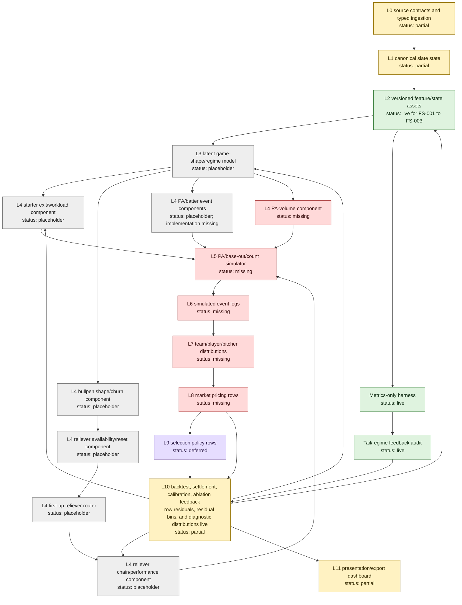
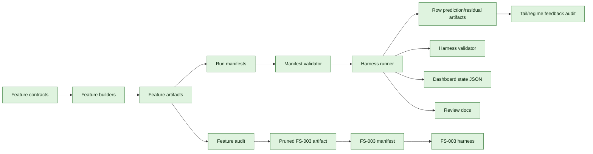

# MLB-M3 Alpha State Progress

Date: 2026-06-03

Status: current through `mlb-m3-alpha-7` FS-004 distribution diagnostics

Primary question: what exists, what is connected, what is only a placeholder, and what is still missing before M3 becomes a real baseball simulator/model stack?

## Audit Status

Last audited: 2026-06-03

Audit result: pass, with status-language clarifications applied.

Evidence checked:

- FS-001, FS-002, and FS-003 report counts match the artifact reports.
- FS-001, FS-002, and FS-003 manifests each expose 12 component placeholders and 7 lane placeholders.
- Manifest lane statuses are `contract_only` for `full_game_total` and `f5_total`, and `deferred` for the other five lanes.
- FS-002 and FS-003 alpha-5 walk-forward metrics match the harness output files.
- Alpha-6 family redesign audit exists and maps FS-003 to 19 target surfaces.
- FS-004 contract exists and validates, and source feasibility passed with 0 blocked surfaces.
- FS-004 reliever `entry_order` source decision is recorded and canonical chain-order fields are backfilled.
- FS-004 builder readiness passed, matrix materialization completed, and the FS-004 harness ran.
- FS-004 tail/regime audit exists and blocks promotion.
- FS-004 row-level prediction/residual artifacts and residual calibration bins exist for the diagnostic harness.
- Alpha-7 distribution-output artifacts exist and explicitly use train-side residual quantile fits.
- Alpha-7 harness validation passes and rejects a temp-copy distribution artifact whose fit scope is changed to validation rows.
- No promoted model, picks, simulator events, prop prices, or edge claims exist in the alpha artifacts.
- This progress file is ASCII-only and should render as normal Markdown plus Mermaid.

Tracking rule: update this document whenever a component status, lane status, feature-set artifact, harness result, simulator contract, market-pricing contract, or promotion gate changes.

## Snapshot

M3 now has a working typed feature-artifact pipeline, manifest infrastructure, metrics-only harness, feature audit, walk-forward diagnostics, a first diagnostic candidate runner, an Alpha-6 surface-gap audit, an FS-004 redesign contract, an FS-004 typed-source feasibility audit, a materialized FS-004 matrix/harness run, an FS-004 tail/regime feedback audit, row-level diagnostic prediction/residual artifacts, residual calibration bins, and fold-safe diagnostic distribution outputs.

M3 does not yet have a promoted model, a simulator, a real backtest edge claim, market pricing, player props, selection rows, calibrated market probabilities, probability calibration bins, or typed prediction/settlement writers.

The most important alpha-5 finding is negative but useful: FS-003 pruning cleaned artifact hygiene but did not improve walk-forward error. That means the next work is feature-family redesign, not model tuning.

## Status Vocabulary

| Status | Meaning |
| --- | --- |
| `live` | Implemented and validated in the current repo. |
| `partial` | Implemented enough for alpha diagnostics, but not complete enough for model-quality claims. |
| `placeholder` | Contract or registry slot exists, but no trained/runtime implementation exists. |
| `missing` | Not built yet. |
| `deferred` | Intentionally out of current alpha scope. |
| `blocked` | Cannot be properly built until an upstream data or contract gap is closed. |

## Current Implemented DAG

```mermaid
flowchart TD
  SQL["sql-mlb.db typed MLB database<br/>status: live"] --> FS001["FS-001 game_shape_starter_v1<br/>886 rows, 62 features<br/>status: live"]
  SQL --> FS002["FS-002 game_story_pitching_state_v0<br/>886 rows, 280 features<br/>status: live"]

  FS001 --> M001["Alpha-2 manifest for FS-001<br/>12 component placeholders, 7 lane placeholders<br/>status: live"]
  M001 --> H001["Alpha-3 harness smoke test<br/>mean-baseline metrics only<br/>status: live"]

  FS002 --> M002["Alpha-2 manifest for FS-002<br/>status: live"]
  M002 --> H002["Alpha-3 harness for FS-002<br/>diagnostic ridge candidates<br/>status: live"]
  M002 --> A002["Alpha-5 feature audit<br/>24 pruned feature recommendations<br/>status: live"]
  H002 --> WF002["Alpha-5 walk-forward and family ablations<br/>candidate worse than baseline<br/>status: live"]

  A002 --> FS003["FS-003 pruned game story artifact<br/>886 rows, 256 features<br/>status: live"]
  FS003 --> M003["Alpha-2 manifest for FS-003<br/>status: live"]
  M003 --> H003["Alpha-5 harness for FS-003<br/>walk-forward and ablations<br/>status: live"]
  H003 --> R003["FS-003 harness review<br/>cleaner artifact, no metric lift<br/>status: live"]

  R003 --> A6["Alpha-6 family redesign audit<br/>19 surfaces: 17 partial, 2 missing<br/>status: live"]
  A6 --> C004["FS-004 state-path redesign contract<br/>status: live"]
  C004 --> S004["FS-004 source feasibility audit<br/>53 typed tables populated, 0 blocked surfaces<br/>status: live"]
  S004 --> D004["Reliever entry-order source decision<br/>normalizer updated, backfill complete<br/>status: live"]
  D004 --> BR004["FS-004 builder readiness<br/>contract + sources + reliever order pass<br/>status: live"]
  BR004 --> FS004["FS-004 state-path redesign artifact<br/>886 rows, 120 features, 14 targets<br/>status: live"]
  FS004 --> M004["Alpha-2 manifest for FS-004<br/>status: live"]
  M004 --> H004["Alpha-6 harness for FS-004<br/>candidate closer, still unpromoted<br/>status: live"]
  H004 --> RP004["FS-004 row-prediction harness<br/>6 residual JSONL artifacts<br/>status: live"]
  RP004 --> TC004["FS-004 tail/regime feedback audit<br/>row residual summaries + residual bins live<br/>status: live"]
  TC004 --> DO004["FS-004 distribution-output harness<br/>6 distribution JSONL artifacts<br/>status: live"]
  DO004 --> DC004["FS-004 distribution coverage audit<br/>train-fit intervals + coverage diagnostics<br/>status: live"]
  DC004 --> NEXT["Next phase: candidate-search harness<br/>status: next"]

  classDef live fill:#dff3df,stroke:#367c39,color:#102b13;
  classDef partial fill:#fff2c2,stroke:#927000,color:#332800;
  classDef next fill:#d7ecff,stroke:#2f6f9f,color:#0d2638;

  class SQL,FS001,FS002,M001,H001,M002,H002,A002,WF002,FS003,M003,H003,R003,A6,C004,S004,D004,BR004,FS004,M004,H004,RP004,TC004,DO004,DC004 live;
  class NEXT next;
```



## Target Architecture With Current Status



## Alpha Timeline

| Phase | Status | Main Artifact | What It Proved | What It Did Not Prove |
| --- | --- | --- | --- | --- |
| Alpha-1 | complete | `m3_fs_001_game_shape_starter_v1_20260603T091939Z` | Typed DB can produce a versioned game-grain matrix and reports. | It did not contain enough baseball state for real model claims. |
| Alpha-2 | complete | `manifest.json`, dashboard state, registry preview | Runs can be contract-first and artifact-hashed. | Registry rows are preview-only; no DB registration yet. |
| Alpha-3 | complete | `training_harness` | Harness can load a manifest, split rows, write metrics, and avoid picks. | Smoke test was shallow and not a backtest edge claim. |
| Alpha-4 | complete | `m3_fs_002_game_story_pitching_state_v0_20260603T155454Z` | First real M3 feature artifact with story, starter, reliever, hitter, and market context. | It did not produce a good candidate model. |
| Alpha-5 | complete | FS-002 audit, FS-003 artifact, FS-003 harness | Walk-forward and ablations can reject weak candidates honestly. | Pruning did not fix the core feature representation problem. |
| Alpha-6 | complete | FS-004 contract, source feasibility, builder readiness, FS-004 matrix, FS-004 manifest, FS-004 harness, row-prediction artifacts, residual calibration bins, tail/regime audit | FS-004 materially improves diagnostic candidate error versus FS-003 but still does not beat baseline; row residuals expose where tails still fail. | No promotion, simulator, pricing, picks, probability calibration, or edge claim. |
| Alpha-7 | complete | Distribution-output harness, validator, distribution coverage audit | Fold-safe diagnostic distribution rows and coverage summaries now exist without validation-residual leakage. | Candidate still fails baseline, so no promotion, simulator, pricing, picks, market probabilities, or edge claim. |

## Feature Artifacts

| Feature Set | Status | Rows | Columns | Features | Targets | Source | Notes |
| --- | --- | ---: | ---: | ---: | ---: | --- | --- |
| `m3_fs_001_game_shape_starter_v1` | live | 886 | 77 | 62 | 9 | typed DB only | Foundation artifact; shallow but accepted. |
| `m3_fs_002_game_story_pitching_state_v0` | live | 886 | 295 | 280 | 9 | typed DB only | First real feature set; includes story memory, starter path, reliever chain, hitter path. |
| `m3_fs_003_game_story_pitching_state_pruned_v0` | live | 886 | 271 | 256 | 9 | derived from FS-002 audit | Cleaner baseline; no predictive lift versus FS-002. |
| `m3_fs_004_state_path_redesign_v0` | live | 886 | 140 | 120 | 14 | typed DB only | First Alpha-6 state-path redesign artifact; diagnostic candidate improved but remains unpromoted. |

All three feature sets report:

- `uses_sports_db: false`
- `uses_m2_weights: false`
- `uses_hand_picked_memory_lengths: false`

## Component Registry State

The manifest registry has 12 component-family slots. They are connected as placeholders, not trained submodels.

| Component Family | Status | Connected Today | Missing Before It Is Real |
| --- | --- | --- | --- |
| `game_shape_distribution` | placeholder | Manifest slot only | Latent regime labels, training target, calibration, walk-forward promotion gate. |
| `team_run_distribution` | partial | Mean baseline and diagnostic ridge harness for totals | Real distribution model, tail calibration, market-line conditioning. |
| `starter_exit_distribution` | placeholder | Feature columns exist in FS-002/FS-003 | Workload/exit target, hook timing distribution, starter-state model. |
| `starter_stat_distribution` | placeholder | Some starter-path features exist | Strikeout/walk/run/hit allowed target contracts and model artifacts. |
| `bullpen_shape_distribution` | placeholder | Reliever-chain and bullpen features exist | Churn regime labels and bullpen state model. |
| `reliever_availability_distribution` | placeholder | Reset/usage feature surfaces exist | Individual arm availability target, quick-reuse model, uncertainty calibration. |
| `first_up_reliever_router` | placeholder | Candidate-pool/router coverage features exist | First-up target labels, router training, role exception handling. |
| `reliever_chain_distribution` | placeholder | Chain length and command coverage features exist | Chain path target, chain performance model, inherited-runner/traffic state. |
| `reliever_stat_distribution` | placeholder | Sparse command profile surfaces exist | Individual-arm performance targets and workload-conditioned distributions. |
| `pa_event_distribution` | placeholder | Manifest slot only | Batter/pitcher event target matrix, pitch/PA state features, event model. |
| `hitter_stat_distribution` | placeholder | Hitter-path feature scaffolding exists | Player prop target matrices, starter-phase and reliever-chain interaction surfaces. |
| `calibration_layer` | partial | Placeholder JSON, FS-004 tail/regime audit, row-level residual artifacts, residual calibration bins, and diagnostic distribution coverage | Market probability calibration bins, settlement joins, and promotion/rejection rules. |

## Lane State

| Lane | Status | Manifest Status | Current Output | Missing |
| --- | --- | --- | --- | --- |
| `full_game_total` | partial | `contract_only` | Mean baseline and diagnostic ridge metrics | Distribution model, calibrated totals probabilities, market-line comparison. |
| `f5_total` | partial | `contract_only` | Mean baseline and diagnostic ridge metrics | Distribution model, calibrated F5 probabilities, market-line comparison. |
| `moneyline` | deferred | `deferred` | Lane placeholder only | Win-prob target, run-distribution coupling, market writer. |
| `team_total` | deferred | `deferred` | Target columns exist for team runs | Team run distribution model and line-conditioned pricing. |
| `starter_props` | deferred | `deferred` | Component slots exist | Starter stat distributions and prop contracts. |
| `reliever_props` | deferred | `deferred` | Reliever-chain slots exist | Reliever identity/workload/performance distributions. |
| `hitter_props` | deferred | `deferred` | Hitter-path feature scaffolding exists | Player event distributions, PA volume, lineup turnover, prop pricing. |

## Current Harness Result

| Feature Set | Fold | Lane | Baseline MAE | Candidate MAE | Delta | Candidate Features |
| --- | --- | --- | ---: | ---: | ---: | ---: |
| FS-002 | `2026-05-01` to `2026-05-15` | `f5_total` | 2.4163 | 2.9071 | +0.4908 | 262 |
| FS-002 | `2026-05-01` to `2026-05-15` | `full_game_total` | 3.4887 | 4.4663 | +0.9777 | 262 |
| FS-002 | `2026-05-16` to `2026-05-31` | `f5_total` | 2.6605 | 3.2909 | +0.6304 | 262 |
| FS-002 | `2026-05-16` to `2026-05-31` | `full_game_total` | 3.5878 | 4.7187 | +1.1309 | 262 |
| FS-003 | `2026-05-01` to `2026-05-15` | `f5_total` | 2.4163 | 2.9071 | +0.4908 | 251 |
| FS-003 | `2026-05-01` to `2026-05-15` | `full_game_total` | 3.4887 | 4.4663 | +0.9777 | 251 |
| FS-003 | `2026-05-16` to `2026-05-31` | `f5_total` | 2.6605 | 3.2909 | +0.6304 | 251 |
| FS-003 | `2026-05-16` to `2026-05-31` | `full_game_total` | 3.5878 | 4.7187 | +1.1309 | 251 |
| FS-004 | `2026-05-01` to `2026-05-15` | `f5_total` | 2.4163 | 2.5536 | +0.1373 | 114 |
| FS-004 | `2026-05-01` to `2026-05-15` | `full_game_total` | 3.4887 | 3.6741 | +0.1854 | 114 |
| FS-004 | `2026-05-16` to `2026-05-31` | `f5_total` | 2.6605 | 2.8113 | +0.1508 | 114 |
| FS-004 | `2026-05-16` to `2026-05-31` | `full_game_total` | 3.5878 | 3.6560 | +0.0682 | 114 |

Interpretation: FS-004 is still worse than the train-mean baseline in every tested fold, so no model is promoted. It is meaningfully closer than FS-003, so Alpha-6 representation work is directionally useful.

## FS-004 Tail/Regime Gate

Audit artifact: `data-private/models/mlb-m3/runs/mlb_m3_alpha2_infra_fs004_20260603T174500Z/tail_calibration_alpha7_distribution_outputs`

Promotion gate: `blocked_for_promotion`

| Gate | Result |
| --- | --- |
| Tail/regime targets present | pass |
| Row-level validation predictions exist | pass |
| Probability or distribution outputs exist | pass |
| Market probability outputs exist | fail |
| Distribution outputs exist | pass |
| Residual calibration bins exist | pass |
| Candidate beats baseline in all comparable folds | fail |

The only current blocking reason is:

- Diagnostic candidate does not beat baseline across comparable walk-forward folds.

Distribution-output coverage from `fold_train_residual_quantile_v0`:

| Split | Fold | Lane | Rows | 50% Hit | 80% Hit | 90% Hit |
| --- | --- | --- | ---: | ---: | ---: | ---: |
| `manifest_validation` | `manifest_validation` | `f5_total` | 218 | 0.385 | 0.725 | 0.817 |
| `manifest_validation` | `manifest_validation` | `full_game_total` | 218 | 0.440 | 0.725 | 0.849 |
| `walk_forward_validation` | `wf_2026_05_01_to_2026_05_15` | `f5_total` | 201 | 0.393 | 0.736 | 0.826 |
| `walk_forward_validation` | `wf_2026_05_01_to_2026_05_15` | `full_game_total` | 201 | 0.418 | 0.701 | 0.841 |
| `walk_forward_validation` | `wf_2026_05_16_to_2026_05_31` | `f5_total` | 218 | 0.385 | 0.725 | 0.817 |
| `walk_forward_validation` | `wf_2026_05_16_to_2026_05_31` | `full_game_total` | 218 | 0.440 | 0.725 | 0.849 |

Worst mean-baseline validation slices:

| Lane | Slice | Rows | Baseline MAE | Direction |
| --- | --- | ---: | ---: | --- |
| `f5_total` | `target_f5_bucket:chaos` | 43 | 5.3351 | underpredicts |
| `full_game_total` | `target_total_bucket:chaos` | 47 | 6.5518 | underpredicts |
| `full_game_total` | `target_total_bucket:low` | 55 | 5.1917 | overpredicts |

Worst candidate residual slices from the row-aware audit:

| Lane | Slice | Rows | Candidate MAE | Baseline MAE | Delta |
| --- | --- | ---: | ---: | ---: | ---: |
| `full_game_total` | `target_total_bucket:chaos` | 47 | 5.8312 | 6.5518 | -0.7206 |
| `full_game_total` | `target_chaos_game_flag:1` | 50 | 5.6926 | 6.3101 | -0.6175 |
| `f5_total` | `target_f5_bucket:chaos` | 43 | 5.5744 | 5.3351 | +0.2394 |

Residual calibration-bin examples from manifest validation:

| Lane | Bin | Rows | Prediction Mean | Actual Mean | Candidate MAE | Baseline MAE | Delta |
| --- | ---: | ---: | ---: | ---: | ---: | ---: | ---: |
| `f5_total` | 1 | 43 | 3.1148 | 5.0000 | 3.0473 | 2.7296 | +0.3177 |
| `f5_total` | 5 | 44 | 6.2494 | 4.5682 | 2.8331 | 2.5113 | +0.3218 |
| `full_game_total` | 5 | 44 | 11.9910 | 9.8182 | 4.4431 | 3.8073 | +0.6358 |

Interpretation: the tail problem is visible at row and distribution level now. FS-004 helps some full-game chaos slices versus the mean baseline, but still loses overall and does not solve F5 chaos. The residual bins show top-end overprediction and low-bin F5 underprediction. The first distribution family is under-covering validation outcomes; it is a diagnostic interval layer, not market probability calibration.

## Alpha-6 Surface Audit

Original surface audit:

| Status | Count |
| --- | ---: |
| `partial` | 17 |
| `missing` | 2 |

Original missing surfaces:

- `hitter_vs_reliever_chain_phase`
- `tail_calibration_feedback`

Current follow-up status:

| Surface | Current Status | Evidence |
| --- | --- | --- |
| `hitter_vs_reliever_chain_phase` | partial | FS-004 has a reliever-chain phase readiness surface, but not a player-level hitter-vs-chain event model. |
| `tail_calibration_feedback` | partial | `tail_calibration_alpha7_distribution_outputs` exists with row residual summaries, residual calibration bins, and diagnostic distribution coverage, but real calibration still needs market probability calibration and settlement joins. |

Candidate next feature set:

```text
m3_fs_004_state_path_redesign_v0
```

FS-004 contract status: `live`

FS-004 source feasibility status: `live`

FS-004 matrix status: `live`

FS-004 targets starter path, reliever chain, hitter-path phase split, ordered story memory, game-regime labels, and calibration hooks before model tuning. The next missing feedback pieces are probability/distribution outputs, settlement joins, and promotion gates.

## Alpha-6 Source Feasibility

| Status | Count |
| --- | ---: |
| `source_feasible` | 17 |
| `partial_source_contract_decision` | 0 |
| `source_feasible_with_optional_source_decisions` | 2 |

The source feasibility audit checked 53 referenced typed tables. All 53 exist and are populated. All 27 FS-004 contract source tables exist and are populated.

No surface is blocked by complete data absence. The two P0 surfaces that required a reliever order source decision are now source-feasible:

- `first_up_reliever_router`
- `hitter_vs_reliever_chain_phase`

The decision is recorded: `entry_order`, `first_inning`, and `first_half` belong in canonical `pitcher_appearances`. Typed staging `mlb_pitcher_appearances` is only the normalization/backfill source. The parser is updated and the focused backfill populated 7,495 of 7,498 canonical pitcher appearance rows.

## Alpha-6 Builder Readiness

Status: `builder_readiness_clear`

| Check | Result |
| --- | --- |
| FS-004 contract validation | pass |
| Source decision declaration | pass |
| FS-004 source feasibility | pass |
| Canonical reliever order data | pass |

FS-004 matrix materialization is complete. Row-level residual diagnostics, residual calibration bins, and fold-safe diagnostic distribution outputs now exist. This still does not allow picks, prop prices, simulator event logs, promotion decisions, or claims that M3 is better. The current allowed next step is a metrics-only candidate-search harness that can honestly challenge the train-mean baseline without validation leakage.

## What Is Connected



## What Is Not Connected Yet

```mermaid
flowchart LR
  H["Harness metrics"] --> TAIL["Tail/regime audit"]
  H --> ROW["Row-level predictions and residuals"]
  ROW --> TAIL
  TAIL -. missing probabilities .-> DISTOUT["Probability/distribution outputs"]
  DISTOUT -. not yet .-> BT["True backtest engine"]
  BT -. not yet .-> CAL["Calibration layer"]
  CAL -. not yet .-> PROMO["Promotion gate"]
  PROMO -. not yet .-> REG["Active model registry"]
  REG -. not yet .-> SIM["Simulator"]
  SIM -. not yet .-> DIST["Team/player distributions"]
  DIST -. not yet .-> PRICE["Market pricing rows"]
  PRICE -. not yet .-> SELECT["Selection policy"]
  SELECT -. not yet .-> UI["Slate UI/export"]
  PRICE -. not yet .-> SETTLE["Settlement rows"]
  SETTLE -. not yet .-> BT

  classDef missing fill:#ffd9d9,stroke:#aa3b3b,color:#3b1111;
  classDef live fill:#dff3df,stroke:#367c39,color:#102b13;
  class TAIL,ROW live;
  class DISTOUT,BT,CAL,PROMO,REG,SIM,DIST,PRICE,SELECT,UI,SETTLE missing;
```



## Gaps By Layer

| Layer | Status | Gap |
| --- | --- | --- |
| Typed DB facts | partial | Good enough for current game-grain feature work; true PA simulator still needs richer replay state and as-of discipline. |
| Feature layer | live | FS-004 is a better first state-path representation, but it still needs family iteration and componentized outputs before model-quality claims. |
| Manifest/run infrastructure | live | Direct typed DB registration remains preview-only. |
| Harness | live | It is metrics-only and can now emit diagnostic row residuals; it is not a final walk-forward backtest engine. |
| Backtest feedback | partial | Walk-forward, ablations, row residuals, residual calibration bins, and tail/regime audit exist, but probability outputs, settlement, probability calibration, and promotion gates are missing. |
| Component models | placeholder | No trained component artifacts have been promoted. |
| Simulator | missing | No PA/base-out/count event simulator or simulated event logs. |
| Market pricing | missing | No fair probabilities, prop prices, or market prediction rows. |
| Selection policy | deferred | No picks, ranking, vetoes, or staking-like outputs. |
| Dashboard | partial | JSON dashboard state exists; no run dashboard UI yet. |

## What Is Left

### Alpha-6: Feature-Family Redesign

Status: opened; FS-004 matrix, harness, row residuals, and tail/regime audit generated.

Build the next feature pass around baseball state, not wider flat columns.

Priority work:

- redesign `starter_path` into separate workload trajectory, damage distribution, pitch-shape change, low-data uncertainty, and opponent-pressure surfaces
- redesign `reliever_chain` into availability, first-up routing, expected chain length, chain regime, recent usage, and arm performance volatility surfaces
- split hitter matchup representation into starter-phase hitter path and reliever-chain hitter path
- treat story memory as ordered interaction context, not a large undifferentiated numeric block
- preserve coverage and uncertainty as first-class inputs

Exit gate:

- a new feature set materially changes representation, not just column count
- walk-forward diagnostics improve or clearly identify which family is failing
- tail/regime diagnostics identify whether failure is mean, tail, family-combination, or missing-output driven
- candidates remain unpromoted unless gates are satisfied

### Alpha-7: Real Component Training Harness

Status: planned as distribution-output scaffolding first.

Replace diagnostic ridge as the only candidate path, but only after distribution diagnostics can be evaluated honestly.

Priority work:

- implement fold-train residual distribution output diagnostics
- validate distribution fit scope to prevent validation leakage
- add coverage diagnostics by lane, fold, and regime
- train component candidates behind registry slots
- add proper model artifacts with lineage
- support distributional targets, not only point MAE
- compare against baselines and FS-003
- keep all outputs metrics-only until promotion gates exist

### Alpha-8: Backtest And Calibration Feedback Loop

Turn diagnostics into a real experiment loop.

Priority work:

- settlement reader and target joiner
- walk-forward fold planner beyond two fixed folds
- generalized row-level prediction and residual artifacts across future components
- calibration diagnostics by slice, month, regime, and market line
- tail diagnostics for chaos/high-run/dead-bat games
- feature ablation reports as first-class artifacts
- promotion/rejection gate documents

### Alpha-9: First Simulator Slice

Build a small coherent simulator before trying player props.

Priority work:

- latent game-shape distribution
- starter exit/workload distribution
- bullpen exposure and reliever-chain distribution
- PA-volume distribution
- first event-log schema
- aggregate full-game total and F5 total distributions from shared simulated paths

### Later: Market And Props

Only after shared distributions exist:

- full-game total pricing
- F5 total pricing
- moneyline-style win probability
- team totals
- starter strikeout/outs props
- hitter hits, total bases, home runs, RBI, runs, walks, strikeouts
- reliever workload/damage props
- selection policy and presentation exports

## Main Risk

The system infrastructure is now ahead of the baseball intelligence.

That is good, because the infrastructure can reject weak ideas honestly. The risk is accidentally treating the current FS-002/FS-003 flat feature matrix as the model architecture. It is not. It is a baseline artifact and a diagnostic substrate.

The next improvement should come from better baseball state representation:

```text
starter path + reliever chain + hitter interaction + story memory + regime labels
```

not from tuning the current ridge or adding another model family on the same flat matrix.
