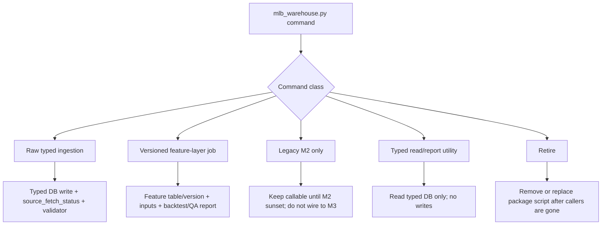

# MLB Warehouse Command Replacement Ledger

Date: 2026-06-03

Ledger version: 0.2.0

Typed CLI version: `pipeline/mlb/warehouse/mlb_typed_warehouse.py` v0.1.0

Scope: first-pass ledger for replacing `pipeline/mlb/warehouse/mlb_warehouse.py` command by command without path-flipping the legacy `sports.db` script into the typed MLB DB.

## Decision Rules

- `mlb_warehouse.py` remains legacy until every active command is replaced, renamed as legacy M2, or retired.
- New typed replacement commands live in `pipeline/mlb/warehouse/mlb_typed_warehouse.py`; do not keep modifying the old monolith for typed DB work.
- New canonical MLB ingestion writes `data-private/warehouse/sports/mlb/sql-mlb.db`.
- Raw ingestion means source receipts, identifiers, replay state, official facts, and market snapshots only.
- Expected PA, shrinkage, hot/cold labels, pitch kernels, mistake shapes, and story labels belong in a versioned feature layer, not raw ingestion.
- M2 research commands stay available for old runs but must not become M3 contracts.
- Package scripts should move only after a command has a typed replacement plus validation report.

## Replacement DAG

## Status Legend

| Status | Meaning |
|---|---|
| `adapter-exists` | A typed adapter/script already exists, but package wiring may still need replacement. |
| `typed-cli-exists` | A command exists in the new typed warehouse CLI, but the legacy package alias has not been fully cut over. |
| `wrapper-needed` | The typed pieces exist, but a CLI/orchestrator replacement is still missing. |
| `feature-rewrite` | Logic should move into a versioned feature-layer job. |
| `legacy-m2` | Keep only for old M2 workflows. Do not use for M3. |
| `typed-read-needed` | Replace with a read-only typed DB report/list command. |
| `retire` | Remove or stop exposing after callers are confirmed gone. |

## Command Ledger

| Command | Package Script | Class | Priority | Status | Replacement Target | Next Action |
|---|---|---|---:|---|---|---|
| `init-db` | `data:init` | retire/schema migration | P0 | `retire` | typed migration scripts and schema validators | Replace package script with explicit typed migration/check command or remove once no callers need it. |
| `ingest-mlb-day` | `data:ingest:mlb-day` | raw typed ingestion | P0 | `wrapper-needed` | `ingest_mlb_schedule_game_feed_raw_to_typed.py`, lineup/market/player context ingestors | Build typed day orchestrator; do not call legacy live fetch path. |
| `ingest-mlb-range` | `data:ingest:mlb-range` | raw typed ingestion | P0 | `wrapper-needed` | date-loop wrapper around typed raw ingestors | Add idempotent typed range runner with per-day reports. |
| `replay-mlb-range-from-raw` | `data:replay:mlb-raw-range` | raw typed ingestion | P0 | `wrapper-needed` | `ingest_mlb_schedule_game_feed_raw_to_typed.py` range mode | Add replay wrapper that rebuilds typed games, PA, pitch, and outcome rows from local raw archive. |
| `prepare-mlb-day` | `data:prep:mlb-day` | orchestration | P1 | `wrapper-needed` | typed ingest + source freshness + feature status checks | Replace with M3-safe preflight/orchestrator after P0 ingest wrappers land. |
| `list-probable-starters` | `data:list:probables`, `data:list:probables:typed` | typed read/report | P0 | `typed-cli-exists` | `mlb_typed_warehouse.py list-probable-starters` over typed `starting_pitchers`, `games`, `teams`, `players` | Validate typed output against legacy output, then move `data:list:probables` to the typed CLI. |
| `derive-mlb-features` | `data:derive:mlb` | feature layer | P1 | `feature-rewrite` | rolling team/starter/bullpen feature jobs | Split into typed feature builders with feature-set IDs and validators. |
| `derive-story-signals` | `data:derive:stories` | feature layer | P2 | `feature-rewrite` | game-story signal feature job from typed replay state | Rebuild as M3 story-transition feature job. |
| `derive-tier2-features` | `data:derive:tier2-mlb` | feature layer | P2 | `feature-rewrite` | team story priors, lineup dependency, starter leash, series context | Port only after core feature tables and contracts are named. |
| `derive-tier3-features` | `data:derive:tier3-mlb` | feature layer | P2 | `feature-rewrite` | reliever first-batter command, starter third-time profiles | Port as separate feature jobs with explicit lookback windows. |
| `derive-hidden-edge-features` | `data:derive:hidden-edges` | feature layer | P2 | `feature-rewrite` | whiff persistence, lead surrender, form carryover | Rebuild as experimental M3 feature family, not ingestion. |
| `derive-state-snapshots` | `data:derive:state-snapshots` | feature layer | P1 | `feature-rewrite` | team/hitter state snapshots from typed facts | Define state snapshot feature contract and rebuild from typed tables. |
| `derive-hitter-classic-trends` | none | feature layer | P1 | `feature-rewrite` | hitter recent/rolling classic trends | Rebuild as player form feature job. |
| `derive-hitter-opponent-context` | none | feature layer | P2 | `feature-rewrite` | hitter opponent-strength context | Rebuild after opponent/team context tables are stable. |
| `derive-market-context` | none | feature layer | P2 | `feature-rewrite` | team market-history and opponent-quality context | Rebuild from typed market tables and outcomes. |
| `derive-mistake-shapes` | `data:derive:mistake-shapes` | feature layer | P1 | `feature-rewrite` | team, starter, bullpen, and lineup mistake-shape feature jobs | Promote as M3 feature family because it feeds chaos/game-shape work. |
| `derive-first-inning-profiles` | `data:derive:first-inning-profiles` | feature layer | P2 | `feature-rewrite` | team/starter first-inning profiles | Rebuild as scoped feature job with validation against F1/F5 outcomes. |
| `derive-story-labels` | `data:derive:story-labels` | label layer | P1 | `feature-rewrite` | game-story labels, phase outcomes, market mispricing labels | Rebuild as M3 backtest/label job, not pregame ingestion. |
| `derive-state-formula-rows` | `data:derive:mlb-state-formulas` | legacy M2 | P3 | `legacy-m2` | none for M3; future simulator feature labels if useful | Leave legacy; do not wire into M3. Mine ideas later. |
| `derive-player-identity-rows` | `data:derive:mlb-player-identity` | legacy M2 | P3 | `legacy-m2` | future M3 player identity feature jobs | Leave legacy; reimplement expected PA/shrinkage/deviation ideas in feature layer later. |
| `derive-pitcher-batter-kernel` | `data:derive:mlb-pitcher-batter-kernel` | legacy M2 | P3 | `legacy-m2` | future M3 pitch-mix matchup feature jobs | Leave legacy; reimplement pitch kernel with typed pitch events later. |
| `backtest-m2-research` | `data:backtest:mlb-m2-research` | legacy M2 | P3 | `legacy-m2` | future M3 experiment/backtest runner | Leave legacy; do not use as M3 backtest framework. |
| `ingest-pitcher-war` | `data:ingest:pitcher-war` | supplemental raw ingestion | P2 | `wrapper-needed` | player/pitcher context typed ingestor | Decide whether Baseball-Reference WAR remains an approved M3 source; if yes, add typed raw receipt and table target. |
| `ingest-statcast-hr` | `data:ingest:statcast-hr` | supplemental raw ingestion | P2 | `wrapper-needed` | player context / Statcast typed ingestion | Add typed Statcast leaderboard ingestor or retire if detailed Statcast pitch/batted-ball data supersedes it. |
| `ingest-hitter-statcast-range` | `data:ingest:hitter-statcast-range` | supplemental raw ingestion | P1 | `adapter-exists` | `ingest_mlb_player_context_raw_to_typed.py` | Confirm coverage for grouped/detail Baseball Savant files and add range wrapper if needed. |
| `ingest-hitter-career-profiles` | `data:ingest:hitter-career-profiles` | supplemental raw ingestion | P1 | `adapter-exists` | `ingest_mlb_player_context_raw_to_typed.py` | Confirm career-profile source coverage and package replacement. |
| `ingest-hitter-lineup-splits` | `data:ingest:hitter-lineup-splits` | supplemental raw ingestion | P2 | `wrapper-needed` | lineup/player context typed targets | Decide whether split rows belong in lineups, player context, or feature layer; then write typed adapter. |
| `derive-hitter-statcast-trends` | `data:derive:hitter-statcast-trends` | feature layer | P1 | `feature-rewrite` | hitter Statcast rolling trend feature job | Rebuild from typed Statcast/player context tables. |
| `derive-batter-outcomes` | `data:derive:batter-outcomes` | typed normalization/label layer | P1 | `adapter-exists` | typed game/player batting outcome normalizers | Confirm typed `game_outcomes`, player batting, and PA aggregates cover this; replace package script with normalizer/validator. |
| `import-predictions` | `data:import:hr` | prediction write path | P3 | `retire` | typed model run index + `normalize_mlb_predictions.py` where needed | Retire old HR import or replace with typed model-output writer. |
| `import-prop-predictions` | `data:import:mlb-props` | prediction write path | P3 | `retire` | typed model run index + `prediction_rows` | Retire old prop import or replace with typed model-output writer. |
| `grade-home-run-picks` | `data:grade:hr` | settlement/evaluation | P3 | `wrapper-needed` | `settle_mlb_ml_prediction_rows.mjs`, prediction validators | Replace with typed settlement command after prediction writer is canonical. |
| `grade-prop-picks` | `data:grade:mlb-props` | settlement/evaluation | P3 | `wrapper-needed` | typed settlement/backtest validators | Replace with typed settlement command after prop prediction writer is canonical. |
| `list-home-runs` | `data:list:hr` | typed read/report | P3 | `typed-read-needed` | typed home-run events or PA outcome views | Add typed read utility or retire. |
| `list-first5` | `data:list:first5` | typed read/report | P2 | `typed-read-needed` | typed `game_outcomes` first-five fields | Add typed read utility if still useful. |
| `list-bullpen-usage` | `data:list:bullpen` | typed read/report | P2 | `typed-read-needed` | future bullpen feature tables | Replace after bullpen feature job is rebuilt. |
| `list-likely-relievers` | `data:list:relievers` | typed read/report | P2 | `typed-read-needed` | future reliever chain feature tables | Replace after reliever feature job is rebuilt. |
| `list-bullpen-shape` | `data:list:bullpen-shape` | typed read/report | P2 | `typed-read-needed` | future bullpen shape feature tables | Replace after bullpen shape feature job is rebuilt. |
| `list-story-signals` | none | typed read/report | P3 | `typed-read-needed` | future story-signal feature table | Add typed read utility only if still used. |

## Suggested Cut Order

1. **P0 raw/read blockers**: `list-probable-starters`, `replay-mlb-range-from-raw`, `ingest-mlb-range`, `ingest-mlb-day`.
2. **P1 typed day readiness**: `prepare-mlb-day`, `derive-state-snapshots`, `derive-mistake-shapes`, `derive-story-labels`, hitter/player context adapters.
3. **P1/P2 feature families**: rolling form, hitter trends, market context, first-inning, tier2/tier3/hidden-edge families.
4. **P3 legacy quarantine**: keep M2 feature/backtest commands callable but relabel package scripts or move to a legacy namespace after current users are cut over.
5. **P3 reporting cleanup**: replace or retire import/grade/list utilities after typed model outputs and settlement are stable.

## Open Questions

- Should Baseball-Reference WAR remain an approved M3 source, or should pitcher season context come from MLB/Statcast-only feeds?
- Should historical HR leaderboard snapshots stay as a distinct source, or are typed pitch/batted-ball events enough?
- Where should hitter lineup split rows live: player context, lineup context, or derived feature layer?
- Which old list/report commands are still used by daily workflow versus just historical debugging?
