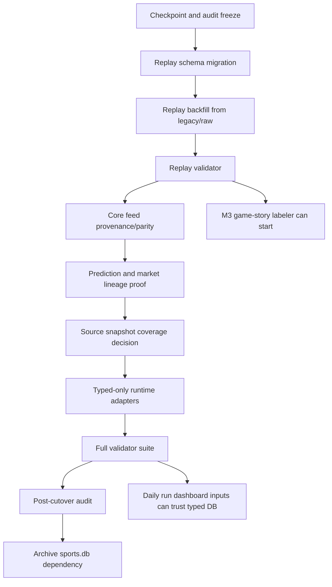

# MLB Typed DB Cutover Run Plan

Date: 2026-06-03

Scope: migrate MLB runtime and M3 research inputs off `data-private/warehouse/sports.db` and onto `data-private/warehouse/sports/mlb/sql-mlb.db`.

Related reports:

- `data-migration/reports/mlb_legacy_to_typed_gap_audit_2026-06-03.md`
- `data-migration/reports/mlb_typed_db_cutover_completion_plan_2026-06-03.md`
- `run-plans/mlb/2026-06-03-typed-db-ingestion-routing.md`
- `run-plans/mlb/2026-06-03-mlb-warehouse-command-ledger.md`
- `research-m3/tech-debt.md`
- `data-migration/reports/mlb_typed_warehouse_command_audit_2026-06-03.json`
- `data-migration/reports/mlb_db_input_cutover_audit_active_2026-06-03.json`
- `data-migration/reports/mlb_db_input_cutover_audit_2026-06-02.json`

## Progress Snapshot

Updated after the typed writer-staging cutover.

Completed:

- Replay-state schema/backfill/validator are complete for typed `plate_appearances` and `pitch_events`.
- Core feed parity, prediction lineage, market lineage, and MLB source snapshot coverage validators pass.
- API warehouse status reads typed MLB tables from `data-private/warehouse/sports/mlb/sql-mlb.db`.
- Typed MLB compatibility views exist for staged `mlb_*` legacy table names, plus canonical views for `mlb_games`, `mlb_plate_appearances`, and `mlb_pitch_events`.
- Writer-owned legacy names for side predictions/backtests and market/prop odds are writable staging tables inside `sql-mlb.db`.
- Prediction, market, and prop normalizers read historical `legacy_table_rows` plus direct-only typed staging rows, so fresh writer rows normalize forward without a `sports.db` bridge.
- New typed warehouse CLI exists at `pipeline/mlb/warehouse/mlb_typed_warehouse.py` v0.8.0; primary package aliases for raw schedule/feed ingestion, day prep, probable starters, HR/F5/bullpen typed read utilities, hitter Statcast ranges, hitter career profiles, lineup-board splits, typed results/outcome labels, and typed readiness validation now point to typed replacements/utilities.
- Current M2 `lineups`, `history-journal`, `generate-day-files`, copied M0/M1 lane scripts, cartridge compare, RP36 read exporters, and story archive export read the typed MLB DB.
- `generate-day-files` historical market fallback now reads typed `mlb_featured_market_odds_snapshots` instead of `published-data/slates/<date>/games`.
- Side backtest and MLB odds/FanDuel research fetchers default to `sql-mlb.db` writable staging tables.

Current audit state:

- Open migration-attention rows: zero.
- Active-profile direct `sports.db` runtime hits: zero.
- Active-profile legacy warehouse CLI callers: zero.
- Active-profile public/private/generated artifact input callers remain in M2 snapshot and workflow surfaces.
- Full-profile legacy `sports.db` hits remain broad historical/research surface debt, not all active runtime gates.
- Remaining warehouse debt is the legacy monolith, M2-only package aliases, and explicit archive-M2 compatibility boundaries, not a safe mechanical path swap:

| File | Why It Remains |
|---|---|
| `pipeline/mlb/warehouse/mlb_warehouse.py` | Legacy monolith owns old `mlb_*` table creation and many inserts/deletes. It needs command-by-command replacement with typed ingestors/normalizers, not a DB-path flip. |
| `models/mlb/cartridges/MLB-M2/workflows/archive-m2/legacy-warehouse.mjs` | Explicit M2-only boundary for feature/import/grade commands that are not M3 typed ingestion. |
| `models/mlb/cartridges/MLB-M2/snapshot.mjs`, `snapshot-run.mjs`, `history-journal.mjs`, `verify-refresh.mjs` | Still include public/private/generated artifact inputs that should become typed DB or DB-derived export inputs. |

## Audit Checkpoint: 2026-06-03

Typed warehouse command audit:

- Ledger commands: 39.
- Legacy commands found: 39.
- Typed replacement commands implemented: 14.
- Implemented replacements: `derive-batter-outcomes`, `ingest-hitter-career-profiles`, `ingest-hitter-lineup-splits`, `ingest-hitter-statcast-range`, `ingest-mlb-day`, `ingest-mlb-range`, `list-bullpen-shape`, `list-bullpen-usage`, `list-first5`, `list-home-runs`, `list-likely-relievers`, `list-probable-starters`, `prepare-mlb-day`, `replay-mlb-range-from-raw`.
- Ledger drift: zero missing legacy commands and zero extra typed replacement commands.

Active DB-input cutover audit:

| Pattern | Files | Hits | Meaning |
|---|---:|---:|---|
| `legacy_sports_db` | 0 | 0 | No active runtime file is directly reading the shared legacy DB path. |
| `warehouse_cli` | 0 | 0 | Active files no longer shell directly into the legacy warehouse CLI. |
| `published_data_input` | 3 | 7 | Snapshot/journal surfaces still use public/site mirrors as model inputs. |
| `private_prediction_json_input` | 6 | 13 | Snapshot/workflow surfaces still read generated prediction artifacts. |
| `private_prediction_json_output` | 4 | 5 | M2 compatibility outputs still write generated JSON. |
| `raw_archive_input` | 4 | 4 | Some surfaces still read raw/archive files directly. |
| `generated_module_input` | 4 | 15 | Some surfaces still read generated modules/files instead of DB-derived exports. |
| `legacy_sqlite_shell` | 4 | 4 | Shell-based SQLite reads still need review. |
| `db_ready_reference` | 11 | 22 | Existing typed/sport-scoped DB references. |

Interpretation:

- The typed DB path work removed active direct `sports.db` runtime reads and direct active legacy warehouse CLI callers.
- `validate-typed-ready` is now the compact report-first gate for typed daily/raw and M3 contract validators.
- The next runtime gate is removing M2 artifact reads from the live prediction slate path.
- The full-profile audit remains useful for research/M0/M2 archive debt, but it is intentionally noisier than the active runtime profile.

## Operating Rules

- Treat `sports.db` as a read-only migration source until the final gate passes.
- Do not tune M2 or M3 model logic during this migration.
- Every migration step writes a JSON report under `data-migration/reports/`.
- Every destructive-looking action must be implemented as additive first: nullable columns, companion tables, new validators, new adapters.
- The cutover is not complete just because row counts match. M3 needs replayable baseball state, and runtime code needs typed-only reads.

## Current Finding

The audit says the typed DB is data-complete for the audited MLB source families:

- 66 normalized/source-linked legacy families.
- 1,202,383 source rows covered by normalized lineage.
- 8 high-value source families are validator-gated without row-level source lineage.
- MLB source snapshot path coverage is validator-gated.
- 0 open migration-attention rows.
- 1 runtime code blocker still points at `sports.db`.

The first M3 modeling gate is replay state on:

- `plate_appearances`
- `pitch_events`

The full database cutover also requires:

- parity/provenance for `games`, `starting_pitchers`, `plate_appearances`, `pitch_events`, and MLB-relevant `source_snapshots`
- lineage proof for `prediction_rows` and `market_snapshots`
- runtime code-path cutover away from `sports.db`

## Migration DAG



## Phase 0: Checkpoint And Freeze

Goal: lock the baseline so any later mismatch is explainable.

Commands:

```bash
git status --short --untracked-files=all
sqlite3 data-private/warehouse/sports.db "pragma integrity_check;"
sqlite3 data-private/warehouse/sports/mlb/sql-mlb.db "pragma integrity_check;"
node data-migration/scripts/audit_mlb_legacy_to_typed_gap.mjs
```

Expected artifacts:

- `data-migration/reports/mlb_legacy_to_typed_gap_audit_2026-06-03.json`
- `data-migration/reports/mlb_legacy_to_typed_gap_audit_2026-06-03.md`

Gate:

- Both SQLite integrity checks return `ok`.
- Baseline audit report is committed or intentionally checkpointed.

## Phase 1: Replay Schema Migration

Goal: make the typed replay spine capable of preserving baseball state transitions.

Preferred approach: add nullable fields directly to the existing typed tables. Row counts already match legacy and typed IDs are deterministic (`mlb-<game_pk>-pa-<at_bat_index>` and `mlb-<game_pk>-pa-<at_bat_index>-event-<event_index>`), so companion tables add lookup friction without much safety benefit.

Add to `plate_appearances`:

| Column | Type |
|---|---|
| `at_bat_index` | INTEGER |
| `outs_before` | INTEGER |
| `outs_after` | INTEGER |
| `balls_final` | INTEGER |
| `strikes_final` | INTEGER |
| `base_state_start` | TEXT |
| `base_state_end` | TEXT |
| `away_score_before` | INTEGER |
| `home_score_before` | INTEGER |
| `away_score_after` | INTEGER |
| `home_score_after` | INTEGER |
| `men_on_base` | TEXT |
| `is_scoring_play` | INTEGER |
| `is_out` | INTEGER |
| `is_at_bat` | INTEGER |
| `raw_json` | TEXT |

Add to `pitch_events`:

| Column | Type |
|---|---|
| `at_bat_index` | INTEGER |
| `event_index` | INTEGER |
| `balls` | INTEGER |
| `strikes` | INTEGER |
| `outs` | INTEGER |
| `is_pitch` | INTEGER |
| `is_strike` | INTEGER |
| `is_ball` | INTEGER |
| `call_code` | TEXT |
| `call_description` | TEXT |
| `pitch_type_code` | TEXT |
| `pitch_type_description` | TEXT |
| `start_speed` | REAL |
| `end_speed` | REAL |
| `play_id` | TEXT |
| `raw_json` | TEXT |

Add indexes after backfill:

```sql
create index if not exists idx_mlb_pa_replay_order
on plate_appearances (game_id, at_bat_index);

create index if not exists idx_mlb_pitch_events_replay_order
on pitch_events (game_id, at_bat_index, event_index);
```

Implementation artifact:

- `data-migration/scripts/migrate_mlb_replay_state_schema.py`

Gate:

- Schema migration is idempotent.
- Existing row counts do not change.

## Phase 2: Replay Backfill

Goal: fill typed replay-state columns using legacy replay rows and raw feed fields.

Backfill join keys:

- legacy `mlb_plate_appearances.game_pk` to typed `games.mlb_game_pk`
- legacy `mlb_plate_appearances.at_bat_index` to typed `plate_appearances.at_bat_index`
- legacy `mlb_pitch_events.game_pk` to typed `games.mlb_game_pk`
- legacy `mlb_pitch_events.at_bat_index` and `event_index` to typed `pitch_events`

Implementation artifact:

- `data-migration/scripts/backfill_mlb_replay_state_to_typed.py`

Backfill rules:

- Preserve existing typed IDs.
- Preserve existing source snapshot IDs.
- Populate replay columns only when a deterministic legacy/raw match exists.
- Report unmatched legacy rows, unmatched typed rows, and conflicting values.
- Do not infer base/out/count state from aggregate stats.

Gate:

- `plate_appearances` typed rows with replay fields: 67,251 expected.
- `pitch_events` typed rows with replay fields: 304,181 expected.
- Unmatched rows are zero or documented with exact game/PA/event IDs.

## Phase 3: Replay Validator

Goal: prove typed DB can replay game stories without `sports.db`.

Implementation artifact:

- `data-migration/scripts/validate_mlb_replay_state_typed.py`

Validator checks:

- PA order is unique by `(game_id, at_bat_index)`.
- Pitch order is unique by `(game_id, at_bat_index, event_index)`.
- Pitch events attach to a valid PA.
- PA score transitions reconstruct the final game outcome where completed games have outcomes.
- Inning run totals match final deltas.
- Out transitions are sane within half-innings.
- Base-state transitions are present where legacy had them.
- Count fields are present for pitch events and PA finals.

Gate:

- Validator passes using only `sql-mlb.db`.
- The M3 game-story labeler is allowed to depend on typed PA/pitch state after this gate.

## Phase 4: Core Feed Provenance And Parity

Goal: document why typed core feed targets are trustworthy even though they were not staged through `legacy_table_rows`.

Tables:

- `games`
- `starting_pitchers`
- `plate_appearances`
- `pitch_events`
- `source_snapshots`

Implementation artifact:

- `data-migration/scripts/validate_mlb_core_feed_parity.py`

Checks:

- `games` parity against legacy `mlb_games` by `mlb_game_pk`.
- `starting_pitchers` parity by `game_id`, team, pitcher, and confirmation status.
- `plate_appearances` and `pitch_events` row and key parity after replay backfill.
- Raw source snapshot coverage for schedule and game feed dates.
- Written explanation for any intentional typed/raw replacement over legacy staging.

Gate:

- Core feed parity report passes or has only explicitly accepted exceptions.

## Phase 5: Prediction And Market Lineage

Goal: prove target rows can be traced back to the legacy prediction/market source families or to a documented replacement pipeline.

Lineage-unclear source families:

- `mlb_side_predictions` -> `prediction_rows`
- `mlb_prop_predictions` -> `prediction_rows`
- `mlb_home_run_predictions` -> `prediction_rows`
- `mlb_featured_market_odds_snapshots` -> `market_snapshots`

Preferred approach:

- First try targeted validators that match rows by natural keys and model/source metadata.
- Add companion lineage tables only if natural-key validators cannot prove enough.
- Avoid bloating hot prediction rows unless runtime needs row-level source lookups.

Possible companion tables:

```sql
create table if not exists prediction_row_lineage (
  prediction_row_id text not null,
  source_table text not null,
  source_pk text,
  source_detail_json text,
  primary key (prediction_row_id, source_table, source_pk)
);

create table if not exists market_snapshot_lineage (
  market_snapshot_id text not null,
  source_table text not null,
  source_pk text,
  source_detail_json text,
  primary key (market_snapshot_id, source_table, source_pk)
);
```

Implementation artifacts:

- `data-migration/scripts/validate_mlb_predictions_lineage.py`
- `data-migration/scripts/validate_mlb_markets_lineage.py`

Gate:

- All four lineage-unclear families are either validated or explicitly retired/replaced.

## Phase 6: Source Snapshot Coverage

Goal: decide what to do with MLB-relevant legacy `source_snapshots`.

Options:

- migrate MLB-relevant source metadata into typed `source_snapshots`
- re-ingest from `data-private/raw/mlb`
- document retirement for rows no longer needed by runtime or M3

Implementation artifact:

- `data-migration/scripts/validate_mlb_source_snapshot_coverage.py`

Gate:

- Coverage report lists every MLB-relevant legacy source key as migrated, re-ingested, or retired.

## Phase 7: Runtime Code Cutover

Goal: remove MLB runtime reads from `data-private/warehouse/sports.db`.

Runtime blockers from the active audit:

- No active direct `sports.db` path reads remain.
- No active direct legacy warehouse CLI callers remain.
- M2-only feature/import/grade commands are quarantined behind `models/mlb/cartridges/MLB-M2/workflows/archive-m2/legacy-warehouse.mjs`.
- `snapshot.mjs`, `snapshot-run.mjs`, `history-journal.mjs`, `verify-refresh.mjs`, and day-file surfaces still include public/private/generated artifact inputs that should become typed DB or DB-derived export inputs.

Order:

1. Separate true M2 compatibility outputs from M3/runtime model inputs.
2. Update snapshot and follow-up paths to typed DB or DB-derived export inputs.
3. Replace or retire M2-only feature/import/grade commands behind the archive boundary as M3 feature and settlement layers land.
4. Archive retired M2-only scripts under their local `archive-m2/` folders after package aliases and callers are gone.
5. Re-run active and full code scans.

Gate:

- Audit reports zero MLB runtime blockers.
- Any remaining `sports.db` reference is test-only, historical, or explicitly marked legacy migration source.

## Phase 8: Full Validation Run

Goal: prove the full typed DB is enough for MLB.

Commands:

```bash
python3 data-migration/scripts/validate_mlb_schedule_game_feed_raw_to_typed.py \
  --date 2026-05-31 \
  --report data-migration/reports/validate_mlb_schedule_game_feed_raw_to_typed_2026-06-03-cutover.json

python3 data-migration/scripts/validate_mlb_replay_state_typed.py \
  --report data-migration/reports/validate_mlb_replay_state_typed_2026-06-03.json

python3 data-migration/scripts/validate_mlb_core_feed_parity.py \
  --report data-migration/reports/validate_mlb_core_feed_parity_2026-06-03.json

python3 data-migration/scripts/validate_mlb_predictions_normalization.py \
  --report data-migration/reports/validate_mlb_predictions_normalization_2026-06-03-cutover.json

python3 data-migration/scripts/validate_mlb_markets_normalization.py \
  --report data-migration/reports/validate_mlb_markets_normalization_2026-06-03-cutover.json

python3 data-migration/scripts/validate_mlb_predictions_lineage.py \
  --report data-migration/reports/validate_mlb_predictions_lineage_2026-06-03.json

python3 data-migration/scripts/validate_mlb_markets_lineage.py \
  --report data-migration/reports/validate_mlb_markets_lineage_2026-06-03.json

python3 data-migration/scripts/validate_mlb_source_snapshot_coverage.py \
  --report data-migration/reports/validate_mlb_source_snapshot_coverage_2026-06-03.json

python3 data-migration/scripts/build_sport_duckdb.py \
  --sport mlb \
  --report data-migration/reports/build_mlb_duckdb_2026-06-03-cutover.json

node data-migration/scripts/audit_mlb_legacy_to_typed_gap.mjs
```

Gate:

- Replay validator passes.
- Core feed parity passes.
- Prediction and market validators pass.
- Source snapshot coverage has no unresolved MLB rows.
- DuckDB build succeeds from typed DB.
- Audit has zero critical replay gaps and zero MLB runtime blockers.

## Final Cutover Gate

`sports.db` can stop being an MLB runtime dependency only when all are true:

- `plate_appearances` and `pitch_events` contain replay-state fields in typed DB.
- M3 replay validator passes without opening `sports.db`.
- Target-populated-not-staged decisions are documented for all five tables.
- Prediction and market lineage validators pass or document intentional retirement/replacement.
- MLB source snapshot coverage is migrated, re-ingested, or retired.
- Runtime code scan reports zero active MLB `sports.db` reads.
- Post-cutover audit is clean.

## Work Packages

| Package | Files | Output |
|---|---|---|
| Replay schema | `migrate_mlb_replay_state_schema.py` | idempotent schema report |
| Replay backfill | `backfill_mlb_replay_state_to_typed.py` | row/key/conflict report |
| Replay validation | `validate_mlb_replay_state_typed.py` | replay confidence report |
| Core parity | `validate_mlb_core_feed_parity.py` | provenance/parity report |
| Prediction lineage | `validate_mlb_predictions_lineage.py` | prediction lineage report |
| Market lineage | `validate_mlb_markets_lineage.py` | market lineage report |
| Source coverage | `validate_mlb_source_snapshot_coverage.py` | migration/re-ingest/retire report |
| Runtime cutover | API/model adapter edits | code-scan report |

## What This Does Not Do

- It does not redesign M3 model heads.
- It does not tune weights.
- It does not delete `sports.db`.
- It does not force old M2 cartridge format onto M3.

The result of this run plan is a typed MLB data spine that M3 can use for fast experiments, replay validation, DuckDB feature work, and typed-only runtime reads.
