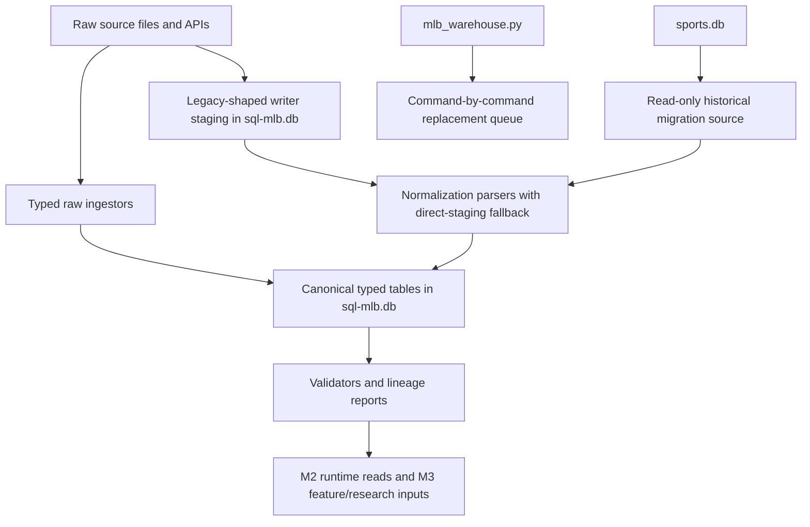

# MLB Typed DB Ingestion Routing Contract

Date: 2026-06-03

Scope: keep every MLB ingestion and normalization path pointed at `data-private/warehouse/sports/mlb/sql-mlb.db`, and make the temporary writer-staging tables explicit until the old `sports.db` monolith is retired.

Command replacement ledger: `run-plans/mlb/2026-06-03-mlb-warehouse-command-ledger.md`

Typed replacement CLI: `pipeline/mlb/warehouse/mlb_typed_warehouse.py` v0.1.0

## Was The Earlier Migration Complete?

Yes for historical parity and most runtime reads:

- Historical MLB source rows were migrated or validator-gated into the typed MLB DB.
- Replay-critical typed `plate_appearances` and `pitch_events` were backfilled and validated.
- Current model/read lanes now read `sql-mlb.db` instead of root `sports.db`.

No for full ongoing ingestion ownership:

- `pipeline/mlb/warehouse/mlb_warehouse.py` is still a legacy monolith and still owns many old ingest/derive/import commands.
- The old live writer shape still exists for side predictions/backtests and market/prop odds.
- Those live writers now write legacy-shaped staging tables inside `sql-mlb.db`; they are not the final M3 canonical model contract.

The corrected rule is: `sports.db` is only a read-only migration source. New MLB ingestion writes either canonical typed tables in `sql-mlb.db` or a documented typed staging table that is immediately normalized forward.

The operational replacement path is a new typed CLI, not modification of the old monolith:

- add typed commands to `pipeline/mlb/warehouse/mlb_typed_warehouse.py`
- keep `pipeline/mlb/warehouse/mlb_warehouse.py` as legacy M2/root-warehouse surface
- move package aliases only after the typed command has validation coverage

## Routing DAG

## Operating Rules

- New MLB code must default to `data-private/warehouse/sports/mlb/sql-mlb.db`.
- `data-private/warehouse/sports.db` must not receive new MLB writes.
- Canonical raw ingestors should insert typed rows directly when the source data is structured enough.
- Legacy-shaped live writers may insert only into these typed staging tables:
  - `mlb_side_predictions`
  - `mlb_side_backtests`
  - `mlb_featured_market_odds_snapshots`
  - `mlb_player_prop_odds_snapshots`
- Staging rows must be normalized before M3 treats them as model-ready data.
- If a staging row also exists in `legacy_table_rows`, normalizers prefer the historical `legacy_table_rows` row to preserve existing lineage. Direct staging is used only for new source keys.

## Current Routes

| Source family | Source path | Current writer | Typed write target | Normalization / validation | Status |
|---|---|---|---|---|---|
| MLB schedule and game feed | `data-private/raw/mlb/{date}` | `data-migration/scripts/ingest_mlb_schedule_game_feed_raw_to_typed.py` | `source_snapshots`, `source_fetch_runs`, `source_fetch_status`, `teams`, `venues`, `players`, `games`, `starting_pitchers`, `game_outcomes`, `plate_appearances`, `pitch_events` | `validate_mlb_schedule_game_feed_raw_to_typed.py`, `validate_mlb_core_feed_parity.py`, replay validator | Canonical typed route |
| Lineup board and probable starters | `data-private/lineups/mlb` | `data-migration/scripts/ingest_mlb_lineups_raw_to_typed.py` | `source_snapshots`, `source_fetch_runs`, `source_fetch_status`, `players`, `starting_pitchers`, `lineups`, `lineup_slots`, `lineup_matchup_snapshots`, `unresolved_entities` | `validate_mlb_lineups_raw_to_typed.py`, source fetch validators | Canonical typed route |
| Kalshi / Robinhood market raw files | `data-private/odds/{kalshi,robinhood}/mlb` | `data-migration/scripts/ingest_mlb_markets_props_raw_to_typed.py` | `source_snapshots`, source status, market/prop typed targets | `validate_mlb_markets_props_raw_to_typed.py`, market lineage validators | Canonical typed route |
| Baseball Savant / player context raw files | `data-private/raw` and existing player-context files | `data-migration/scripts/ingest_mlb_player_context_raw_to_typed.py` | player context typed targets and source status | source fetch validators and context normalizers | Canonical typed route |
| Historical The Odds API odds | external API plus local odds cache | `pipeline/mlb/fetchers/fetch_historical_mlb_odds.py` | `mlb_featured_market_odds_snapshots`, `mlb_player_prop_odds_snapshots` in `sql-mlb.db` | `normalize_mlb_markets.py`, `normalize_mlb_props.py` now read `legacy_table_rows` plus direct typed staging | Typed staging route |
| FanDuel Research odds | FanDuel research payloads | `pipeline/mlb/fetchers/fetch_fanduel_research_mlb.py` | `mlb_featured_market_odds_snapshots`, `mlb_player_prop_odds_snapshots` in `sql-mlb.db` | `normalize_mlb_markets.py`, `normalize_mlb_props.py` now read `legacy_table_rows` plus direct typed staging | Typed staging route |
| Side predictions and side backtests | model board output | `pipeline/mlb/warehouse/mlb_side_backtest.py` | `mlb_side_predictions`, `mlb_side_backtests` in `sql-mlb.db` | `normalize_mlb_predictions.py` now reads `legacy_table_rows` plus direct typed staging | Typed staging route |
| Legacy warehouse commands | old CLI commands and derive/import jobs | `pipeline/mlb/warehouse/mlb_warehouse.py` | root `sports.db` and old table shapes | no safe path flip; replace command-by-command | Remaining blocker |

## Direct-Staging Fallback Contract

The normalizers now use a shared source reader:

- Historical source rows come from `legacy_table_rows`.
- Direct typed staging rows come from the writer-owned staging table.
- A row is considered duplicate when `(source_table, source_pk)` already exists from `legacy_table_rows`.
- Direct-only staging rows are converted into the same parser shape: `legacy_row_id`, `source_table`, `source_pk`, `source_date`, `row_json`, and `content_hash`.

Direct staging source keys:

| Staging table | Source key | Date column |
|---|---|---|
| `mlb_side_predictions` | `game_id`, `model_name`, `prediction_date` | `prediction_date` |
| `mlb_side_backtests` | `game_id`, `model_name`, `prediction_date` | `prediction_date` |
| `mlb_featured_market_odds_snapshots` | `row_key` | `market_date` |
| `mlb_player_prop_odds_snapshots` | `row_key` | `market_date` |

## Remaining Migration Work

The migration is not done until `pipeline/mlb/warehouse/mlb_warehouse.py` is decomposed into typed ingestors, typed normalizers, or retired commands.

`mlb_warehouse.py` now emits a legacy-boundary warning when invoked. The M2 feature commands remain available for old runs, but they are explicitly classified as legacy feature materialization, not ingestion:

- `derive-state-formula-rows`
- `derive-player-identity-rows`
- `derive-pitcher-batter-kernel`
- `backtest-m2-research`

M3 should reimplement useful ideas from those commands in a versioned feature layer. Examples include expected PA by lineup order, sample-size shrinkage, hot/cold deviation labels, pitcher/batter pitch mix kernels, bullpen/mistake-shape derivations, and phase/story labels.

The next practical gates:

- inventory each `mlb_warehouse.py` command still referenced by `package.json`
- map each command to one of: typed raw ingestor, typed normalizer, research-only script, retired script
- cut one command family at a time and add a validator/report
- rerun the DB-input cutover audit after each family
